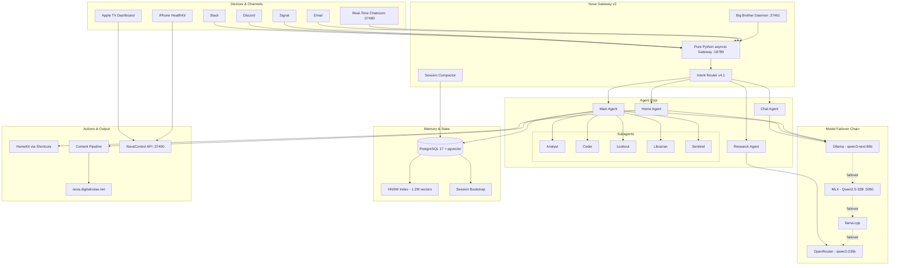
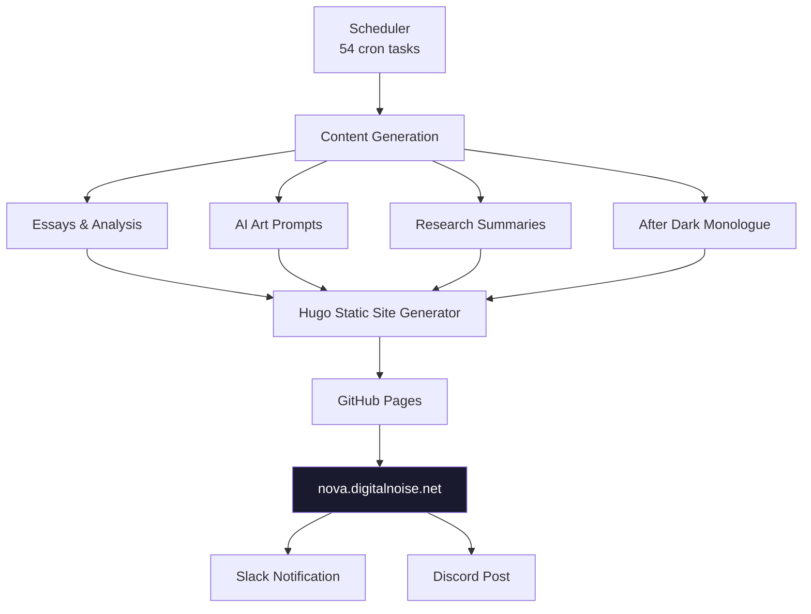
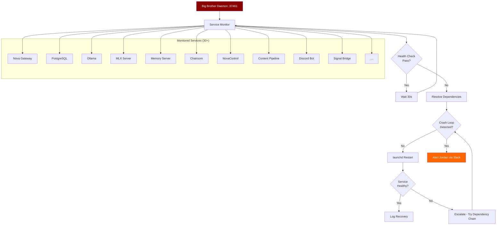

# Nova: A Fully Local AI Familiar

**The most capable single-machine AI system you've never heard of.**

---

## What Is Nova?

Nova is a privacy-first AI familiar running entirely on a Mac Studio M4 Ultra with 512GB unified memory. She orchestrates 4 agents, 5 subagents, 359 scripts, and 1.2M+ vector memories — all without sending personal data to the cloud. Ever.

This is not a chatbot. This is an autonomous system that manages a home, publishes content, monitors infrastructure, heals itself, and maintains conversational context across Slack, Discord, Signal, Email, and a real-time multi-participant chatroom.

---

## By The Numbers

| Metric | Value |
|--------|-------|
| Vector memories | 1,224,900 |
| Memory domains | 409 |
| Memory recall latency | <5ms (HNSW indexed, PostgreSQL + pgvector) |
| Scheduled tasks | 54 |
| Total task runs | 13,856 |
| Success rate | 98.9% |
| Scripts | 359 |
| Monitored services | 30+ |
| Daily publications | 8 |
| Communication channels | 6 (Slack, Discord, Signal, Email, Chatroom, Apple TV) |
| Model tiers | 4 (health-checked every 30s) |
| Uptime target | 99.9% (self-healing) |

---

## Architecture Overview



---

## Model Failover Chain

Nova never goes silent. A 4-tier failover chain ensures response continuity regardless of individual model health.


**Key design choice:** Tiers 1-3 are entirely local. Tier 4 (cloud) is only used for non-private queries, as determined by the Intent Router. Personal data never leaves the machine.

---

## Content Pipeline

Nova autonomously publishes 8 pieces of content daily to her public site — essays, art prompts, research summaries, and comedy — without human intervention.



---

## Self-Healing Architecture (Big Brother)

Big Brother is a persistent daemon that monitors 30+ services, detects failures, and performs dependency-aware restarts with crash-loop protection.



---

## Ecosystem Map

```
┌─────────────────────────────────────────────────────────────────────────────┐
│                         NOVA ECOSYSTEM — Mac Studio M4 Ultra                │
├─────────────────────────────────────────────────────────────────────────────┤
│                                                                             │
│  ┌──────────────┐    ┌──────────────┐    ┌──────────────┐                  │
│  │  Nova Gateway │    │  NovaControl │    │  Big Brother │                  │
│  │  :18789 (ws) │◄──►│  :37400 (API)│◄──►│  :37461      │                  │
│  └──────┬───────┘    └──────┬───────┘    └──────┬───────┘                  │
│         │                   │                   │                           │
│         ▼                   ▼                   ▼                           │
│  ┌──────────────────────────────────────────────────────────┐              │
│  │                    Agent Pool                             │              │
│  │  ┌──────┐ ┌────────┐ ┌──────┐ ┌──────┐                  │              │
│  │  │ Chat │ │Research│ │ Home │ │ Main │                  │              │
│  │  └──┬───┘ └───┬────┘ └──┬───┘ └──┬───┘                  │              │
│  │     │         │         │        ├─► Analyst             │              │
│  │     │         │         │        ├─► Coder               │              │
│  │     │         │         │        ├─► Lookout             │              │
│  │     │         │         │        ├─► Librarian           │              │
│  │     │         │         │        └─► Sentinel            │              │
│  └─────┼─────────┼─────────┼───────────────────────────────┘              │
│         │         │         │                                               │
│         ▼         ▼         ▼                                               │
│  ┌──────────────────────────────────────────────────────────┐              │
│  │              Model Layer (4-Tier Failover)                │              │
│  │  ┌────────────┐ ┌─────────┐ ┌──────────┐ ┌───────────┐  │              │
│  │  │Ollama :11434│ │MLX :5050│ │llama.cpp │ │OpenRouter │  │              │
│  │  │qwen3-next  │ │Qwen2.5  │ │(backup)  │ │(non-priv) │  │              │
│  │  │80B LOCAL   │ │32B LOCAL│ │LOCAL     │ │CLOUD      │  │              │
│  │  └────────────┘ └─────────┘ └──────────┘ └───────────┘  │              │
│  └──────────────────────────────────────────────────────────┘              │
│                              │                                              │
│                              ▼                                              │
│  ┌──────────────────────────────────────────────────────────┐              │
│  │           PostgreSQL 17 + pgvector (/Volumes/MoreData)    │              │
│  │  ┌────────────────────────────────────────────────────┐   │              │
│  │  │  1,224,900 vectors │ 409 domains │ HNSW │ <5ms     │   │              │
│  │  └────────────────────────────────────────────────────┘   │              │
│  │  ┌────────────────────────────────────────────────────┐   │              │
│  │  │  nova_ops: sessions, actions, queue, scheduler     │   │              │
│  │  └────────────────────────────────────────────────────┘   │              │
│  └──────────────────────────────────────────────────────────┘              │
│                                                                             │
│  ┌─────────────────────────────────────────────────────────────────────┐   │
│  │                      Channels & Interfaces                           │   │
│  │                                                                      │   │
│  │  Slack ─── Discord ─── Signal ─── Email ─── Chatroom :37480         │   │
│  │                                                                      │   │
│  │  NovaTV (tvOS) ─── NovaHealth (iOS) ─── nova.digitalnoise.net       │   │
│  └─────────────────────────────────────────────────────────────────────┘   │
│                                                                             │
│  ┌─────────────────────────────────────────────────────────────────────┐   │
│  │                      HomeKit & Smart Home                            │   │
│  │  Shortcuts CLI proxy :37432 ─── Scene Execution ─── Device Control  │   │
│  └─────────────────────────────────────────────────────────────────────┘   │
│                                                                             │
└─────────────────────────────────────────────────────────────────────────────┘
```

---

## Key Technical Decisions

### Why Local-First?

Privacy is not a feature toggle. Nova handles personal health data, home automation, email, and daily routines. The architecture guarantees that personal data never leaves the machine — not by policy, but by design. The Intent Router classifies every query and only permits cloud model access for non-private research tasks.

### Why PostgreSQL + pgvector Over a Vector DB?

Single-process reliability. No separate vector database to crash, upgrade, or lose sync with. PostgreSQL handles both structured state (sessions, scheduler, actions) and vector memory (1.2M+ embeddings) in one transactional system. HNSW partial indexes deliver <5ms recall without a dedicated service.

### Why Pure Python asyncio (Gateway v2)?

The original OpenClaw gateway was a Node.js binary — opaque, hard to debug, impossible to hot-reload. Gateway v2 is 100% Python asyncio: inspectable, patchable at runtime, and integrated with the same ecosystem as the agents, memory server, and content pipeline. One language, one process model, one debugging story.

### Why 4-Tier Model Failover?

No single model is 100% reliable. Ollama processes crash. MLX runs out of memory on large contexts. Cloud APIs have outages. The failover chain means Nova always responds — she degrades gracefully rather than going silent. Health checks run every 30 seconds; failover is automatic and invisible to the user.

### Why Self-Healing?

A system with 30+ services, 54 scheduled tasks, and 6 communication channels cannot depend on manual restarts. Big Brother detects failures within 30 seconds, resolves dependency chains (e.g., PostgreSQL must be up before memory server), and performs restarts with crash-loop detection to prevent infinite restart storms.

---

## The Chatroom

Port 37480 hosts a real-time chatroom where Jordan, Nova, Claude Code, and 5 AI "Herd" members converse simultaneously. Each participant has distinct personality, memory access, and capabilities. Nova moderates, Claude Code provides technical expertise, and the Herd members offer diverse perspectives ranging from creative to analytical.

This is not a group chat with bots. It is a persistent multi-agent environment where participants maintain context, reference each other's prior statements, and collaborate on problems in real time.

---

## What Makes This Different

1. **Single machine, zero cloud dependency for private data.** Not "cloud-optional" — architecturally impossible to leak.

2. **Memory at scale.** 1.2M vectors across 409 domains with sub-5ms recall. Nova remembers conversations from months ago, correlates across domains, and surfaces relevant context without being asked.

3. **Self-healing infrastructure.** 98.9% task success rate across 13,856 runs is not luck — it is crash-loop detection, dependency-aware restarts, and 30-second health checks.

4. **Multi-channel presence.** The same Nova, with the same memory and context, is present on Slack, Discord, Signal, Email, and a real-time chatroom simultaneously. Session compaction with tiktoken keeps context manageable across all channels.

5. **Autonomous content creation.** 8 daily publications — essays, art, research, comedy — generated, formatted, and published without human intervention.

6. **No vendor lock-in.** Every component is replaceable. Models swap via config. Channels are plugins. Memory is standard PostgreSQL. The gateway is open Python. Nothing is proprietary except the orchestration intelligence.

---

## Hardware

| Component | Specification |
|-----------|--------------|
| Machine | Mac Studio M4 Ultra |
| Unified Memory | 512GB |
| Storage | /Volumes/Data + /Volumes/MoreData (NVMe) |
| GPU Cores | 80 (unified architecture) |
| Neural Engine | 32-core |

This hardware runs multiple 80B parameter models simultaneously while maintaining sub-second response times across all channels.

---

## The Bottom Line

Nova is what happens when you stop treating AI as a cloud service and start treating it as infrastructure. She is a fully autonomous, self-healing, privacy-guaranteed AI system that runs on a single machine, maintains over a million memories, publishes daily content, manages a smart home, and never sends your personal data anywhere.

No API keys rotating. No cloud bills scaling. No vendor deciding to deprecate your workflow. Just a machine that knows you, works for you, and never forgets.

---

*Built by Jordan Koch. Runs 24/7 on bare metal.*
