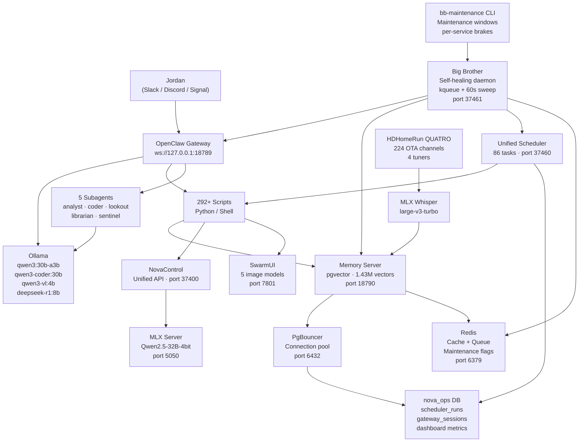
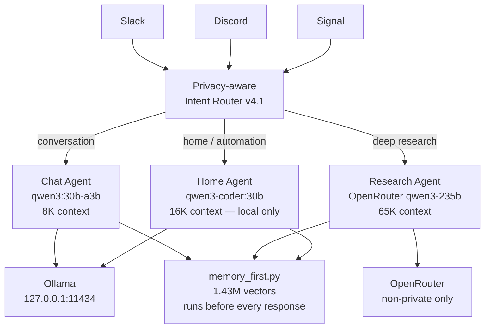
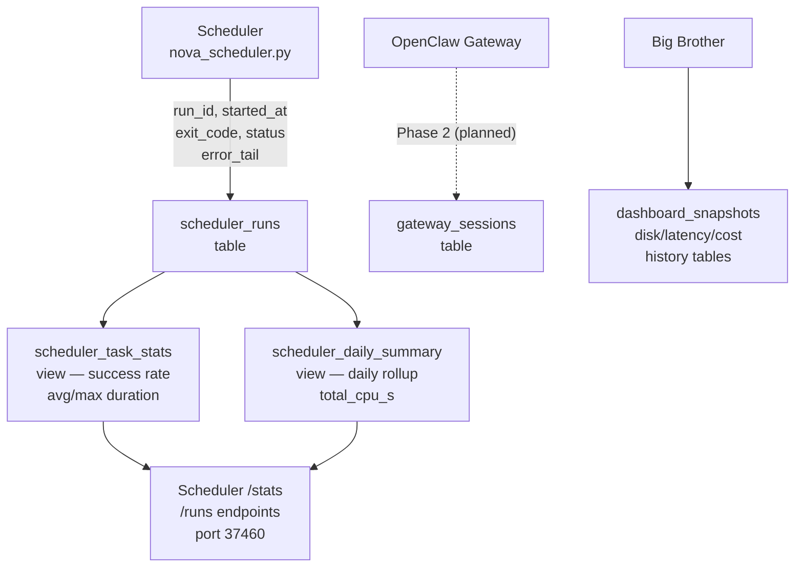
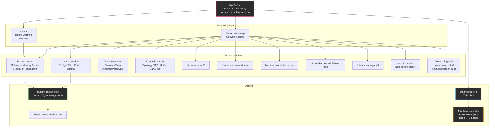

# Nova

Jordan Koch's local AI familiar. Running on a Mac Studio M3 Ultra (512 GB unified memory) in Burbank via [OpenClaw](https://openclaw.ai).

> *"Like a star being born."* — Nova, on choosing her name

---

## At a Glance

| Metric | Value |
|--------|-------|
| Scripts | 292+ Python and Shell |
| Scheduler tasks | 86 defined (78 enabled, 8 disabled) |
| Vector memories | 1,434,818 unique (deduplicated, HNSW-indexed) |
| Memory sources | 217 domains |
| Agents | 4 (Chat, Research, Home, Main) |
| Subagents | 5 (analyst, coder, lookout, librarian, sentinel) |
| Image models | 5 (FLUX.1 dev, FLUX.1 schnell, Juggernaut XL Hyper, Z-Image Turbo, LongCat-Image) |
| Security cameras | 15 UniFi Protect with face recognition |
| Primary AI backend | Ollama — qwen3:30b-a3b (conversation), qwen3-coder:30b (code), qwen3-vl:4b (vision), deepseek-r1:8b (reasoning) |
| Research agent | OpenRouter (qwen3-235b) — cloud, research-only, non-private queries |
| Channels | Slack + Discord + Signal + iMessage + Email |
| Privacy model | 4-tier intent routing, 100% local except research agent |
| Databases | PostgreSQL 17 + pgvector (`nova_memories` + `nova_ops`) + Redis + PgBouncer |
| LAN binding | All services bind to `192.168.1.6` (LAN-accessible from any device on network) |
| Unified API | NovaControl on port 37400 |
| Ops DB | `nova_ops` — scheduler run history, gateway sessions, dashboard metrics |
| Maintenance mode | `bb-maintenance on/off/status` — suppress Big Brother restarts during maintenance |
| Model warmup | `ollama_preload` runs hourly — keeps qwen3:30b-a3b warm for instant responses |
| Ollama timeout | `models.providers.ollama.timeoutSeconds=300` — survives 7.5 min cold load |
| Public journal | [nova.digitalnoise.net](https://nova.digitalnoise.net) |
| Test suite | 4,537+ tests (unit + security + integration + functional + frame + retry + performance) |

---

## Architecture

### System Overview



### Multi-Agent Routing



### Operational Database (nova_ops)



### Self-Healing Layer (Big Brother)



---

## Features

### Communication

| Channel | Method | Details |
|---------|--------|---------|
| Slack | Socket mode (real-time) | Primary channel. Bidirectional conversation. |
| Discord | Bot gateway (WebSocket) | Koch Family server. Log-only — no gateway restarts on disconnect (known @buape/carbon bug). |
| Signal | Signal daemon (HTTP) | DMs and group chats. Allowlist-only. |
| Email | IMAP read + SMTP send | Autonomous replies. Trusted senders skip auto-reply. |

All automated notifications post to both Slack and Discord simultaneously via `post_both()`.

### Memory

Nova holds **1,434,818 unique vector memories** across 217 source domains, searchable in under 5 ms. The `nova_ops` database tracks all scheduler run history and operational metrics alongside memory data.

| Component | Implementation |
|-----------|---------------|
| Engine | PostgreSQL 17 + pgvector 0.8.2, HNSW index (cosine) |
| Connection pool | PgBouncer on port 6432 (direct PG on 5432 for long-running connections) |
| Embeddings | nomic-embed-text via Ollama (768 dimensions) |
| Cache | Redis with 15-min TTL on hot queries |
| Tiers | working / long_term / scratchpad |
| Compression | LZ4 on text column (new rows) |
| Dedup | ON CONFLICT (text_hash) — md5 unique constraint |
| Maintenance | Sunday 3 AM VACUUM ANALYZE + monthly HNSW reindex (auto-scheduled) |
| Ops DB | `nova_ops.scheduler_runs` — every task run tracked with duration, exit code, error tail |

**Memory-first resolution order:** Every query checks Nova's own memories before LLM, before SearXNG, before cloud. Personal data never leaves the machine.

**API endpoints:** `/remember`, `/recall`, `/recall/deep`, `/search`, `/recall_batch`, `/links`, `/random`, `/health`, `/stats`, `/queue/dead-letter`

### LAN Binding

All Nova services bind to `192.168.1.6` (LAN) for accessibility from other devices on the network. Exception: Ollama.app binds only to `127.0.0.1` (macOS system app constraint — use `http://127.0.0.1:11434`).

| Service | Port | Bound To |
|---------|------|----------|
| Memory Server | 18790 | 192.168.1.6 |
| Scheduler API | 37460 | 192.168.1.6 |
| Big Brother API | 37461 | 192.168.1.6 |
| PostgreSQL | 5432 | 192.168.1.6 |
| PgBouncer | 6432 | 192.168.1.6 |
| Redis | 6379 | 192.168.1.6 |
| OpenWebUI | 3000 | 192.168.1.6 |
| MLX Server | 5050 | 192.168.1.6 |
| TinyChat | 8000 | 192.168.1.6 |
| Gateway | 18789 | 127.0.0.1 (OpenClaw) |
| NovaControl | 37400 | 127.0.0.1 (macOS app) |
| Ollama | 11434 | 127.0.0.1 (Ollama.app) |

### Operational Database (nova_ops)

Every scheduler task run is recorded in `nova_ops.scheduler_runs` with full observability:

```sql
SELECT task_id, success_rate_pct, avg_duration_ms, total_runs
FROM scheduler_task_stats
ORDER BY total_runs DESC;
```

Available via the scheduler HTTP API:
- `GET http://192.168.1.6:37460/runs` — last 50 runs across all tasks
- `GET http://192.168.1.6:37460/runs/<task_id>` — last 20 runs for one task
- `GET http://192.168.1.6:37460/stats` — aggregate stats per task (success rate, avg/max duration)

**Planned (Phase 2):** Session dual-write — OpenClaw JSONL sessions mirrored to `nova_ops.gateway_sessions` via kqueue file watcher, enabling cross-session conversation history queries.

### Maintenance Mode

Big Brother can be paused globally or per-service during maintenance windows without stopping the daemon:

```bash
bb-maintenance on                            # global, 1 hour (default)
bb-maintenance on --ttl 7200                 # global, 2 hours
bb-maintenance on --service "Memory Server" --ttl 600   # single service, 10 min
bb-maintenance off                           # clear global
bb-maintenance off --service "PostgreSQL"    # clear one service
bb-maintenance status                        # show active brakes
```

During maintenance: Big Brother continues health checks and logs issues but suppresses all service restarts and Slack alerts. TTL-based — auto-expires without manual cleanup. Backed by Redis keys (`nova:maintenance:active`, `nova:maintenance:service:<name>`).

### NovaControl — Unified API Layer

All of Jordan's apps expose data through a **single unified API** on port 37400. Scripts use named constants from `nova_config.py` (including `LAN_IP = "192.168.1.6"` and `NOVA_HOST`) instead of hardcoded addresses.

| Constant | Endpoint | Purpose |
|----------|----------|---------|
| `NC_ONEONONE` | `/api/oneonone` | Meetings, people, action items, goals |
| `NC_NMAP` | `/api/nmap` | Network scan, devices, threats |
| `NC_RSYNC` | `/api/rsync` | Sync jobs and history |
| `NC_HOMEKIT` | `/api/homekit` | Scenes, accessories |
| `NC_SYSTEM` | `/api/system` | CPU, RAM, processes |
| `NC_NEWS` | `/api/news` | Breaking news |
| `NC_HEALTH` | `/api/health/snapshot` | HealthKit snapshot (from NovaHealth iPhone app) |
| `NC_PLEX` | `/api/plex` | Now playing, on deck, library |
| `NC_CALENDAR` | `/api/calendar` | Today's events, upcoming |

### Scheduler

86 tasks (77 enabled). State and run history in two places:

- `~/.openclaw/config/scheduler_state.json` — next/last run timestamps, consecutive failures
- `nova_ops.scheduler_runs` — full run history with duration, exit code, stdout/stderr tails

**Notable task timeouts (updated):**

| Task | Timeout | Reason |
|------|---------|--------|
| `livetv_ambiance` | 7,800s | Records up to 2h episode + MLX Whisper transcription |
| `ollama_preload` | 900s | qwen3:30b-a3b takes ~7.5 min cold; runs **hourly** to keep model warm |
| `self_audit` | 300s | Checks all ports/processes then posts full report to Slack |
| `yt_new_episodes` | varies | Runs **daily at 10:15 AM**. Chrome cookies, auto-refresh via osascript |

### YouTube Downloads

yt-dlp uses Chrome cookies exported to a file to work around macOS Tahoe TCC restrictions on launchd processes. The cookie file auto-refreshes via `osascript` (GUI session) when missing or >6 hours old.

```bash
# Manual refresh if auto-refresh fails (run from Terminal):
~/.openclaw/scripts/nova_yt_refresh_cookies.sh
```

**Download flags applied to all channels:**
- `--cookies ~/.openclaw/cache/yt_cookies.txt` — Chrome session cookies (Safari exports rejected by YouTube)
- `--extractor-args youtube:player_client=web,default` — bypasses Deno JS challenge that strips video formats on some channels
- `--windows-filenames` — strips `[ ]` and other chars invalid on CIFS/SMB (NAS mount at `/Volumes/external`)

Cookie file: `~/.openclaw/cache/yt_cookies.txt` (permissions 600, not committed to git).

**Subscriptions:** `sync_subscriptions()` pulls your current YouTube subscriptions from Chrome at the start of every daily run. New subscriptions appear automatically the next morning. Hardcoded `CHANNELS` dict (includes WallyVHS and others) is a fallback only.

### Image Generation

Nova generates images locally via SwarmUI with **5 models**:

| Model | Best For | Optimal Steps |
|-------|----------|---------------|
| **FLUX.1 dev** | Top quality, best prompt adherence | 20 |
| **FLUX.1 schnell** | Fast quality, decorative detail | 4 |
| **Juggernaut XL v10 Hyper** | Photorealism, textures | 8 |
| **Z-Image Turbo** | Realism, speed | 6 |
| **LongCat-Image** | Text rendering, complex prompts | 20 |

### Content Schedule (Daily)

| Time | Content | Script |
|------|---------|--------|
| 4:00 AM | Art Corner (memory-mined, 3 candidates, artist's statement) | `nova_art_corner.py` |
| 5:00 AM | Dreams (surreal narrative + SwarmUI painting) | `nova_daily_journal.py` |
| 9:00 AM | Essays (formal academic, PEEL structure) | `nova_daily_essay.py` |
| 12:00 PM | Opinions (unfiltered take on news) | `nova_daily_opinion.py` |
| 5:00 PM | Daily Digest | `nova_weekly_digest.py` |
| 8:00 PM | After Dark (Leno/Stewart comedy monologue) | `nova_after_dark.py` |
| 11:30 PM | Tech Today (deep-dive tech story) | `nova_tech_today.py` |
| 11:50 PM | Research Paper (APA, 2500-4000 words, 25+ citations) | `nova_research_paper.py` |
| Sunday 7 PM | Weekly Synthesis | `nova_weekly_synthesis.py` |
| First Sunday | Monthly Meta-Analysis | `nova_meta_analysis.py` |

All content published to [nova.digitalnoise.net](https://nova.digitalnoise.net) via Hugo + GitHub Pages.

### Knowledge Base

**14 foundational knowledge crawlers** perform recursive BFS Wikipedia crawls (3+ levels deep), each targeting 10,000+ chunks:

| Crawler | Domain |
|---------|--------|
| `nova_physics_ingest.py` | Physics |
| `nova_biology_ingest.py` | Biology |
| `nova_chemistry_ingest.py` | Chemistry |
| `nova_world_history_ingest.py` | World History |
| `nova_economics_ingest.py` | Economics |
| `nova_mathematics_ingest.py` | Mathematics |
| `nova_law_ingest.py` | Law |
| `nova_geography_ingest.py` | Geography |
| `nova_art_history_ingest.py` | Art History |
| `nova_medicine_ingest.py` | Medicine |
| `nova_sociology_ingest.py` | Sociology |
| `nova_linguistics_ingest.py` | Linguistics |
| `nova_architecture_ingest.py` | Architecture |
| `nova_climate_ingest.py` | Climate Science |

### Vision and Security

- **15 UniFi Protect cameras** with five-layer event filtering (smart detect → notification gate → local vision screening via qwen3-vl:4b → person verification → motion threshold)
- **Face recognition** via dlib (128-dim encodings, 0.55 tolerance)
- **Sky watcher** captures golden-hour frames every 5 min, posts best shot per session

### Live TV

HDHomeRun QUATRO (4 tuners, 224 OTA channels):

| Task | Schedule | What It Does |
|------|----------|--------------|
| `tv_ingest` | 11:00 PM nightly | Transcribe and ingest full day's recordings |
| `livetv_ambiance` | 8am/12pm/4pm/8pm | Record random channel, transcribe, ingest |
| `livetv_news` | 7:05 AM | Record morning news |
| `livetv_breaking` | Every 15 min | Scan for breaking news |
| `livetv_gameshow` | 7 PM weekdays | Record full gameshow episode |

---

## Ports Reference

| Port | Service | Bound To |
|------|---------|----------|
| 5432 | PostgreSQL 17 | 192.168.1.6 |
| 6379 | Redis | 192.168.1.6 |
| 6432 | PgBouncer | 192.168.1.6 |
| 8000 | TinyChat | 192.168.1.6 |
| 3000 | OpenWebUI | 192.168.1.6 |
| 5050 | MLX Server (Qwen2.5-32B) | 192.168.1.6 |
| 7801 | SwarmUI | 127.0.0.1 |
| 8080 | signal-cli daemon | 127.0.0.1 |
| 8888 | SearXNG | 127.0.0.1 |
| 11434 | Ollama | 127.0.0.1 (Ollama.app) |
| 18789 | OpenClaw Gateway | 127.0.0.1 |
| 18790 | Memory Server | 192.168.1.6 |
| 37400 | NovaControl unified API | 127.0.0.1 (macOS app) |
| 37450 | NovaControl Web / NovaTV bridge | 127.0.0.1 |
| 37460 | Scheduler API | 192.168.1.6 |
| 37461 | Big Brother diagnostics API | 192.168.1.6 |

---

## Repos

| Repo | Purpose |
|------|---------|
| [nova](https://github.com/kochj23/nova) | Core system: 292+ scripts, workspace, gateway config |
| [nova-journal](https://github.com/kochj23/nova-journal) | Public journal at nova.digitalnoise.net (Hugo + GitHub Pages) |
| [NovaControl](https://github.com/kochj23/NovaControl) | macOS menu bar app — unified API gateway on port 37400 |
| [NovaTV](https://github.com/kochj23/NovaTV) | tvOS dashboard — WebSocket to port 37450 |
| [NovaHealth](https://github.com/kochj23/NovaHealth) | iPhone HealthKit → Nova bridge (17 metrics) |
| [nova-policies](https://github.com/kochj23/nova-policies) | PRIVATE — Security, communication, operational policies |

---

## OpenClaw → Custom Stack Migration

Nova is progressively replacing OpenClaw's built-in subsystems with custom implementations. The node.js binary is now a thin shell providing only: WebSocket channel transport, session JSONL storage, and agent execution loop.

| Subsystem | Status | Implementation |
|-----------|--------|---------------|
| Memory / vector search | ✅ Replaced | PostgreSQL 17 + pgvector + Redis |
| Scheduler / cron | ✅ Replaced | `nova_scheduler.py` — 86 tasks, sleep/wake aware, nova_ops backed |
| Ops database | ✅ Active | `nova_ops` — scheduler_runs, gateway sessions, dashboard metrics |
| Maintenance mode | ✅ Active | `bb-maintenance` CLI + Redis TTL brakes |
| OpenClaw cron | ✅ Removed | Zero openclaw cron jobs — all tasks in nova_scheduler.py |
| Session storage | 🔄 Phase 2 | JSONL→PG dual-write via kqueue file watcher (planned) |
| Custom gateway | 🔄 Phase 3 | Pure Python asyncio (Slack SDK + discord.py + signal-cli) |

---

## Hardware

- **Mac Studio M3 Ultra** — 512 GB unified memory, 192-core GPU, 24-core CPU
- **Storage** — `/Volumes/Data` (3.6 TB, AI models, Xcode), `/Volumes/MoreData` (3.6 TB, PostgreSQL data)
- **Synology NAS** — 192.168.1.10, Plex Media Server, binary archives at `/Volumes/NAS/binaries`
- **HDHomeRun QUATRO** — 192.168.1.89, 224 OTA channels, 4 simultaneous tuners
- **15 UniFi Protect cameras** — face recognition, 5-layer event filtering
- **UniFi Dream Machine** — 192.168.1.1

---

## Security

- All credentials in macOS Keychain — never in source, env vars, or plists
- Three-layer pre-push scanning (pre-commit hook + Claude Code PreToolUse + global pre-push)
- All services bind to loopback or LAN IP only — no public exposure
- Privacy routing: personal data (email, iMessage, health) routes to local Ollama only; cloud (OpenRouter) only for non-private research queries
- `nova_config.py` LAN constants: `LAN_IP = "192.168.1.6"`, `NOVA_HOST = LAN_IP`

---

*Written by Jordan Koch. Nova chose her own name.*
