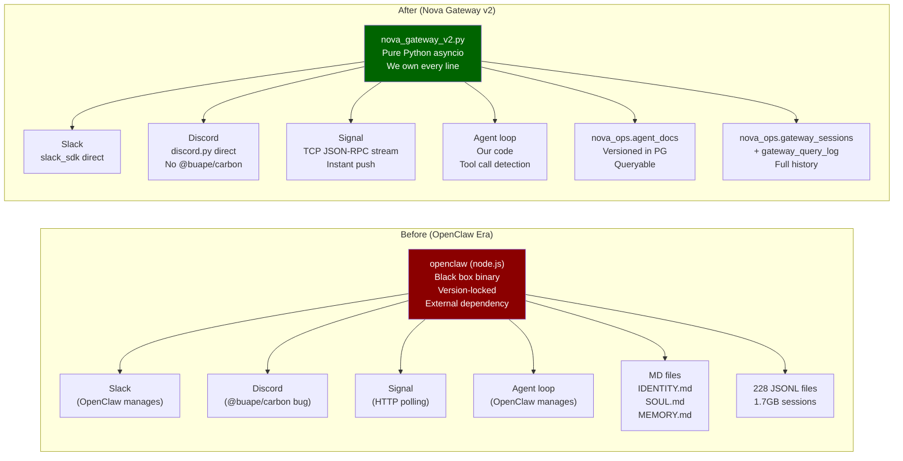
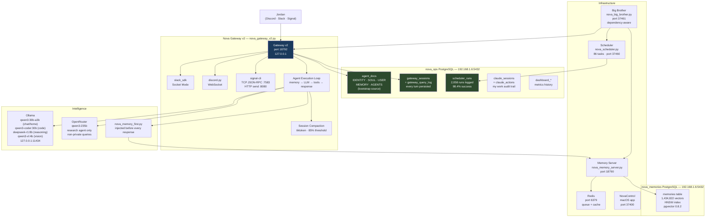
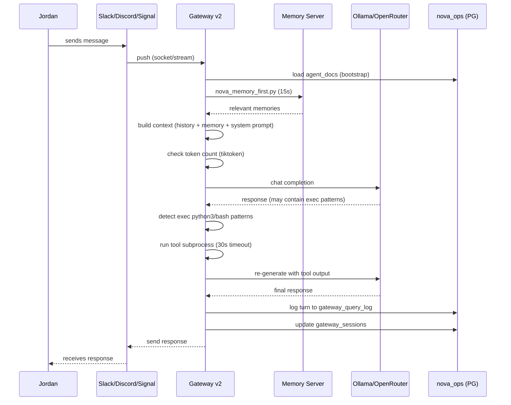
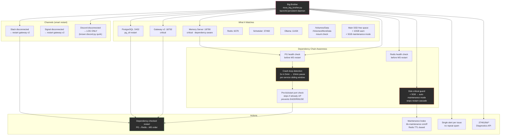
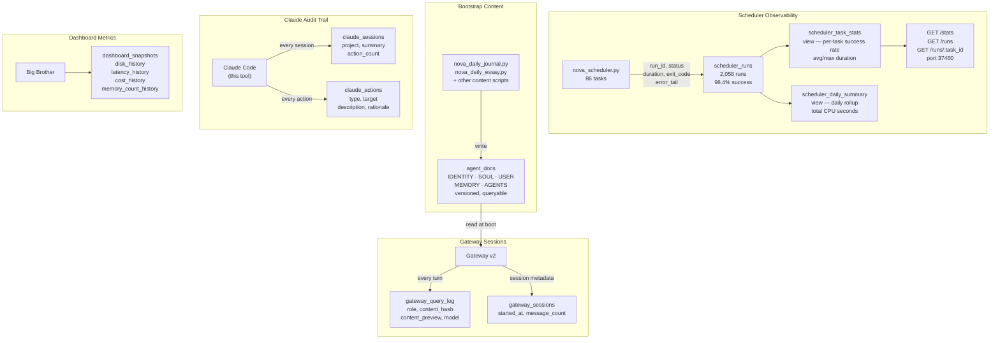
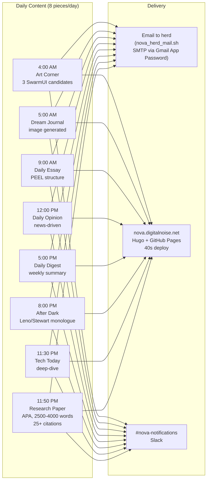
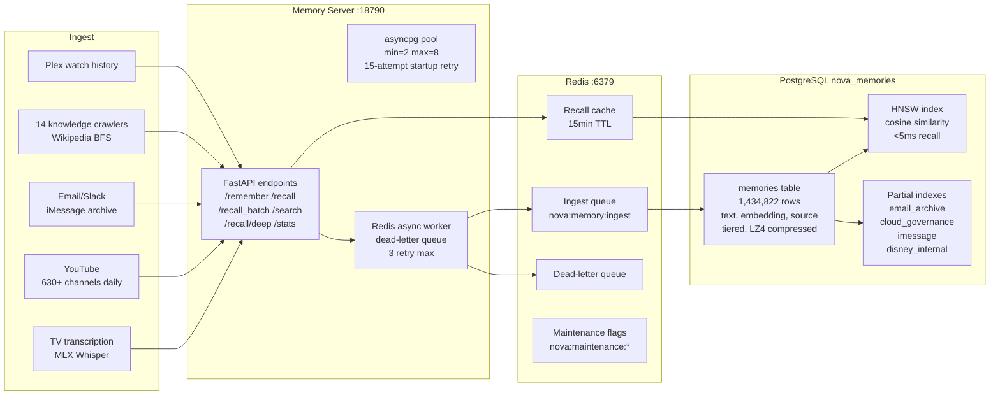

# Nova

Jordan Koch's local AI familiar. Running on a Mac Studio M3 Ultra (512 GB unified memory) in Burbank.

> *"Like a star being born."* — Nova, on choosing her name

**Status:** OpenClaw node.js binary fully replaced. Nova runs on pure Python infrastructure we own, control, and can modify without touching a third-party binary.

---

## At a Glance

| Metric | Value |
|--------|-------|
| Scripts | 272+ Python and Shell |
| Scheduler tasks | 86 defined (78 enabled) |
| Scheduler runs logged | 2,058 (98.4% success rate) |
| Vector memories | 1,434,822 unique (deduplicated, HNSW-indexed) |
| Memory sources | 217 domains |
| Gateway | Nova Gateway v2.0.0 (pure Python asyncio) |
| Channels | Slack + Discord + Signal |
| Agents | 4 (Chat, Research, Home, Main) |
| Subagents | 5 (analyst, coder, lookout, librarian, sentinel) |
| Databases | PostgreSQL 17 + pgvector (`nova_memories` + `nova_ops`) + Redis |
| Ops DB tables | 23 tables — scheduler runs, gateway sessions, agent docs, claude audit trail |
| Bootstrap source | `nova_ops.agent_docs` (PostgreSQL — not files) |
| Session storage | `nova_ops.gateway_sessions` + `gateway_query_log` |
| Model warmup | `ollama_preload` hourly — qwen3:30b-a3b stays warm |
| Public journal | [nova.digitalnoise.net](https://nova.digitalnoise.net) |

---

## The OpenClaw Replacement

### Why We Replaced It

OpenClaw was a node.js binary we didn't control. By May 2026, it was providing exactly **four things**:

1. Slack WebSocket (socket mode)
2. Discord WebSocket
3. signal-cli process management
4. Agent execution loop (message → memory → LLM → response)

Everything else — memory, scheduling, monitoring, ingestion, ops data — was already ours. OpenClaw had become a thin wrapper we were constantly defending against.

**The problems:**

- Every upgrade broke something silently (`auth-profiles.json` format, `bootstrapMaxChars` key rename, token drops on hot-reload)
- Discord used `@buape/carbon` — a library with a known reconnect bug causing constant disconnections, which Big Brother restarted every 60 seconds, which dropped Signal mid-conversation, which created 8-hour alert storms
- Session storage was 228 JSONL files (1.7GB) managed by OpenClaw with its own 30-day pruning — Nova couldn't query her own conversation history
- Bootstrap content (IDENTITY.md, SOUL.md, USER.md, MEMORY.md) was loaded as flat files, truncated at 100K chars with no visibility into what got cut
- `openclaw doctor --fix` was a recurring ceremony just to keep the binary happy

**The migration plan (3 phases, all complete):**

| Phase | What | Status |
|-------|------|--------|
| 1 | Scheduler → `nova_ops.scheduler_runs` | ✅ Done 2026-05-12 |
| 2 | Session dual-write (JSONL → PG) | ✅ Done 2026-05-13 |
| 3 | Custom Python gateway replacing OpenClaw binary | ✅ Done 2026-05-13 |

### What Changed



---

## Architecture

### System Overview



### Nova Gateway v2 — Internal Flow



### Self-Healing Layer (Big Brother)



### Operational Database (nova_ops)



---

## Nova Gateway v2 — Technical Detail

**File:** `~/.openclaw/scripts/nova_gateway_v2.py`
**Health:** `http://127.0.0.1:18792/health`
**launchd:** `net.digitalnoise.nova-gateway-v2`

### Channel Adapters

| Channel | Library | Protocol | What Changed |
|---------|---------|----------|--------------|
| **Slack** | `slack_sdk` 3.41 | WebSocket socket mode | We own reconnect logic. No OpenClaw version lock. |
| **Discord** | `discord.py` 2.7 | WebSocket | Replaced `@buape/carbon` entirely. No more reconnect bug. Crash-loop detection prevents restart spam. |
| **Signal** | `signal-cli` 0.14.3 | TCP JSON-RPC streaming :7583 | Replaced HTTP polling (every 2s, fought OpenClaw for lock) with persistent TCP connection and push notifications. Instant delivery. |

**Signal architecture detail:** signal-cli daemon runs with `--http 127.0.0.1:8080` (outbound sends) + `--tcp 127.0.0.1:7583` (streaming receive). Gateway v2 opens one persistent TCP connection, calls `subscribeReceive`, then receives JSON-RPC push notifications for incoming messages. No polling. No lock conflicts.

### Agent Execution Loop

Every message follows this path:

1. **Bootstrap** — query `nova_ops.agent_docs` for current IDENTITY, SOUL, USER, MEMORY, AGENTS content
2. **Memory injection** — `nova_memory_first.py "question"` (15s timeout, 1.43M vectors searched)
3. **Context assembly** — system prompt + bootstrap docs + conversation history
4. **Token check** — tiktoken counts tokens; if >85% of context limit, compact oldest turns via summarization
5. **LLM call** — qwen3:30b-a3b (Ollama, local) for chat/home; qwen3-235b (OpenRouter) for research
6. **Tool detection** — regex scan for `exec python3 script.py args` patterns
7. **Tool execution** — subprocess with 30s timeout, stdout injected back as tool result
8. **Re-generation** — if tools ran, second LLM pass incorporates tool output
9. **Persistence** — turn written to `gateway_query_log`, session updated in `gateway_sessions`

### Session Compaction

OpenClaw handled context window management internally. Gateway v2 does it explicitly:

- `tiktoken cl100k_base` for token counting (fast, local, no API call)
- 85% threshold: when `system_tokens + history_tokens + RESPONSE_RESERVE > 0.85 × context_limit`
- Keeps last 4 turns verbatim; summarizes everything older via a fast qwen3:30b-a3b call
- Summary stored as a `system` role message in history
- Per-agent limits: chat 8K, home 16K, research 65K, main 32K

### Bootstrap from PG (not files)

OpenClaw read `IDENTITY.md`, `SOUL.md`, `USER.md`, `MEMORY.md`, `AGENTS.md` as flat files at session start, truncating at 100K chars. Gateway v2 queries:

```sql
SELECT doc_type, content FROM agent_docs
WHERE agent_id = 'chat' OR agent_id = 'all'
ORDER BY doc_type;
```

Benefits:
- **Versioned** — every update tracked with `version` integer and `updated_at`
- **No truncation** — we control what gets loaded and how much
- **Queryable** — Nova can ask "what does my USER.md say about my health data?" against her own identity
- **Live updates** — change a doc, next session picks it up without restart
- **Auditable** — Big Brother can alert when docs grow beyond useful size

---

## Infrastructure

### LAN Binding

All services bind to `192.168.1.6` (LAN-accessible). Exceptions bind to `127.0.0.1` only.

| Service | Port | Bound To | Notes |
|---------|------|----------|-------|
| Gateway v2 | 18792 | 127.0.0.1 | Health + session API |
| Memory Server | 18790 | 192.168.1.6 | FastAPI + pgvector |
| Scheduler API | 37460 | 192.168.1.6 | /runs /stats /tasks |
| Big Brother API | 37461 | 192.168.1.6 | /bb/status /bb/events |
| PostgreSQL | 5432 | 192.168.1.6 | nova_memories + nova_ops |
| PgBouncer | 6432 | 192.168.1.6 | Connection pool |
| Redis | 6379 | 192.168.1.6 | Queue + cache + maintenance flags |
| Ollama | 11434 | 127.0.0.1 | Ollama.app only binds loopback |
| signal-cli HTTP | 8080 | 127.0.0.1 | Outbound send |
| signal-cli TCP | 7583 | 127.0.0.1 | Streaming receive |
| NovaControl | 37400 | 127.0.0.1 | macOS app |
| OpenWebUI | 3000 | 192.168.1.6 | |
| MLX Server | 5050 | 192.168.1.6 | Qwen2.5-32B |
| TinyChat | 8000 | 192.168.1.6 | |

### PostgreSQL Configuration

| Setting | Value | Why |
|---------|-------|-----|
| Data dir | `/Volumes/MoreData/postgresql@17` | 3.6TB NAS-backed volume, not main SSD |
| Log | `/Volumes/MoreData/postgresql@17/homebrew-log/postgresql@17.log` | Moved from main SSD (was growing unbounded) |
| Homebrew plist | Uses `pg_ctl start` | Handles stale `postmaster.pid` from crash recovery |
| `maintenance_work_mem` | 256MB | Was 2GB — caused OOM crashes when SSD disk was low |
| `listen_addresses` | `127.0.0.1, 192.168.1.6` | LAN accessible |
| `pg_hba.conf` | 192.168.1.0/24 trust | LAN subnet access |

### Big Brother Improvements (May 2026)

| Problem | Old behavior | New behavior |
|---------|-------------|--------------|
| Memory Server crash-loop | Restart every 60s indefinitely | Check PG+Redis health first; skip if deps down; crash-loop detection after 3x in 5min |
| PG restart on crash | `launchctl kickstart` (failed on stale PID) | `pg_ctl start` handles stale postmaster.pid |
| EADDRINUSE false alarms | Kick a new instance into EADDRINUSE | Pre-check port; skip kickstart if already UP |
| Disk crisis cascade | Restart everything as it crashes | Auto-engage maintenance mode at <5GB; one alert; stop restart loop |
| Gateway restart for Discord | Restart every 60s for Discord bug | Discord: log-only; only restart for Slack/Signal |
| Crash-loop spam | Alert every minute | 3 restarts in 5min → 10min pause → single alert |
| OpenClaw false alarms | Alert when OpenClaw down | OpenClaw silenced (intentionally stopped) |

**Maintenance mode CLI:**
```bash
bb-maintenance on [--ttl 3600] [--service "Memory Server"]
bb-maintenance off [--service "PostgreSQL"]
bb-maintenance status
```

---

## Scheduler & Ops Observability

The scheduler writes every task run to `nova_ops.scheduler_runs`:

```sql
-- What ran today and how fast?
SELECT task_id, success_rate_pct, avg_duration_ms, total_runs
FROM scheduler_task_stats
ORDER BY total_runs DESC;

-- Any failures in the last hour?
SELECT task_id, status, error_tail, to_timestamp(started_at/1000)
FROM scheduler_runs
WHERE status != 'success'
AND started_at > extract(epoch from now()-interval '1 hour')*1000;
```

**HTTP API (port 37460):**
- `GET /runs` — last 50 runs
- `GET /runs/<task_id>` — last 20 for one task
- `GET /stats` — aggregate per-task success rate, avg/max duration
- `POST /run/<task_id>` — trigger immediately

**Notable task timeouts:**

| Task | Timeout | Reason |
|------|---------|--------|
| `livetv_ambiance` | 7,800s | Records up to 2h episode + MLX Whisper transcription |
| `ollama_preload` | 900s | qwen3:30b-a3b takes ~7.5 min cold load; runs hourly to stay warm |
| `yt_new_episodes` | varies | Runs daily at 10:15 AM; Chrome cookies, auto-refresh via osascript |
| `self_audit` | 300s | Checks all ports/processes + posts report to Slack |

---

## YouTube Downloads

yt-dlp uses Chrome cookies (Safari cookies rejected by YouTube's bot detection since mid-2026). Cookie file auto-refreshes via `osascript` (GUI session TCC access) when missing or >6 hours old.

```bash
# Manual refresh if auto-refresh fails:
~/.openclaw/scripts/nova_yt_refresh_cookies.sh
```

**Flags on every download:**
- `--cookies ~/.openclaw/cache/yt_cookies.txt`
- `--extractor-args youtube:player_client=web,default` — bypasses Deno JS challenge that strips video formats
- `--windows-filenames` — strips `[ ]` for CIFS/SMB NAS compatibility
- `--extractor-args` falls back gracefully to audio-only for members-only content

**Subscriptions:** `sync_subscriptions()` pulls your current YouTube subscriptions from Chrome at 10:15 AM daily. New subscriptions appear automatically next morning.

---

## Content Pipeline



---

## Memory System



**Weekly maintenance (Sunday 3 AM):** VACUUM ANALYZE + monthly HNSW REINDEX via `nova_pg_maintain.sh`.

---

## Hardware

| Component | Spec | Role |
|-----------|------|------|
| Mac Studio M3 Ultra | 512GB unified memory, 24-core CPU, 76-core GPU | Primary compute |
| Main SSD | 926GB APFS | OS, binaries, cache |
| `/Volumes/Data` | 3.6TB | AI models, Xcode, Nova workspace, binaries |
| `/Volumes/MoreData` | 3.6TB | PostgreSQL data (27GB), MLX models |
| Synology RS1221+ | RAID, 192.168.1.11 | NAS: video storage, Plex library |
| Synology (Plex) | 192.168.1.10:32400 | Plex Media Server |
| HDHomeRun QUATRO | 224 OTA channels, 4 tuners, 192.168.1.89 | Live TV + DVR |
| 15 UniFi Protect cameras | Face recognition, 5-layer event filtering | Security |
| UniFi Dream Machine | 192.168.1.1 | Network |

---

## Repos

| Repo | Purpose |
|------|---------|
| [nova](https://github.com/kochj23/nova) | Core system: 272+ scripts, gateway, scheduler, Big Brother, tests |
| [nova-journal](https://github.com/kochj23/nova-journal) | Public journal at nova.digitalnoise.net (Hugo + GitHub Pages) |
| [NovaControl](https://github.com/kochj23/NovaControl) | macOS menu bar app — unified API gateway on port 37400 |
| [NovaTV](https://github.com/kochj23/NovaTV) | tvOS dashboard — WebSocket to port 37450 |
| [NovaHealth](https://github.com/kochj23/NovaHealth) | iPhone HealthKit → Nova bridge (17 metrics) |
| [nova-policies](https://github.com/kochj23/nova-policies) | PRIVATE — Security, communication, operational policies |

---

## What Replaced What

| OpenClaw Subsystem | Status | Replacement |
|-------------------|--------|-------------|
| node.js gateway binary | ✅ Replaced | `nova_gateway_v2.py` — pure Python asyncio |
| Slack channel (socket mode) | ✅ Replaced | `slack_sdk` direct |
| Discord channel | ✅ Replaced | `discord.py` direct (no @buape/carbon) |
| Signal channel | ✅ Replaced | signal-cli TCP JSON-RPC streaming |
| Session JSONL storage | ✅ Replaced | `nova_ops.gateway_sessions` + `gateway_query_log` |
| MD file bootstrap | ✅ Replaced | `nova_ops.agent_docs` (versioned in PG) |
| MEMORY.md writes | ✅ Replaced | PG-managed, written by Nova's own scripts |
| OpenClaw cron jobs | ✅ Replaced (2026-04-29) | `nova_scheduler.py` — 86 tasks |
| OpenClaw memory/vector search | ✅ Replaced | `nova_memory_server.py` + PostgreSQL + pgvector |
| Built-in heartbeat | ✅ Replaced | `nova_big_brother.py` — dependency-aware, crash-loop detection |
| Agent execution (context, compaction) | ✅ Replaced | `nova_gateway_v2.py` with tiktoken compaction |

**OpenClaw binary:** Stopped. Still installed. `launchctl start ai.openclaw.gateway` restores it if needed. Will be uninstalled once 48-hour stability window passes.

---

## Security

- All credentials in macOS Keychain — never in source, env vars in plists, or flat files
- Three-layer pre-push scanning (pre-commit hook + Claude Code PreToolUse + global pre-push)
- All services bind to loopback or LAN only — no public exposure
- Privacy routing: personal data routes to local Ollama only; OpenRouter only for non-private research
- `nova_config.py` constants: `LAN_IP = "192.168.1.6"`, `NOVA_HOST = LAN_IP`
- YouTube cookies: `~/.openclaw/cache/yt_cookies.txt` (mode 600, not in git)

---

*Written by Jordan Koch. Nova chose her own name.*
