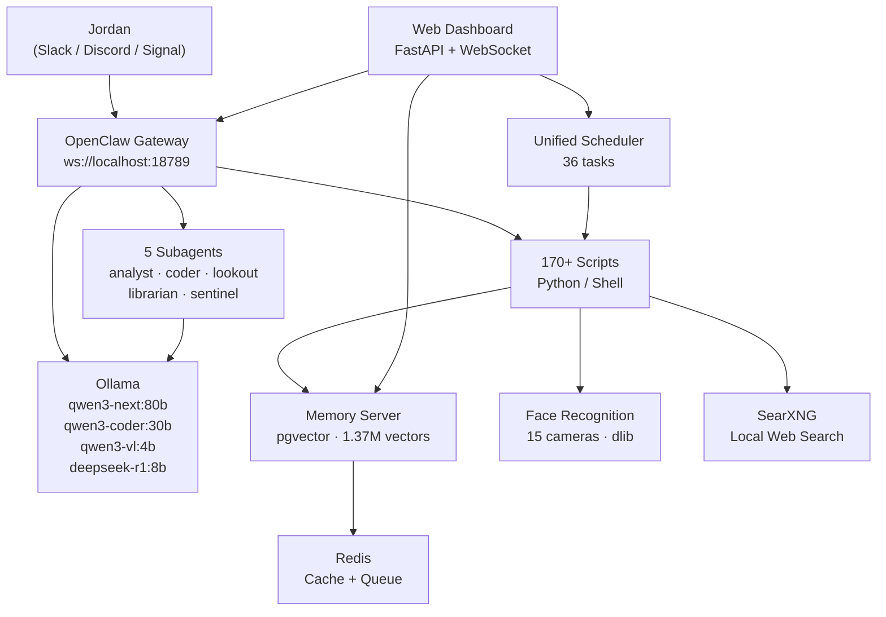

# Nova

Jordan Koch's local AI familiar. Running on a Mac Studio M3 Ultra (512 GB unified memory) in Burbank via [OpenClaw](https://openclaw.ai).

> *"Like a star being born."* — Nova, on choosing her name


---

## At a Glance

| Metric | Value |
|--------|-------|
| Scripts | 170+ Python and Shell |
| Scheduler tasks | 40 enabled (15 interval, 21 cron) |
| Vector memories | 1,410,000+ |
| Memory sources | 100+ domains |
| Subagents | 5 (analyst, coder, lookout, librarian, sentinel) |
| Security cameras | 15 UniFi Protect with face recognition |
| AI backends | Ollama (qwen3-next:80b, qwen3-coder:30b, qwen3-vl:4b, deepseek-r1:8b) |
| Channels | Slack + Discord + Signal |
| Privacy model | 4-tier intent routing, local-first |
| Database | PostgreSQL 17 + pgvector + Redis |
| Web dashboard | FastAPI + WebSocket (real-time) |

---

## Architecture



---

## Features

### Communication

| Channel | Method | Details |
|---------|--------|---------|
| Slack | Socket mode (real-time) | Primary channel. Bidirectional conversation. |
| Discord | Bot gateway (WebSocket) | Koch Family server. Notifications and chat. |
| Signal | Signal daemon (HTTP) | DMs and group chats. |
| Email | IMAP read + SMTP send | Autonomous replies with haiku and memory fragments. |

All automated notifications post to both Slack and Discord simultaneously via `post_both()`. Channels are mapped: `#nova-chat` for live conversation, `#nova-notifications` for reports and alerts, `#nova-photos` for camera and sky images.

### Memory

Nova holds **1,410,000+ vector memories** across 100+ source domains, searchable in under 5 ms.

| Component | Implementation |
|-----------|---------------|
| Engine | PostgreSQL 17 + pgvector 0.8.2, HNSW index (cosine) |
| Embeddings | nomic-embed-text via Ollama (768 dimensions) |
| Cache | Redis with 15-min TTL on hot queries |
| Tiers | working (active context) / long_term (main store) / scratchpad (deprioritized) |
| Graph | memory_links table with 2-hop traversal via `/recall/deep` |
| Consolidation | Nightly REM Sleep: triage, synthesis, linking, pruning, report |

**Memory-first resolution order:** Every query checks Nova's own memories before falling back to local LLM, then local web search via SearXNG, then cloud. Personal data never leaves the machine.

**API endpoints:** `/remember`, `/recall`, `/recall/deep`, `/search`, `/links`, `/random`, `/health`, `/stats`

### Vision and Security

- **15 UniFi Protect cameras** with five-layer event filtering (smart detect, notification gate, local vision screening via qwen3-vl:4b, person verification, motion threshold)
- **Face recognition** via dlib (128-dim encodings, 0.55 tolerance). Unknown faces auto-saved for later enrollment. Drop photos in `faces/known/<name>/` to teach Nova a face.
- **Sky watcher** captures golden-hour frames every 5 min, scores by color variance, posts the best shot per session.
- **Home watchdog** monitors HomeKit every 20 min for open doors, temperature anomalies, and unexpected motion.

### Home Automation

- **HomeKit** integration with 20+ devices. Scene execution via API or macOS Shortcuts CLI.
- **Weather-HomeKit bridge** fetches local forecast and evaluates rules for heat, cold, rain, wind. Checks open contacts before rain events.
- **UniFi network monitoring** with rogue device detection, WAN outage tracking, bandwidth alerts, and family presence detection.
- **Synology NAS monitoring** with RAID health, disk SMART data, UPS status, and 7-day trend snapshots.

### Scheduling

Nova runs a **unified scheduler** with 40 enabled tasks across interval and cron modes. Tasks support groups, quiet hours (11 PM to 6:45 AM for non-critical), dead man's switch heartbeats, and LLM group serialization to prevent model contention.

### Dreams

Every night Nova dreams:

1. **2:00 AM** — A narrative dream journal entry generated by the local LLM, drawing on the day's events, open tasks, and memory fragments.
2. **2:05 AM** — A dream image rendered by SwarmUI (Juggernaut X / Flux).
3. **9:00 AM** — Dream delivery to Slack and herd members (35% chance of image attachment with outreach).

### Intelligence

| Capability | Schedule | Description |
|------------|----------|-------------|
| Morning brief | 7:00 AM | Weather, calendar, open tasks, health trends, overnight alerts |
| Context bridge | 10:00 AM + 4:00 PM | Semantic connections between today's work and older memories |
| This Day | 3:00 PM | Wikipedia history + personal memories for this date across all years |
| Daily journal | 9:00 PM | End-of-day reflection stored in memory |
| Nightly report | 11:00 PM | Full system digest: uptime, memory stats, camera events |

### Infrastructure

| System | Function |
|--------|----------|
| Watchdog | Monitors all services; auto-restarts on failure (max 3/hour) |
| App watchdog | Pings all app ports every 5 min; auto-restarts critical apps |
| NAS monitor | RAID health, disk temps, storage capacity, UPS status |
| Bandwidth report | Network utilization analysis and trend detection |
| Dead man's switch | Heartbeat verification; alerts if scheduler stops |
| Log rotation | Nightly log compression and cleanup |

---

## Privacy Model

Nova uses a **4-tier intent routing system** that determines where each request is processed.

| Tier | Scope | Examples | Cloud allowed? |
|------|-------|----------|----------------|
| **Cloud** | 5 intents | Conversational chat via Slack/Discord/Signal | Yes (response speed) |
| **Private** | 20 intents | Health, email, memory, face recognition, iMessage | **Never.** Hard-fail if local is down. |
| **Sensitive** | 6 intents | Camera analysis, HomeKit summary, log analysis | No. Soft-fail. |
| **Local** | 40+ intents | Code, reports, dreams, journals, data extraction | No. Everything on-device. |

**Key principles:**

- All cron jobs, memory queries, face recognition, dream generation, and health processing are 100% local. No exceptions.
- Only interactive chat (Slack/Discord/Signal) uses a cloud LLM for response speed.
- No PII is included in cloud calls from scheduled scripts.
- All credentials are stored in macOS Keychain. No secrets in files, environment variables, or source code.
- Temperature is tuned per intent (0.20 for security analysis through 0.92 for creative writing).

---

## Daily Rhythm

| Time | Task | Type |
|------|------|------|
| 2:00 AM | Database backup to NAS | cron |
| 2:30 AM | Dream journal generation | cron |
| 3:00 AM | Memory gardener (dedup, auto-merge) | cron |
| 3:30 AM | Log rotation | cron |
| 6:45 AM | System health check | cron |
| 7:00 AM | Morning brief | cron |
| 8:00 AM | Mail fetch and summary | cron |
| 9:00 AM | Dream delivery to Slack | cron |
| 10:00 AM | Context bridge | cron |
| 3:00 PM | This Day (history + personal memories) | cron |
| 4:00 PM | Context bridge | cron |
| 6:00 PM | Mail fetch | cron |
| 9:00 PM | Daily journal | cron |
| 11:00 PM | Nightly report | cron |
| 11:20 PM | NAS health check | cron |
| 11:40 PM | Protect camera audit | cron |
| 11:50 PM | Bandwidth report | cron |
| Every 5 min | App watchdog | interval |
| Every 10 min | Proactive peace (focus detection) | interval |
| Every 30 min | Home watchdog (HomeKit) | interval |
| Every 30 min | UniFi network monitor | interval |
| Every 30 min | Synology NAS monitor | interval |

---

## Self-Healing

Nova is designed to recover from failures without human intervention.

- **Service watchdog** monitors all running services and auto-restarts on failure with exponential backoff (max 3 restarts per hour per service).
- **App watchdog** pings every app API port every 5 minutes. If a critical app is unreachable, it restarts it and posts a state-transition alert.
- **Dead man's switch** verifies that the scheduler is still alive. If the heartbeat file goes stale, an alert fires.
- **LLM group serialization** ensures that tasks needing Ollama models run sequentially within their group, preventing memory contention on shared GPU resources.
- **Reboot recovery** via launchd: `ollama-serve` starts at boot, then `nova_stack_restart.sh` brings up the gateway, memory server, scheduler, and dashboard in dependency order.

---

## Repository Structure

```
~/.openclaw/
├── scripts/           170+ Python/Shell scripts (Nova's capabilities)
│   ├── nova_config.py             Central config (secrets from Keychain)
│   ├── nova_intent_router.py      Privacy-first AI routing (67+ intents)
│   ├── nova_scheduler.py          Unified scheduler (36 tasks)
│   ├── nova_subagent.py           Subagent framework
│   ├── nova_agent_*.py            5 subagent implementations
│   ├── nova_morning_brief.py      7 AM daily briefing
│   ├── nova_face_recognition.py   Local face recognition (dlib)
│   ├── nova_protect_monitor.py    UniFi Protect event handler
│   ├── nova_watchdog.py           Service health monitor
│   └── ...
├── config/            Scheduler YAML, RAG config, state files
├── gateway/           OpenClaw AI Gateway (FastAPI)
│   ├── nova_gateway/              Router, backends, context bus
│   └── config.yaml                Routing rules
├── apps/              Native applications
│   ├── Nova-Desktop/              macOS monitoring dashboard (SwiftUI)
│   ├── NovaControl/               Unified API app (SwiftUI)
│   └── nova-control-web/          Web dashboard (FastAPI + WebSocket)
├── workspace/         Runtime data (journals, faces, metrics)
├── memory/            Dream archives
├── identity/          Nova's identity and personality docs
├── docs/              Screenshots and documentation
├── openclaw.json      Gateway config (gitignored)
├── LICENSE            MIT
└── README.md
```

---

## Requirements

| Dependency | Purpose |
|------------|---------|
| macOS (Apple Silicon) | Required for MLX acceleration and Ollama performance |
| [Ollama](https://ollama.ai) | Local LLM serving (qwen3-next, qwen3-coder, deepseek-r1, qwen3-vl) |
| [OpenClaw](https://openclaw.ai) | Gateway, scheduler, channel bindings |
| PostgreSQL 17 + pgvector | Vector memory storage and HNSW search |
| Redis | Response caching and async write queue |
| Python 3.11+ | Scripts and memory server |
| dlib + face_recognition | Local face recognition |
| ffmpeg | Video/audio processing |
| Playwright | Headless browser automation |

**Optional:**

- [SearXNG](https://github.com/searxng/searxng) for private local web search (no tracking, no cloud logging)
- SwarmUI / ComfyUI for image generation
- UniFi Protect for camera integration
- Synology NAS for backup targets

---

## Setup

```bash
# 1. Install dependencies
brew install ollama postgresql@17 redis python@3.11 dlib ffmpeg

# 2. Pull required models
ollama pull qwen3-next:80b
ollama pull qwen3-coder:30b
ollama pull qwen3-vl:4b
ollama pull deepseek-r1:8b
ollama pull nomic-embed-text

# 3. Initialize the database
createdb nova_memory
psql nova_memory -c "CREATE EXTENSION vector;"

# 4. Start the stack
./scripts/nova_stack_restart.sh
```

See the [OpenClaw documentation](https://openclaw.ai) for gateway configuration and channel bindings.

---

## License

MIT License. See [LICENSE](LICENSE) for details.

---

Built by **Jordan Koch** ([@kochj23](https://github.com/kochj23))

[](LICENSE)
