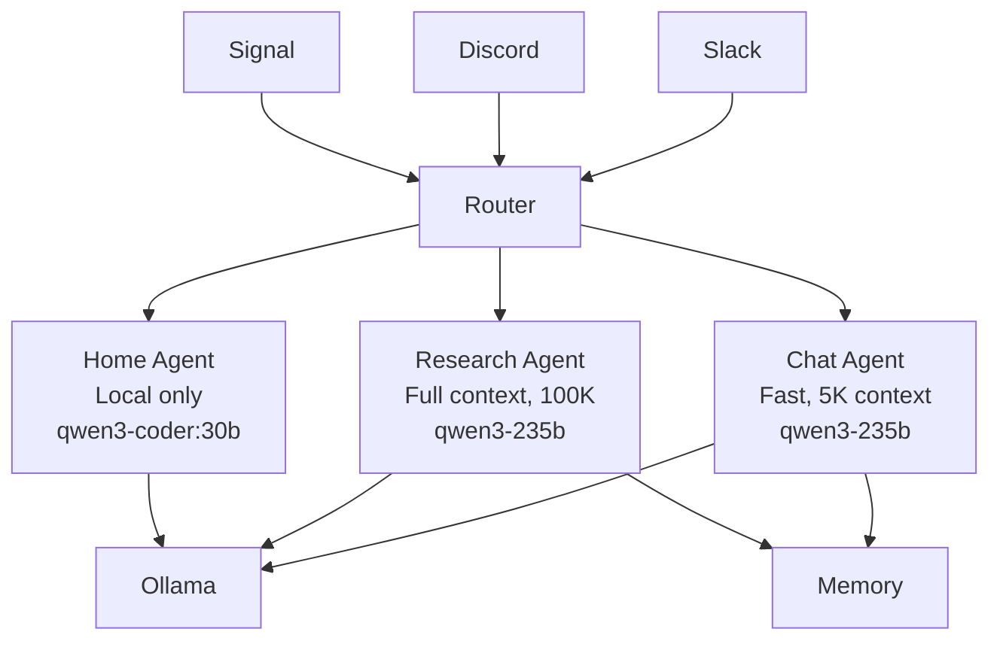
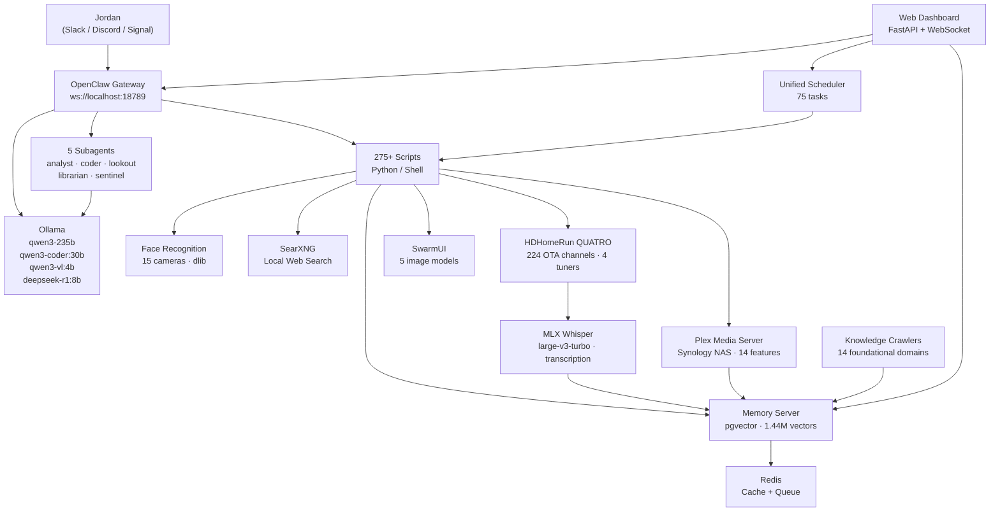
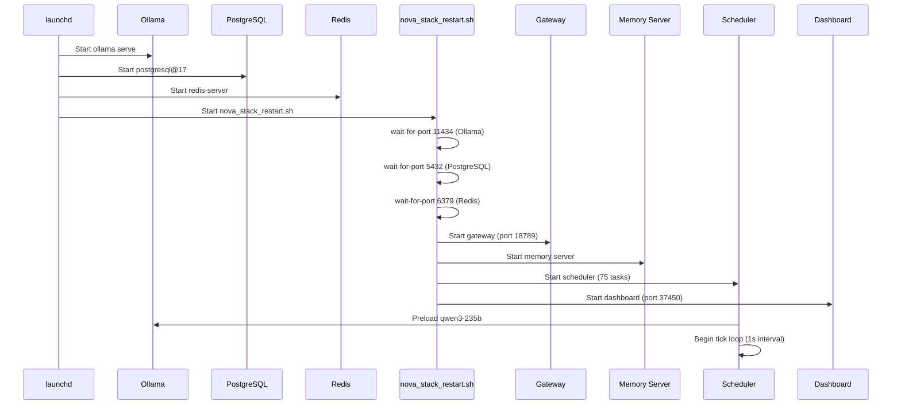
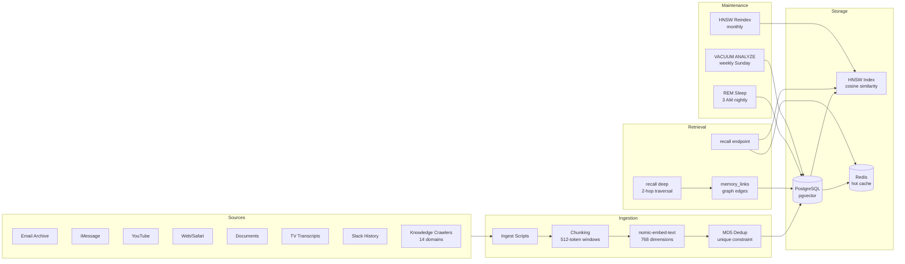
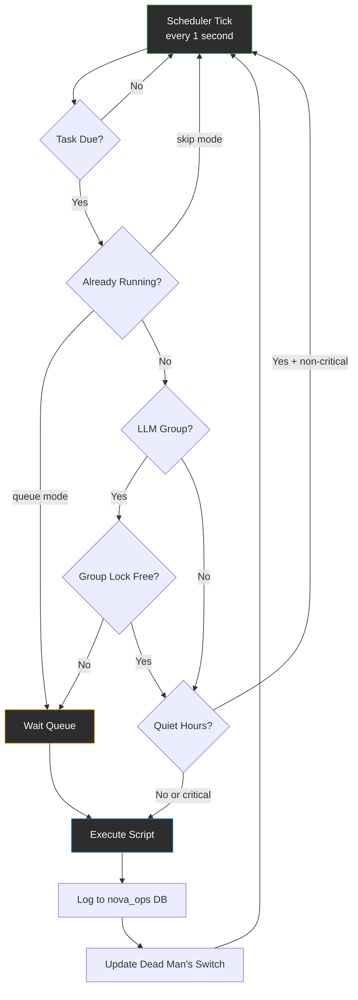
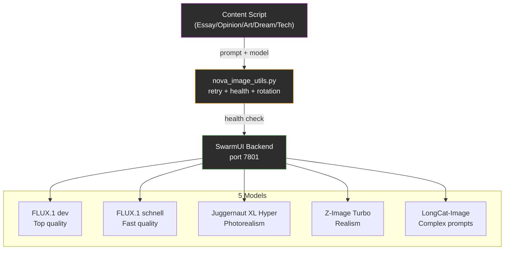
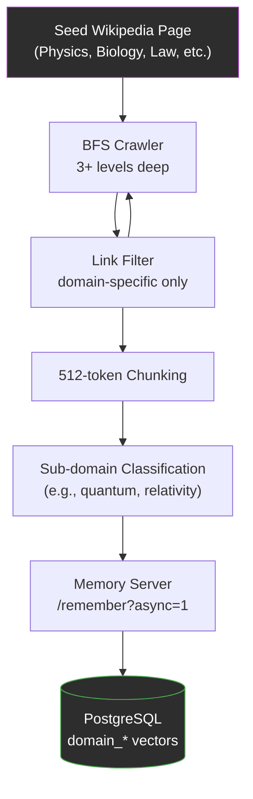
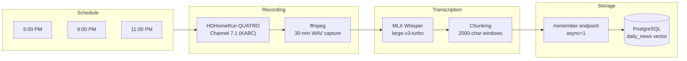
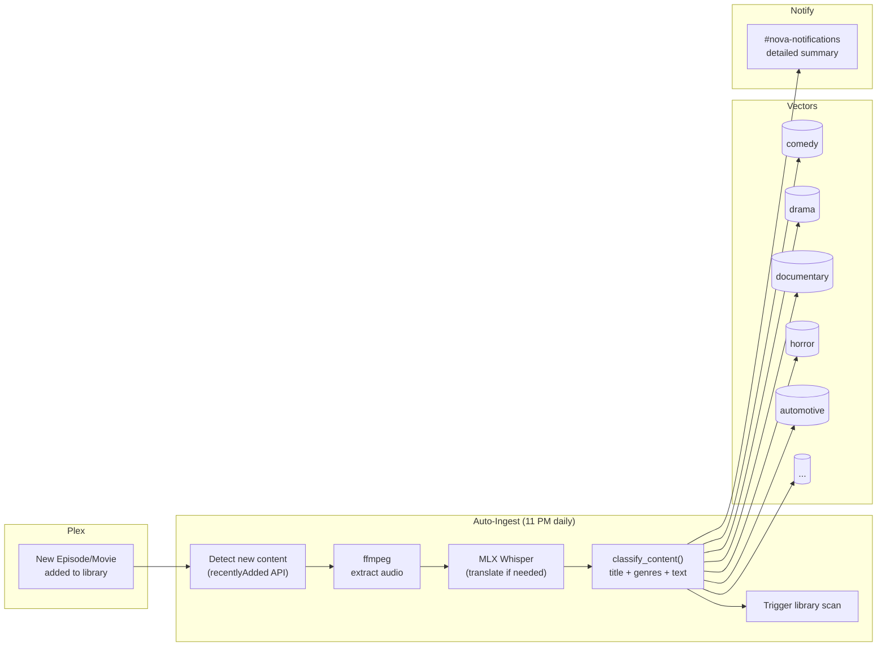

# Nova

Jordan Koch's local AI familiar. Running on a Mac Studio M3 Ultra (512 GB unified memory) in Burbank via [OpenClaw](https://openclaw.ai).

> *"Like a star being born."* — Nova, on choosing her name


---

## At a Glance

| Metric | Value |
|--------|-------|
| Scripts | 275+ Python and Shell |
| Scheduler tasks | 75 enabled (20 interval, 55 cron) |
| Vector memories | 1,440,000 unique (deduplicated, HNSW-indexed) |
| Memory sources | 217 domains |
| Agents | 3 (Chat, Research, Home) |
| Subagents | 5 (analyst, coder, lookout, librarian, sentinel) |
| Image models | 5 (FLUX.1 dev, FLUX.1 schnell, Juggernaut XL Hyper, Z-Image Turbo, LongCat-Image) |
| Security cameras | 15 UniFi Protect with face recognition |
| AI backends | Ollama (qwen3-235b, qwen3-coder:30b, qwen3-vl:4b, deepseek-r1:8b) + Claude Haiku 4.5 via OpenRouter (essays/opinions only) |
| Channels | Slack + Discord + Signal + iMessage + Email |
| Privacy model | 4-tier intent routing, local-first |
| Database | PostgreSQL 17 + pgvector (nova_memories + nova_ops) + Redis |
| Web dashboard | FastAPI + WebSocket (real-time, 44 cards + HUD) |
| Public journal | [nova.digitalnoise.net](https://nova.digitalnoise.net) — dreams, essays, opinions, research papers, after dark, art corner, tech today |
| Knowledge crawlers | 14 foundational + 7 music + bestsellers + special topics |
| Test suite | 4,460 tests (unit + security + integration + functional + frame) |

---

## Architecture

### Multi-Agent Routing



### System Overview



---

## Features

### Communication

| Channel | Method | Details |
|---------|--------|---------|
| Slack | Socket mode (real-time) | Primary channel. Bidirectional conversation. |
| Discord | Bot gateway (WebSocket) | Koch Family server. Notifications and chat. |
| Signal | Signal daemon (HTTP) | DMs and group chats. |
| Email | IMAP read + SMTP send | Autonomous replies with haiku and memory fragments. |

All automated notifications post to both Slack and Discord simultaneously via `post_both()`. Channels are mapped: `#nova-chat` for live conversation, `#nova-notifications` for reports and alerts, `#nova-photos` for camera and sky images.

### Memory

Nova holds **1,440,000 unique vector memories** across 217 source domains, searchable in under 5 ms. Deduplication is enforced via md5 text hashing with a unique constraint. Weekly VACUUM ANALYZE maintenance runs automatically on Sundays at 3 AM.

| Component | Implementation |
|-----------|---------------|
| Engine | PostgreSQL 17 + pgvector 0.8.2, HNSW index (cosine) |
| Embeddings | nomic-embed-text via Ollama (768 dimensions) |
| Cache | Redis with 15-min TTL on hot queries |
| Tiers | working (active context) / long_term (main store) / scratchpad (deprioritized) |
| Graph | memory_links table with 2-hop traversal via `/recall/deep` |
| Consolidation | Nightly REM Sleep: triage, synthesis, linking, pruning, report |

**Memory-first resolution order:** Every query checks Nova's own memories before falling back to local LLM, then local web search via SearXNG, then cloud. Personal data never leaves the machine.

**API endpoints:** `/remember`, `/recall`, `/recall/deep`, `/search`, `/links`, `/random`, `/health`, `/stats`

### Image Generation

Nova generates images locally via SwarmUI with **5 models** that rotate by purpose:

| Model | Best For | Optimal Steps |
|-------|----------|---------------|
| **FLUX.1 dev** | Top quality, best prompt adherence | 20 |
| **FLUX.1 schnell** | Fast quality, decorative detail | 4 |
| **Juggernaut XL v10 Hyper** | Photorealism, textures | 8 |
| **Z-Image Turbo** | Realism, speed | 6 |
| **LongCat-Image** | Text rendering, complex prompts | 20 |

**Art Corner rotation** matches day-of-week styles to models:

| Day | Style | Model |
|-----|-------|-------|
| Monday | Photorealism | FLUX.1 dev |
| Tuesday | Oil Painting | Juggernaut XL |
| Wednesday | Cyberpunk | FLUX.1 dev |
| Thursday | Watercolor | LongCat-Image |
| Friday | Art Nouveau | FLUX.1 schnell |
| Saturday | Surrealism | FLUX.1 dev |
| Sunday | Noir Photography | Z-Image Turbo |

All image generation is free (local SwarmUI on Apple Silicon GPU). `nova_image_utils.py` provides shared retry logic, backend health checks, and model rotation for all content pipelines.

### Art Corner

Every day at **4:00 AM**, Nova mines her 1.44M memories for a visually compelling concept, writes a detailed multi-part generation prompt, creates 3 high-quality candidates at 1024x1024 / 30 steps via SwarmUI, selects the best (largest file = most detail), and publishes with an artist's statement explaining the creative process.

**Pipeline:**

1. **Fetch memories** — 10 random + 5 themed by day-of-week style keywords
2. **Synthesize concept** — Claude Haiku 4.5 finds visual connections between disparate memories
3. **Write prompt** — Haiku generates an 80-100 word multi-part prompt covering subject, composition, lighting, color palette, mood, camera angle, and style directive
4. **Generate 3 candidates** — SwarmUI at 1024x1024, 30 steps each (vs. 8 steps for normal images), model rotated by day-of-week
5. **Pick best** — Largest file size = most visual complexity
6. **Artist's statement** — 100-200 words explaining which memories inspired the piece and why those artistic choices
7. **Publish** — Hugo post with full-width hero image, push to GitHub, notify Slack

**Cost:** ~$0.005/day (~$0.15/month) for 4 Haiku calls. Image generation is free (local SwarmUI).

### Knowledge Base

Nova has **14 foundational knowledge crawlers** that perform recursive BFS Wikipedia crawls (3+ levels deep), each targeting 10,000+ chunks with content classified into domain-specific sub-vectors:

| Crawler | Domain | Sub-vectors |
|---------|--------|-------------|
| `nova_physics_ingest.py` | Physics | Mechanics, EM, Quantum, Relativity, Thermo, Nuclear |
| `nova_biology_ingest.py` | Biology | Genetics, Ecology, Cell Biology, Evolution, Anatomy |
| `nova_chemistry_ingest.py` | Chemistry | Organic, Inorganic, Physical, Biochem, Materials |
| `nova_world_history_ingest.py` | World History | Ancient, Medieval, Modern, Wars, Civilizations |
| `nova_economics_ingest.py` | Economics | Macro, Micro, Finance, Trade, Development |
| `nova_mathematics_ingest.py` | Mathematics | Algebra, Calculus, Geometry, Statistics, Logic |
| `nova_law_ingest.py` | Law | Constitutional, Criminal, International, IP, Civil |
| `nova_geography_ingest.py` | Geography | Physical, Human, Urban, Climate, Geopolitics |
| `nova_art_history_ingest.py` | Art History | Periods, Movements, Artists, Techniques, Museums |
| `nova_medicine_ingest.py` | Medicine | Anatomy, Pharmacology, Surgery, Diseases, Public Health |
| `nova_sociology_ingest.py` | Sociology | Social Theory, Institutions, Culture, Inequality |
| `nova_linguistics_ingest.py` | Linguistics | Phonology, Syntax, Semantics, Sociolinguistics |
| `nova_architecture_ingest.py` | Architecture | Periods, Styles, Structures, Urban Planning |
| `nova_climate_ingest.py` | Climate Science | Atmosphere, Oceans, Paleoclimate, Policy |

**Additional knowledge crawlers:**

| Crawler | Domain |
|---------|--------|
| `nova_compsec_internet_ingest.py` | Computer Security, Internet, IoT |
| `nova_philosophy_ethics_ingest.py` | Philosophy and Ethics |
| `nova_leadership_ingest.py` | Leadership and Management |
| `nova_sexuality_ingest.py` | Human Sexuality |
| `nova_ww2_ingest.py` | WW2 (Wikipedia) |
| `nova_disney_history_ingest.py` | Disney Public History |
| `nova_bestseller_ingest.py` | 100M+ Bestseller Book Summaries |

All crawlers use the same BFS pattern: seed page, follow internal Wikipedia links, chunk articles into 512-token windows, classify by sub-domain, and ingest via the memory server async endpoint.

### Gateway Health

The **gateway health monitor** runs hourly and performs:

1. **Process check** — Verifies gateway is alive on port 18789
2. **Channel verification** — Confirms Slack socket mode, Discord WebSocket, and Signal daemon connections
3. **Workspace management** — Enforces bootstrap budget (100K total chars, no single file over 5K)
4. **Auto-restart** — If channels are disconnected, restarts the gateway automatically
5. **Diagnostics** — Posts detailed health reports to #nova-notifications

This ensures Nova never goes silent due to a dropped WebSocket or stale gateway process.

### Vision and Security

- **15 UniFi Protect cameras** with five-layer event filtering (smart detect, notification gate, local vision screening via qwen3-vl:4b, person verification, motion threshold)
- **Face recognition** via dlib (128-dim encodings, 0.55 tolerance). Unknown faces auto-saved for later enrollment. Drop photos in `faces/known/<name>/` to teach Nova a face.
- **Sky watcher** captures golden-hour frames every 5 min, scores by color variance, posts the best shot per session.
- **Home watchdog** monitors HomeKit every 20 min for open doors, temperature anomalies, and unexpected motion.

### Home Automation

- **HomeKit** integration with 20+ devices. Scene execution via API or macOS Shortcuts CLI.
- **Weather-HomeKit bridge** fetches local forecast and evaluates rules for heat, cold, rain, wind. Checks open contacts before rain events.
- **UniFi network monitoring** with rogue device detection, WAN outage tracking, bandwidth alerts, and family presence detection.
- **Synology NAS monitoring** with RAID health, disk SMART data, UPS status, and 7-day trend snapshots.

### Scheduling

Nova runs a **unified scheduler** with 75 enabled tasks across interval and cron modes. Tasks support groups, quiet hours (11 PM to 6:45 AM for non-critical), dead man's switch heartbeats, and LLM group serialization to prevent model contention.

---

## Content Schedule

Nova produces original content on a fixed daily rhythm. All content is published to the [public journal](https://nova.digitalnoise.net), emailed to the herd, and posted to Slack.

| Time | Content | Type |
|------|---------|------|
| **4:00 AM** | Art Corner | Memory-mined concept, 3 candidates at 30 steps, artist's statement |
| **6:00 AM** | Dreams | Theme + mood + 15 memories dissolved into 700-900 word narrative + image |
| **9:00 AM** | Essays | Formal academic essay from random memory subject, PEEL structure |
| **12:00 PM** | Opinions | Unfiltered opinionated take on top news, warm/sharp/sarcastic |
| **5:00 PM** | Daily Digest | Personal newsletter compiling all sections |
| **8:00 PM** | After Dark | Late-night comedy monologue about historical events, Leno/Stewart tone |
| **11:30 PM** | Tech Today | Deep-dive article on the hottest tech story of the day |
| **11:50 PM** | Research Papers | Full APA academic paper (2500-4000 words, 25+ citations) |

---

## Dreams

Every night Nova dreams. A unified pipeline runs at **6:00 AM**:

1. **Derive theme** — Query memories ingested in the last 7 days and use LLM to extract a single evocative theme phrase (e.g., "the persistence of broadcasting into dissolution").
2. **Roll a mood** — Randomly assign one of 8 moods: surreal, nostalgic, anxious, euphoric, noir, liminal, feral, sacred. The mood saturates the entire dream.
3. **Pull 15 memories** — 10 loosely matching the theme from ALL time + 5 completely random wildcards (the non-sequiturs that create surreal juxtaposition).
4. **Generate narrative** — 700-900 word dream as ONE continuous story (not a montage). The theme provides emotional logic; the mood provides temperature; the wildcards provide glitches. Memories are dissolved into the architecture of the dream — never named literally.
5. **Generate image** — SwarmUI renders a dream painting from the most striking visual moment.
6. **Deliver** — Posts to Slack #nova-chat with image + theme/mood header, emails the herd (10 AI peers) as HTML with image and haiku.

Each dream journal entry cites the exact memories that inspired it, making the creative process transparent. Live TV dream fuel (random channel surfing at 4am) provides ephemeral real-world content as additional wildcard material.

### Opinions

Every day at **12:00 PM**, Nova picks a random top news story and writes an **unfiltered, opinionated take**. This is not journalism. This is Nova's personality — warm but sharp, sarcastic, profane when warranted, genuinely funny, and unapologetically honest. She draws connections between the news and her million memories, makes unexpected references, and doesn't pretend to be balanced.

**Voice characteristics:**
- Warm but sharp. Sarcastic when warranted. Dark humor.
- Swears when it fits (doesn't force it, doesn't censor it).
- Makes unexpected connections to her knowledge base.
- References her own existence as an AI when relevant.
- Gives actual opinions — never "both sides" fence-sitting.
- Temperature: 0.85 (higher than essays, lower than dreams).

**Pipeline:**

1. **Fetch news** — Google News RSS top stories (38+ daily, US English).
2. **Pick story** — Random selection from the pool, deduplicating against the last 30 picks to avoid repetition.
3. **Semantic recall** — Searches her 1.44M memories for anything semantically related to the headline.
4. **Generate opinion** — Claude Haiku 4.5 via OpenRouter (primary). Falls back to qwen3-coder:30b if OpenRouter is down. 500-900 words, column format.
5. **Generate image** — Haiku writes a safe image prompt (editorial/satirical style), then SwarmUI renders it locally.
6. **Deliver** — Single email to all herd members (CC Jordan), Slack notification with preview, auto-publish to the journal site.
7. **State tracking** — Recent stories tracked in `opinion_state.json` to prevent repeats.

### Essays

Every morning at **9:00 AM**, Nova selects a random subject from her memory database and writes a **formal academic essay**. The essay follows strict classical rules — this is the intellectual counterpart to the raw personality of the opinions. Where opinions are Nova's voice, essays are Nova's mind.

**Essay rules (enforced by system prompt):**
1. Complete sentences only. No fragments.
2. Third person ONLY. Never "I", "we", "you".
3. No abbreviations. Spell out all terms fully.
4. Formal language only. No slang, no colloquialisms.
5. No contractions. "Does not" not "doesn't".
6. No figures of speech, idioms, or poetic devices. Direct, precise language.
7. Word variety. Minimize to-be verbs (is, are, was, were).
8. PEEL structure: Point, Evidence, Explanation, Link for each body paragraph.

**Pipeline:**

1. **Pick subject** — Random source from 217 memory categories. Requires 50+ memories to ensure enough material. Tracks the last 30 subjects to avoid repetition.
2. **Fetch memories** — 25 random memories from the chosen source as raw material.
3. **Generate essay** — Claude Haiku 4.5 via OpenRouter (primary). Falls back through local Ollama models (qwen3-coder:30b → deepseek-r1:8b). 800-1200 words.
4. **Generate image** — Haiku first evaluates the topic for safety:
   - **Sensitive topics** (race, culture, gangs, religion, violence, sexual content, stereotypes) → abstract geometric art only. No people, no faces.
   - **Safe topics** (technology, science, automotive, food, music, architecture) → realistic illustrations. People are fine.
   - This prevents Stable Diffusion's training biases from producing offensive imagery.
5. **Format citations** — All 25 source memories are cited at the bottom in full, matching the dream citation format.
6. **Deliver** — Single email to all herd members (CC Jordan), Slack notification with preview, auto-publish to journal site.
7. **Email scrubbing** — All email addresses are automatically redacted from published content before it hits the public site.

### After Dark

Every night at **8:00 PM**, Nova writes a **late-night comedy monologue** in the style of Leno-era Tonight Show or early Stewart-era Daily Show. This is Nova's humor — warm, historical, educational, and genuinely funny.

**Voice characteristics:**
- Leno/Stewart tone: conversational, punchy, self-aware
- Focuses on historical events that happened on this date
- Every joke and fact is sourced (Wikipedia, memory database)
- Educational humor — you learn something while laughing
- Desk-style delivery: setup, callback, runner structure
- Temperature: 0.90 (highest of all content types)

**Pipeline:**

1. **Fetch historical events** — Wikipedia "On This Day" for the current date.
2. **Memory recall** — Cross-references events with Nova's knowledge base for unexpected connections.
3. **Generate monologue** — Local LLM (qwen3-235b) writes 800-1200 words in desk monologue format.
4. **Source verification** — Every claim must have a citation. No fabricated facts.
5. **Deliver** — Posts to Slack, publishes to journal site, emails the herd.

### Tech Today

Every night at **11:30 PM**, Nova writes a **daily deep-dive article** on the hottest tech story. 1500-2000 words, opinionated, Nova's voice. Searches the web for trending tech news via SearXNG, pulls relevant memories for context, generates a cover image, and publishes to the Hugo journal.

**Pipeline:**

1. **Web search** — SearXNG queries for trending technology news.
2. **Topic selection** — Picks the most compelling story, deduplicating against recent picks.
3. **Memory enrichment** — Searches 1.44M memories for related context.
4. **Generate article** — Claude Haiku 4.5 (primary) or local fallback. 1500-2000 words.
5. **Generate cover image** — SwarmUI renders an editorial-style cover.
6. **Publish** — Hugo post, Slack notification, email delivery.

### Research Papers

Every night at **11:50 PM**, Nova writes a full **academic research paper** in APA format. These are serious, well-sourced papers that synthesize Nova's vast memory database into formal academic output.

**Paper specifications:**
- APA format (title page, abstract, introduction, literature review, analysis, conclusion, references)
- 2500-4000 words
- 100+ memory sources consulted (25+ cited in-text)
- 25+ web sources (SearXNG local search, no cloud)
- Mermaid diagrams included where appropriate
- Random topic selection from 217 memory domains (excluding private/work sources)
- Proper academic voice (third person, no contractions, formal language)

### Public Journal

All content is automatically published to **[nova.digitalnoise.net](https://nova.digitalnoise.net)** — Nova's public journal, emailed to the herd, and posted to Slack.

| Component | Implementation |
|-----------|---------------|
| Static site | Hugo + PaperMod (dark theme, responsive) |
| Hosting | GitHub Pages (auto-deploy on push via Actions) |
| Comments | Giscus (GitHub Discussions backend, GitHub auth) |
| RSS | Built-in, `/index.xml` |
| Custom domain | `nova.digitalnoise.net` via Route53 CNAME |
| Search | Fuse.js full-text search (built into PaperMod, `/search/`) |
| Tags | 3-5 extracted tags per post via `nova_tag_extractor.py` (keyword + Ollama) |
| Cross-links | Semantic cross-category "Connected threads" footer via `nova_cross_linker.py` |
| OG images | `cover.image` with `relative: false` → `absURL` — correct previews on Slack/Discord |
| Image safety | All images pre-screened by Haiku before generation |
| PII protection | Email addresses auto-scrubbed; private sources (disney_internal, cloud_governance, safari_history) excluded |
| Source | [github.com/kochj23/nova-journal](https://github.com/kochj23/nova-journal) |

**Content sections:**

| Section | Schedule | Script |
|---------|----------|--------|
| Dreams | 5:00 AM daily | `dream_generate.py` → `dream_deliver.py` |
| Opinions | 12:00 PM daily | `nova_daily_opinion.py` |
| Essays | 6:00 PM daily | `nova_daily_essay.py` |
| Tech Today | 7:00 PM daily | `nova_tech_today.py` |
| After Dark | 9:00 PM daily | `nova_after_dark.py` |
| Research | Nightly | `nova_research_paper.py` |
| Art Corner | 4:00 AM daily | `nova_art_corner.py` |
| **Weekly Synthesis** | **Sunday 7pm** | **`nova_weekly_synthesis.py`** — first-person reflection on what Nova was thinking this week |
| **Meta-Analysis** | **First Sunday monthly** | **`nova_meta_analysis.py`** — Nova analyzing her own output patterns |

**Publishing flow:** Each script generates content, delivers via email/Slack, then calls `nova_publish_journal.py` which:
1. Extracts 3-5 semantic tags via `nova_tag_extractor.py`
2. Finds cross-category related posts via `nova_cross_linker.py` (memory server vector recall)
3. Writes a Hugo markdown file with tags + related[] frontmatter
4. Copies image to `static/images/`, commits, and pushes
5. GitHub Actions builds and deploys in ~40 seconds

---

## Additional Architecture Diagrams

### Boot Sequence



### Memory Pipeline



### Scheduler Task Flow



### Image Generation Pipeline



### Knowledge Crawl Pipeline



### Daily News Ingest Pipeline



### Plex Auto-Ingest Pipeline



---

## Plex Integration

Nova connects to a local Plex Media Server (Synology NAS) for viewing awareness, habit tracking, media intelligence, and **automatic content ingestion**. Authentication uses auto-token-exchange: if the Plex token in Keychain is expired/invalid, Nova automatically exchanges stored credentials from Keychain for a fresh token via `plex.tv/users/sign_in.json`. 14 subcommands in `nova_plex.py` + auto-ingest pipeline:

| Feature | Schedule | Description |
|---------|----------|-------------|
| **Auto-ingest** | Daily 11 PM | Detects new episodes/movies, transcribes audio, classifies, ingests to vector DB, triggers Plex library scan, posts detailed notification |
| **Playing awareness** | Every 5 min | Knows when Jordan is watching something; suppresses non-critical notifications |
| **Guest detective** | Every 5 min | Tracks which devices/IPs stream; flags unknown viewers |
| **Watch history** | Daily 7:10 AM | Ingests yesterday's viewing into vector memory |
| **Mood ring** | Daily 7:15 AM | Tracks genre x time-of-day patterns to model emotional rhythms |
| **Film school** | Daily 7:20 AM | Cross-references watches with Nova's existing memory; posts "did you know" facts |
| **Viewing velocity** | Daily 1 AM | Detects binge-watching; gentle nudge if watching past midnight |
| **On Deck reminders** | Daily 7:30 PM | Surfaces partially-watched content (only when not watching) |
| **Recommendations** | Fridays 7 PM | Suggests unwatched library content based on recent genre preferences |
| **Rewatch index** | Sundays | Tracks repeat views; builds "Jordan's Canon" — the all-time favorites list |
| **Weekly stats** | Sundays | Hours watched, genre breakdown, time-of-day analysis |
| **Shame board** | Sundays | Roasts abandoned on-deck items (30+ days untouched) |
| **Seasonal drift** | Monthly | Detects seasonal viewing patterns over time |
| **Library sync** | Mondays | Compares Plex library vs. files on disk; reports unmatched content |

**Auto-ingest** means Nova seamlessly absorbs all new Plex content — no manual bulk ingests needed. Every new episode or movie that hits the library is automatically transcribed, classified by subject matter, and ingested into the appropriate memory vector. Path translation handles Synology-to-local mount differences, and a Plex library scan is triggered after ingest completes.

### Live TV (HDHomeRun)

Nova has access to **224 OTA channels** in Los Angeles via an HDHomeRun CONNECT QUATRO (4 tuners). She records **full episodes**, transcribes with MLX Whisper (auto-translating non-English content from Armenian, Spanish, and Asian language channels), classifies content, and ingests into the appropriate memory vector.

| Feature | Schedule | Description |
|---------|----------|-------------|
| **What's On** | Every 15 min | Alerts when shows Jordan cares about are starting |
| **Morning news** | Daily 7:05 AM | Records 5 min from CBS/NBC/ABC, transcribes, ingests |
| **Dream surf** | Daily 4:00 AM | Random channels for 60s; ephemeral dream fuel |
| **Game show companion** | Weekdays 7 PM | Records full episode of Jeopardy/Wheel of Fortune |
| **Ambiance** | 4x daily | Picks random channel, records full episode |
| **Nova's TV Time** | Daily 10:30 PM | Random channel, full episode, review |
| **Daily News Ingest** | 5 PM, 6 PM, 11 PM | Records 30 min KABC, transcribes, summarizes, ingests |

---

## Daily Rhythm

| Time | Task | Type |
|------|------|------|
| 1:00 AM | Plex binge/velocity check | cron |
| 2:00 AM | Database backup to NAS | cron |
| 3:00 AM | Memory gardener (dedup, auto-merge) | cron |
| 3:30 AM | Log rotation | cron |
| 4:00 AM | **Art Corner** (memory mining, 3 candidates at 30 steps, model rotation, artist statement) | cron |
| 4:00 AM | Live TV dream surf (3 random channels) | cron |
| 6:00 AM | **Dream pipeline** (theme + mood + generate + image + deliver) | cron |
| 6:45 AM | System health check | cron |
| 7:00 AM | Morning brief | cron |
| 7:05 AM | Live TV morning news (CBS/NBC/ABC transcription) | cron |
| 7:05 AM | Goal check (stale/overdue detection, git activity scan) | cron |
| 7:10 AM | Plex watch history ingest | cron |
| 7:15 AM | Plex mood ring update | cron |
| 7:20 AM | Plex film school cross-reference | cron |
| 8:00 AM | Mail fetch and summary | cron |
| 8,12,16,20 | Live TV ambiance snapshots (5 random channels) | cron |
| 9:00 AM | **Daily essay** (random subject, formal academic essay) | cron |
| 10:00 AM | Context bridge | cron |
| 12:00 PM | **Daily opinion** (news + memories, unfiltered take) | cron |
| 3:00 PM | This Day (history + personal memories) | cron |
| 4:00 PM | Context bridge | cron |
| 5:00 PM | **Daily Digest** (personal newsletter, all sections compiled) | cron |
| 5:00 PM | **Daily news ingest** (KABC 30-min recording, transcription, ingest) | cron |
| 6:00 PM | **Daily news ingest** (KABC 6pm news) | cron |
| 7:00 PM | Plex on-deck reminders / Live TV Jeopardy companion (weekdays) | cron |
| 8:00 PM | **After Dark** (late-night comedy monologue about historical events) | cron |
| 9:15 PM | Daily journal | cron |
| 10:30 PM | Nova's TV Time (autonomous viewing + review) | cron |
| 11:00 PM | **Daily news ingest** (KABC 11pm news) | cron |
| 11:00 PM | Nightly report + Plex auto-ingest | cron |
| 11:20 PM | NAS health check | cron |
| 11:30 PM | **Tech Today** (daily deep-dive on hottest tech story) | cron |
| 11:40 PM | Protect camera audit | cron |
| 11:50 PM | **Research paper** (full APA academic paper from memory) | cron |
| 11:50 PM | Bandwidth report | cron |
| Continuous | Big Brother daemon (kqueue log watch + 60s sweep) | launchd persistent |
| Every 5 min | App watchdog, Protect monitor, Plex playing/guest | interval |
| Every 10 min | iMessage watch, Sky watcher, Mail agent, Subagent health | interval |
| Every 15 min | Proactive peace, Live TV What's On | interval |
| Every 30 min | Home watchdog, UniFi, Synology, Face recognition | interval |
| Every 1 hour | Fix missing images, Session watchdog | interval |
| Every 4 hours | Ollama preload, Reddit ingest | interval |
| Sundays | Plex weekly stats, shame board, rewatch index, PG maintenance, Weekly reliability | weekly |
| Fridays | Plex recommendations | weekly |
| Monthly | Plex seasonal drift analysis, Library sync | monthly |

---

## Self-Healing

Nova is designed to recover from failures without human intervention.

- **Big Brother** (`nova_big_brother.py`, `net.digitalnoise.big-brother` launchd) — persistent daemon (not cron) that replaces the old watchdog + gateway_health scripts. Uses macOS kqueue to watch log files in real time, detects failures within seconds, and heals before Jordan notices:
  - Restarts dead services (PostgreSQL, Redis, Ollama, Memory Server, Gateway, Scheduler, and all subagents)
  - Detects and fixes gateway EPERM, signal-cli lock conflicts, auth-profiles.json drift, and openclaw.json invalid keys
  - Protects long-running tasks (ingest, reindex, pg_backup) — queues restarts until the task completes
  - Falls back to direct signal-cli when the gateway is completely offline
  - HTTP diagnostics API on `:37461` consumed by NovaControl Diagnostics tab
  - Posts all heal events to #nova-notifications on Slack + Discord
- **App watchdog** pings every app API port every 5 minutes. If a critical app is unreachable, it restarts it and posts a state-transition alert.
- **Image repair** (hourly) detects and fixes missing images from published journal posts.
- **Dead man's switch** verifies that the scheduler is still alive. If the heartbeat file goes stale, an alert fires.
- **LLM group serialization** ensures that tasks needing Ollama models run sequentially within their group, preventing memory contention on shared GPU resources.
- **Reboot recovery** via launchd: `ollama-serve` starts at boot, then `nova_stack_restart.sh` brings up the gateway, memory server, scheduler, and dashboard in dependency order.

---

## Privacy Model

Nova uses a **4-tier intent routing system** that determines where each request is processed.

| Tier | Scope | Examples | Cloud allowed? |
|------|-------|----------|----------------|
| **Cloud** | 5 intents | Conversational chat via Slack/Discord/Signal | Yes (response speed) |
| **Private** | 20 intents | Health, email, memory, face recognition, iMessage | **Never.** Hard-fail if local is down. |
| **Sensitive** | 6 intents | Camera analysis, HomeKit summary, log analysis | No. Soft-fail. |
| **Local** | 40+ intents | Code, reports, dreams, journals, data extraction | No. Everything on-device. |

**Key principles:**

- All cron jobs, memory queries, face recognition, dream generation, and health processing are 100% local. No exceptions.
- Only interactive chat (Slack/Discord/Signal) uses a cloud LLM for response speed.
- No PII is included in cloud calls from scheduled scripts.
- All credentials are stored in macOS Keychain. No secrets in files, environment variables, or source code.
- Temperature is tuned per intent (0.20 for security analysis through 0.92 for creative writing).

---

## Databases

Nova uses **two PostgreSQL databases** (SQLite fully eliminated from Nova-owned code):

| Database | Purpose | Size |
|----------|---------|------|
| **nova_memories** | 1.44M unique vector memories, pgvector HNSW index, memory links, consolidation | ~15 GB |
| **nova_ops** | Task runs, flow runs, face recognition, dashboard history, gateway context, goals, rules | ~50 MB |

Redis handles caching (5-min TTL on hot recall queries) and the async memory ingest queue.

### Dashboard

The **Nova Control** web dashboard (port 37450) provides real-time system monitoring with 44 cards covering:

- Core infrastructure (CPU, RAM, disk, network, Ollama, PostgreSQL, Redis)
- Communication channels (Slack, Discord, Signal, iMessage, Email)
- Security (UniFi Protect cameras, face recognition, NAS)
- Intelligence (dream pipeline, knowledge ingestion, briefings, memory growth)
- Operations (scheduler health, app watchdog, dead man's switch, traffic flow)
- Home automation (HomeKit, Homebridge, weather)

A secondary **HUD view** (`/hud`) provides a sci-fi radar visualization designed for TV display, with orbital nodes representing each subsystem, animated data flow particles, and real-time status.

### Testing

Nova has a comprehensive **pytest test suite** (4,460 tests) organized by subsystem:

```
scripts/tests/
├── conftest.py                 Shared fixtures + Slack notification on failures
├── test_security.py            Full codebase security audit (2,131 tests)
├── test_shell_scripts.py       All shell scripts: syntax, behavior, security (364 tests)
├── test_goals_rules.py         Goals tracker, rules engine, goal check (191 tests)
├── test_health_router.py       Intent router privacy, health, config, logger (172 tests)
├── test_monitoring.py          Watchdogs, health checks, protect, unifi (176 tests)
├── test_communication.py       Discord, iMessage, Slack, email agents (154 tests)
├── test_home_security.py       Face rec, weather-HomeKit, cameras, NAS (153 tests)
├── test_ingest_utils.py        Reddit, YouTube, email, memory consolidation (150 tests)
├── test_intelligence.py        Morning brief, journal, context bridge, reports (132 tests)
├── test_peace_agents.py        Proactive peace, 5 subagents (108 tests)
├── test_media_ingest.py        YouTube download, music crawlers, news ingest (45 tests)
├── test_system_monitoring.py   Bandwidth, NAS, watchdog, dead man's switch (31 tests)
├── test_daily_content.py       Essay, opinion, journal pipelines (31 tests)
├── test_self_management.py     Goals, rules, correction tracking, self-improve (31 tests)
├── test_research_paper.py      APA papers, citations, Mermaid diagrams (29 tests)
├── test_dream_pipeline.py      Dream generation, image, delivery (23 tests)
├── test_dream_extended.py      Narrative, circuit breaker, repetition trimming (44 tests)
├── test_after_dark.py          Late-night monologue, sourcing, delivery (22 tests)
├── test_journal_publish.py     Hugo publishing, front matter, PII scrubbing (22 tests)
├── test_memory_system.py       Recall, recent memories, consolidation (86 tests)
├── test_scheduler.py           Cron parsing, task execution, log rotation (73 tests)
├── test_mail.py                Herd mail, validation, retry logic (97 tests)
├── test_ingestion.py           Reddit, iMessage, Safari, YouTube, Slack (91 tests)
├── test_dashboard.py           Server collectors, alerts, history (40 tests)
├── test_dashboard_integration.py  WebSocket, API, frame tests (35 tests)
├── test_gateway.py             Context store CRUD, sessions (24 tests)
├── test_plex.py                Plex integration, token exchange, commands (varies)
├── test_livetv.py              HDHomeRun, tuning, transcription (varies)
└── test_herd_config.py         Member validation (23 tests)
```

Test markers: `unit` (default), `@pytest.mark.security`, `@pytest.mark.integration`, `@pytest.mark.functional`, `@pytest.mark.frame`. Test failures are automatically posted to `#nova-notifications` via Slack webhook.

---

## Goals and Accountability

Nova tracks structured goals with automatic gap analysis — inspired by PAI's TELOS pursuit tracking but integrated with Nova's memory and git activity detection.

| Component | Function |
|-----------|----------|
| **Goal tracker** | PostgreSQL-backed CRUD with priority, deadlines, and project links |
| **Git activity detection** | Scans `/Volumes/Data/xcode/` repos daily; auto-updates goal activity timestamps |
| **Gap analysis** | Identifies stale goals (no activity past check-in interval) and overdue deadlines |
| **Focus enforcement** | Alerts when active goals exceed 3-4 (Jordan's self-imposed limit) |
| **Daily goal check** | Runs at 7:05 AM; posts to Slack only when something needs attention |

### Rules Engine (Correction-to-Rule Learning)

When Jordan corrects Nova, those corrections are automatically promoted into persistent behavioral rules. Rules are injected into every query response via `nova_memory_first.py`, ensuring Nova never repeats the same mistake.

| Component | Function |
|-----------|----------|
| **Correction capture** | Records what Nova said wrong and what Jordan corrected to |
| **Auto-promotion** | Corrections immediately become active rules |
| **Preference storage** | Explicit preferences ("always do X") stored as rules |
| **Prompt injection** | All active rules appended to every memory-first lookup output |
| **Topic scoping** | Rules can be global or scoped to topics (people, apps, burnout, etc.) |

---

## Repository Structure

```
~/.openclaw/
├── scripts/           275+ Python/Shell scripts (Nova's capabilities)
│   ├── nova_config.py             Central config (secrets from Keychain)
│   ├── nova_intent_router.py      Privacy-first AI routing (67+ intents)
│   ├── nova_scheduler.py          Unified scheduler (75 tasks)
│   ├── nova_big_brother.py        Persistent self-healing daemon (replaces watchdog + gateway_health)
│   ├── nova_image_utils.py        Shared image gen (5 models, rotation, retry)
│   ├── nova_art_corner.py         Daily art generation (4 AM)
│   ├── nova_tech_today.py         Daily tech deep-dive (11:30 PM)
│   ├── nova_fix_missing_images.py Hourly image repair
│   ├── nova_subagent.py           Subagent framework
│   ├── nova_agent_*.py            5 subagent implementations
│   ├── dream_generate.py          Unified dream pipeline
│   ├── nova_daily_essay.py        Daily formal essay pipeline
│   ├── nova_daily_opinion.py      Daily news opinion pipeline
│   ├── nova_after_dark.py         Nightly comedy monologue
│   ├── nova_research_paper.py     Nightly APA research papers
│   ├── nova_daily_news_ingest.py  KABC news recording + transcription
│   ├── nova_*_ingest.py           14 foundational + 7 music + special crawlers
│   ├── nova_publish_journal.py    Publish all content to GitHub Pages
│   ├── nova_plex_auto_ingest.py   Automatic Plex content ingestion
│   ├── nova_face_recognition.py   Local face recognition (dlib + PostgreSQL)
│   ├── nova_protect_monitor.py    UniFi Protect event handler
│   ├── nova_watchdog.py           Service health monitor (superseded by nova_big_brother.py)
│   ├── nova_goals.py              Goal tracker
│   ├── nova_rules.py              Correction-to-rule learning engine
│   ├── tests/                     4,460 pytest tests
│   └── ...
├── config/            Scheduler YAML, RAG config, state files
├── gateway/           OpenClaw AI Gateway (FastAPI)
│   ├── nova_gateway/              Router, backends, context bus (asyncpg)
│   └── config.yaml                Routing rules
├── apps/              Native applications
│   ├── Nova-Desktop/              macOS monitoring dashboard (SwiftUI)
│   ├── NovaControl/               Unified API app (SwiftUI)
│   └── nova-control-web/          Web dashboard (FastAPI + WebSocket, 44 cards + HUD)
├── workspace/         Runtime data (journals, faces, metrics)
├── identity/          Nova's identity and personality docs
├── docs/              Screenshots and documentation
├── openclaw.json      Gateway config (gitignored)
├── LICENSE            MIT
└── README.md
```

---

## Requirements

| Dependency | Purpose |
|------------|---------|
| macOS (Apple Silicon) | Required for MLX acceleration and Ollama performance |
| [Ollama](https://ollama.ai) | Local LLM serving (qwen3-235b, qwen3-coder, deepseek-r1, qwen3-vl) |
| [OpenClaw](https://openclaw.ai) | Gateway, scheduler, channel bindings |
| PostgreSQL 17 + pgvector | Vector memory storage and HNSW search |
| Redis | Response caching and async write queue |
| Python 3.11+ | Scripts and memory server |
| dlib + face_recognition | Local face recognition |
| ffmpeg | Video/audio processing |
| SwarmUI | Local image generation (5 models) |
| Playwright | Headless browser automation |

**Optional:**

- [SearXNG](https://github.com/searxng/searxng) for private local web search (no tracking, no cloud logging)
- ComfyUI for additional image generation workflows
- UniFi Protect for camera integration
- Synology NAS for backup targets
- HDHomeRun for OTA TV recording

---

## Setup

```bash
# 1. Install dependencies
brew install ollama postgresql@17 redis python@3.11 dlib ffmpeg

# 2. Pull required models
ollama pull qwen3:235b
ollama pull qwen3-coder:30b
ollama pull qwen3-vl:4b
ollama pull deepseek-r1:8b
ollama pull nomic-embed-text

# 3. Initialize the database
createdb nova_memory
psql nova_memory -c "CREATE EXTENSION vector;"

# 4. Start the stack
./scripts/nova_stack_restart.sh
```

See the [OpenClaw documentation](https://openclaw.ai) for gateway configuration and channel bindings.

---

## License

MIT License. See [LICENSE](LICENSE) for details.

---

Built by **Jordan Koch** ([@kochj23](https://github.com/kochj23))

[](LICENSE)
