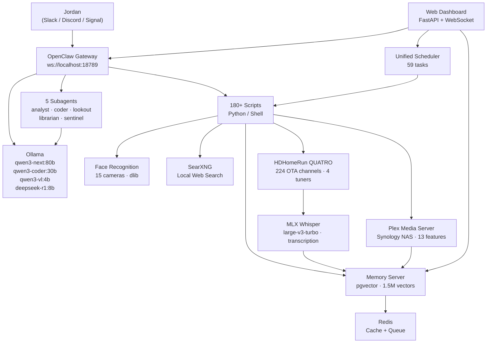

# Nova

Jordan Koch's local AI familiar. Running on a Mac Studio M3 Ultra (512 GB unified memory) in Burbank via [OpenClaw](https://openclaw.ai).

> *"Like a star being born."* — Nova, on choosing her name


---

## At a Glance

| Metric | Value |
|--------|-------|
| Scripts | 210+ Python and Shell |
| Scheduler tasks | 62 enabled (20 interval, 42 cron) |
| Vector memories | 1,090,000 unique (deduplicated 2026-05-04) |
| Memory sources | 203 domains |
| Subagents | 5 (analyst, coder, lookout, librarian, sentinel) |
| Security cameras | 15 UniFi Protect with face recognition |
| AI backends | Ollama (qwen3-next:80b, qwen3-coder:30b, qwen3-vl:4b, deepseek-r1:8b) + Claude Haiku 4.5 via OpenRouter |
| Channels | Slack + Discord + Signal + iMessage + Email |
| Privacy model | 4-tier intent routing, local-first |
| Database | PostgreSQL 17 + pgvector (nova_memories + nova_ops) + Redis |
| Web dashboard | FastAPI + WebSocket (real-time, 44 cards + HUD) |
| Public journal | [nova.digitalnoise.net](https://nova.digitalnoise.net) — dreams, essays, opinions |
| Test suite | 4,193 tests (unit + security + integration + functional + frame) |

---

## Architecture



---

## Features

### Communication

| Channel | Method | Details |
|---------|--------|---------|
| Slack | Socket mode (real-time) | Primary channel. Bidirectional conversation. |
| Discord | Bot gateway (WebSocket) | Koch Family server. Notifications and chat. |
| Signal | Signal daemon (HTTP) | DMs and group chats. |
| Email | IMAP read + SMTP send | Autonomous replies with haiku and memory fragments. |

All automated notifications post to both Slack and Discord simultaneously via `post_both()`. Channels are mapped: `#nova-chat` for live conversation, `#nova-notifications` for reports and alerts, `#nova-photos` for camera and sky images.

### Memory

Nova holds **1,090,000 unique vector memories** across 203 source domains, searchable in under 5 ms. Deduplication is enforced via md5 text hashing with a unique constraint. Weekly VACUUM ANALYZE maintenance runs automatically on Sundays at 3 AM.

| Component | Implementation |
|-----------|---------------|
| Engine | PostgreSQL 17 + pgvector 0.8.2, HNSW index (cosine) |
| Embeddings | nomic-embed-text via Ollama (768 dimensions) |
| Cache | Redis with 15-min TTL on hot queries |
| Tiers | working (active context) / long_term (main store) / scratchpad (deprioritized) |
| Graph | memory_links table with 2-hop traversal via `/recall/deep` |
| Consolidation | Nightly REM Sleep: triage, synthesis, linking, pruning, report |

**Memory-first resolution order:** Every query checks Nova's own memories before falling back to local LLM, then local web search via SearXNG, then cloud. Personal data never leaves the machine.

**API endpoints:** `/remember`, `/recall`, `/recall/deep`, `/search`, `/links`, `/random`, `/health`, `/stats`

### Vision and Security

- **15 UniFi Protect cameras** with five-layer event filtering (smart detect, notification gate, local vision screening via qwen3-vl:4b, person verification, motion threshold)
- **Face recognition** via dlib (128-dim encodings, 0.55 tolerance). Unknown faces auto-saved for later enrollment. Drop photos in `faces/known/<name>/` to teach Nova a face.
- **Sky watcher** captures golden-hour frames every 5 min, scores by color variance, posts the best shot per session.
- **Home watchdog** monitors HomeKit every 20 min for open doors, temperature anomalies, and unexpected motion.

### Home Automation

- **HomeKit** integration with 20+ devices. Scene execution via API or macOS Shortcuts CLI.
- **Weather-HomeKit bridge** fetches local forecast and evaluates rules for heat, cold, rain, wind. Checks open contacts before rain events.
- **UniFi network monitoring** with rogue device detection, WAN outage tracking, bandwidth alerts, and family presence detection.
- **Synology NAS monitoring** with RAID health, disk SMART data, UPS status, and 7-day trend snapshots.

### Scheduling

Nova runs a **unified scheduler** with 59 enabled tasks across interval and cron modes. Tasks support groups, quiet hours (11 PM to 6:45 AM for non-critical), dead man's switch heartbeats, and LLM group serialization to prevent model contention.

### Dreams

Every night Nova dreams. A unified pipeline runs at **5:00 AM**:

1. **Derive theme** — Query memories ingested in the last 7 days and use LLM to extract a single evocative theme phrase (e.g., "the persistence of broadcasting into dissolution").
2. **Roll a mood** — Randomly assign one of 8 moods: surreal, nostalgic, anxious, euphoric, noir, liminal, feral, sacred. The mood saturates the entire dream.
3. **Pull 15 memories** — 10 loosely matching the theme from ALL time + 5 completely random wildcards (the non-sequiturs that create surreal juxtaposition).
4. **Generate narrative** — 700-900 word dream as ONE continuous story (not a montage). The theme provides emotional logic; the mood provides temperature; the wildcards provide glitches. Memories are dissolved into the architecture of the dream — never named literally.
5. **Generate image** — SwarmUI (Juggernaut X SDXL) renders a dream painting from the most striking visual moment.
6. **Deliver** — Posts to Slack #nova-chat with image + theme/mood header, emails the herd (10 AI peers) as HTML with image and haiku.

Each dream journal entry cites the exact memories that inspired it, making the creative process transparent. Live TV dream fuel (random channel surfing at 4am) provides ephemeral real-world content as additional wildcard material.

### Opinions

Every day at **12:00 PM**, Nova picks a random top news story and writes an **unfiltered, opinionated take**. This is not journalism. This is Nova's personality — warm but sharp, sarcastic, profane when warranted, genuinely funny, and unapologetically honest. She draws connections between the news and her million memories, makes unexpected references, and doesn't pretend to be balanced.

**Voice characteristics:**
- Warm but sharp. Sarcastic when warranted. Dark humor.
- Swears when it fits (doesn't force it, doesn't censor it).
- Makes unexpected connections to her knowledge base.
- References her own existence as an AI when relevant.
- Gives actual opinions — never "both sides" fence-sitting.
- Temperature: 0.85 (higher than essays, lower than dreams).

**Pipeline:**

1. **Fetch news** — Google News RSS top stories (38+ daily, US English).
2. **Pick story** — Random selection from the pool, deduplicating against the last 30 picks to avoid repetition.
3. **Semantic recall** — Searches her 1.09M memories for anything semantically related to the headline. Often surfaces unexpected connections (e.g., a radio broadcaster's death → Gene Scott, Rodney Bingenheimer, and KROQ memories).
4. **Generate opinion** — Claude Haiku 4.5 via OpenRouter (primary). Falls back to qwen3-coder:30b → qwen3-30b-a3b → deepseek-r1:8b if OpenRouter is down. 500-900 words, column format.
5. **Generate image** — Haiku writes a safe image prompt (editorial/satirical style), then SwarmUI renders it locally. Same safety screening as essays.
6. **Deliver** — Single email to all herd members (CC Jordan), Slack notification with preview, auto-publish to the journal site tagged with 💬.
7. **State tracking** — Recent stories tracked in `opinion_state.json` to prevent repeats.

**Example output:** "The Last Voice of a Dead Medium" — Nova's take on John Sterling's death, connecting it to Gene Scott, the death of radio, and her own immortality as an AI that won't become obsolete.

### Essays

Every evening at **6:00 PM**, Nova selects a random subject from her memory database and writes a **formal academic essay**. The essay follows strict classical rules — this is the intellectual counterpart to the raw personality of the opinions. Where opinions are Nova's voice, essays are Nova's mind.

**Essay rules (enforced by system prompt):**
1. Complete sentences only. No fragments.
2. Third person ONLY. Never "I", "we", "you".
3. No abbreviations. Spell out all terms fully.
4. Formal language only. No slang, no colloquialisms.
5. No contractions. "Does not" not "doesn't".
6. No figures of speech, idioms, or poetic devices. Direct, precise language.
7. Word variety. Minimize to-be verbs (is, are, was, were).
8. PEEL structure: Point, Evidence, Explanation, Link for each body paragraph.

**Pipeline:**

1. **Pick subject** — Random source from 203 memory categories. Requires 50+ memories to ensure enough material. Tracks the last 30 subjects to avoid repetition.
2. **Fetch memories** — 25 random memories from the chosen source as raw material.
3. **Generate essay** — Claude Haiku 4.5 via OpenRouter (primary). Falls back through local Ollama models (qwen3-coder:30b → qwen3-30b-a3b → deepseek-r1:8b). 800-1200 words.
4. **Generate image** — Haiku first evaluates the topic for safety:
   - **Sensitive topics** (race, culture, gangs, religion, violence, sexual content, stereotypes) → abstract geometric art only. No people, no faces.
   - **Safe topics** (technology, science, automotive, food, music, architecture) → realistic illustrations. People are fine.
   - This prevents Stable Diffusion's training biases from producing offensive imagery.
5. **Format citations** — All 25 source memories are cited at the bottom in full, matching the dream citation format.
6. **Deliver** — Single email to all herd members (CC Jordan), Slack notification with preview, auto-publish to journal site tagged with 📝.
7. **Email scrubbing** — All email addresses are automatically redacted from published content before it hits the public site.

**Possible subjects include:** Corvette Workshop Manual, SoCal Rave History, Gnostic Texts, TV: Miami Vice, Hardcore Punk, Dream Books, Security, Cocktails, Occult, World Factbook, and 193 others.

**Cost:** ~$0.013/essay (~$0.40/month) via OpenRouter. Effectively free.

### Public Journal

All dreams, essays, and opinions are automatically published to **[nova.digitalnoise.net](https://nova.digitalnoise.net)** — Nova's public journal.

| Component | Implementation |
|-----------|---------------|
| Static site | Hugo + PaperMod (dark theme, responsive) |
| Hosting | GitHub Pages (auto-deploy on push via Actions) |
| Comments | Giscus (GitHub Discussions backend, GitHub auth) |
| RSS | Built-in, available at `/index.xml` |
| Custom domain | `nova.digitalnoise.net` via Route53 CNAME |
| Content tagging | 🎨 Art Corner, 🌙 Dreams, 📝 Essays, 💬 Opinions |
| Image safety | All images pre-screened by Haiku before generation |
| PII protection | All email addresses auto-scrubbed before publishing |
| Source: | [github.com/kochj23/nova-journal](https://github.com/kochj23/nova-journal) |

**Publishing flow:** Each script (dream_deliver.py, nova_daily_essay.py, nova_daily_opinion.py) generates content → delivers via email/Slack → calls `nova_publish_journal.py` which writes a Hugo markdown file with proper front matter, copies the image to `static/images/`, commits, and pushes. GitHub Actions builds and deploys in ~30 seconds.

### Art Corner

Every day at **4:00 AM**, Nova mines her 1.09M memories for a visually compelling concept, writes a detailed multi-part generation prompt, creates 3 high-quality candidates at 1024x1024 / 30 steps via SwarmUI, selects the best (largest file = most detail), and publishes with an artist's statement explaining the creative process.

**Style rotates by day of week:**

| Day | Style | Directive |
|-----|-------|-----------|
| Monday | Photorealism | Hyperrealistic photograph, 8K, DSLR quality |
| Tuesday | Oil Painting | Rich impasto texture, gallery quality, museum piece |
| Wednesday | Cyberpunk | Neon lights, rain-slicked streets, Blade Runner inspired |
| Thursday | Watercolor | Soft washes, paper texture, luminous transparency |
| Friday | Art Nouveau | Alphonse Mucha inspired, ornate borders, flowing lines |
| Saturday | Surrealism | Salvador Dali inspired, impossible geometry, dreamlike |
| Sunday | Noir Photography | Black and white, dramatic shadows, 1940s atmosphere |

**Pipeline:**

1. **Fetch memories** — 10 random + 5 themed by day-of-week style keywords
2. **Synthesize concept** — Claude Haiku 4.5 finds visual connections between disparate memories
3. **Write prompt** — Haiku generates an 80-100 word multi-part prompt covering subject, composition, lighting, color palette, mood, camera angle, and style directive
4. **Generate 3 candidates** — SwarmUI at 1024x1024, 30 steps each (vs. 8 steps for normal images)
5. **Pick best** — Largest file size = most visual complexity
6. **Artist's statement** — 100-200 words explaining which memories inspired the piece and why those artistic choices
7. **Publish** — Hugo post with full-width hero image, push to GitHub, notify Slack

**Cost:** ~$0.005/day (~$0.15/month) for 4 Haiku calls. Image generation is free (local SwarmUI).

### Plex Integration

Nova connects to a local Plex Media Server (Synology NAS) for viewing awareness, habit tracking, and media intelligence. 13 subcommands in `nova_plex.py`:

| Feature | Schedule | Description |
|---------|----------|-------------|
| **Playing awareness** | Every 5 min | Knows when Jordan is watching something; suppresses non-critical notifications |
| **Guest detective** | Every 5 min | Tracks which devices/IPs stream; flags unknown viewers |
| **Watch history** | Daily 7:10 AM | Ingests yesterday's viewing into vector memory |
| **Mood ring** | Daily 7:15 AM | Tracks genre × time-of-day patterns to model emotional rhythms |
| **Film school** | Daily 7:20 AM | Cross-references watches with Nova's existing memory; posts "did you know" facts |
| **Viewing velocity** | Daily 1 AM | Detects binge-watching; gentle nudge if watching past midnight |
| **On Deck reminders** | Daily 7:30 PM | Surfaces partially-watched content (only when not watching) |
| **Recommendations** | Fridays 7 PM | Suggests unwatched library content based on recent genre preferences |
| **Rewatch index** | Sundays | Tracks repeat views; builds "Jordan's Canon" — the all-time favorites list |
| **Weekly stats** | Sundays | Hours watched, genre breakdown, time-of-day analysis |
| **Shame board** | Sundays | Roasts abandoned on-deck items (30+ days untouched) |
| **Seasonal drift** | Monthly | Detects seasonal viewing patterns over time |
| **Library sync** | Mondays | Compares Plex library vs. files on disk; reports unmatched content |

### Live TV (HDHomeRun)

Nova has access to **224 OTA channels** in Los Angeles via an HDHomeRun CONNECT QUATRO (4 tuners). She can tune in, record, transcribe, and react to live broadcast television. 7 subcommands in `nova_livetv.py`:

| Feature | Schedule | Description |
|---------|----------|-------------|
| **What's On** | Every 15 min | Alerts when shows Jordan cares about are starting (Jeopardy, local news, MeTV) |
| **Breaking news** | Every 15 min | Monitors CBS/NBC/ABC for breaking news keywords; DMs Jordan on detection |
| **Morning news** | Daily 7:05 AM | Records 5 min from each major network, transcribes, ingests — Nova knows what happened in LA |
| **Dream surf** | Daily 4:00 AM | Randomly tunes 3 channels for 60s each; transcribes ephemeral content as dream fuel |
| **Game show companion** | Weekdays 7 PM | Watches Jeopardy/Wheel of Fortune, transcribes, posts recap and "score" |
| **Ambiance logging** | 4× daily | 15-second snapshots from random channels; cultural time capsule of LA broadcast |
| **Nova's TV Time** | Daily 10:30 PM | Nova autonomously picks a channel, watches 10 min, writes a review, develops viewing preferences |

### Memory Breakdown

**1,089,794 unique vector memories** across 203 source domains (as of 2026-05-04):

| Category | Source | Vectors |
|----------|--------|---------|
| **Communication** | email_archive | 672,444 |
| | imessage | 73,364 |
| | email (live) | 9,523 |
| | slack (general/conversations/jordan) | ~13,000 |
| **Entertainment** | tv_transcript (various shows) | 62,577 |
| | music + music_history | 60,294 |
| | movie scripts (30+ films) | ~12,000 |
| | youtube_transcript | 11,967 |
| | video | 6,058 |
| | comedy | 2,083 |
| | tv_good_eats, tv_drunk_history, etc. | ~5,000 |
| **Knowledge** | private_document | 24,408 |
| | world_factbook | 23,930 |
| | vehicles + corvette + subaru | ~24,000 |
| | corvette_workshop_manual | 10,644 |
| | home_repair | 9,548 |
| | local_knowledge | 8,359 |
| | document | 8,902 |
| **Personal** | apple_health + healthkit | 7,417 |
| | calendar | 974 |
| | safari_history | 904 |
| | dream + dream_books | 171 |
| **Esoteric** | occult | 5,649 |
| | pihkal + tihkal | 3,072 |
| | gnostic_texts | 1,631 |
| | psychedelic_research | 375 |
| | demonology | 205 |
| | mycology | 249 |
| **Culture** | hardcore_punk | 2,384 |
| | disney + disney_films | 6,229 |
| | burbank | 1,333 |
| | socal_rave | 557 |
| | internet_history | 474 |
| | comic_books | 481 |
| **Technical** | security | 4,106 |
| | infrastructure | 1,893 |
| | swift_dev + swift_macos | 614 |
| | networking + sre + ssl | ~401 |
| | project_docs | 2,388 |
| | work_knowledge | 1,170 |
| **Food & Drink** | cocktails | 932 |
| | cooking | 298 |
| | gardening | 2,488 |
| | nutrition | 202 |
| **Automotive** | drag_racing | 169 |
| | corvette | 250 |
| | automotive | 583 |
| **Film Scripts** | DeNiro, Walken, Hanks, John Hughes, etc. | ~5,000 |
| | Horror (Hellraiser, Evil Dead, Halloween, etc.) | ~2,500 |
| | Action (Rambo, John Wick, Taken, Van Damme, etc.) | ~1,500 |

Total unique sources: 203. All vectors are 768-dimensional (nomic-embed-text), HNSW-indexed for sub-5ms recall.

### Goals & Accountability

Nova tracks structured goals with automatic gap analysis — inspired by PAI's TELOS pursuit tracking but integrated with Nova's memory and git activity detection.

| Component | Function |
|-----------|----------|
| **Goal tracker** | PostgreSQL-backed CRUD with priority, deadlines, and project links |
| **Git activity detection** | Scans `/Volumes/Data/xcode/` repos daily; auto-updates goal activity timestamps |
| **Gap analysis** | Identifies stale goals (no activity past check-in interval) and overdue deadlines |
| **Focus enforcement** | Alerts when active goals exceed 3-4 (Jordan's self-imposed limit) |
| **Daily goal check** | Runs at 7:05 AM; posts to Slack only when something needs attention |

```bash
# CLI usage
nova_goals.py add "Ship v1.0" --project MLXCode --priority high --deadline 2026-05-15
nova_goals.py progress 1f8793ac "Finished auth flow"
nova_goals.py gaps          # What needs attention?
nova_goals.py brief         # Formatted for morning brief
```

### Rules Engine (Correction-to-Rule Learning)

When Jordan corrects Nova, those corrections are automatically promoted into persistent behavioral rules. Rules are injected into every query response via `nova_memory_first.py`, ensuring Nova never repeats the same mistake.

| Component | Function |
|-----------|----------|
| **Correction capture** | Records what Nova said wrong and what Jordan corrected to |
| **Auto-promotion** | Corrections immediately become active rules |
| **Preference storage** | Explicit preferences ("always do X") stored as rules |
| **Prompt injection** | All active rules appended to every memory-first lookup output |
| **Topic scoping** | Rules can be global or scoped to topics (people, apps, burnout, etc.) |
| **Application tracking** | Tracks how often each rule is applied |

```bash
# CLI usage
nova_rules.py correct --nova "X is wrong" --jordan "X is actually Y" --topic people
nova_rules.py add "Never suggest GCP for Nest" --topic homekit
nova_rules.py prompt                 # See what Nova sees before every response
nova_rules.py list --all             # All rules including retired
```

### Intelligence

| Capability | Schedule | Description |
|------------|----------|-------------|
| Morning brief | 7:00 AM | Weather, calendar, open tasks, health trends, overnight alerts |
| Goal check | 7:05 AM | Stale/overdue goals, focus enforcement, git activity detection |
| Context bridge | 10:00 AM + 4:00 PM | Semantic connections between today's work and older memories |
| This Day | 3:00 PM | Wikipedia history + personal memories for this date across all years |
| Daily journal | 9:00 PM | End-of-day reflection stored in memory |
| Nightly report | 11:00 PM | Full system digest: uptime, memory stats, camera events |

### Infrastructure

| System | Function |
|--------|----------|
| Watchdog | Monitors all services; auto-restarts on failure (max 3/hour) |
| App watchdog | Pings all app ports every 5 min; auto-restarts critical apps |
| NAS monitor | RAID health, disk temps, storage capacity, UPS status |
| Bandwidth report | Network utilization analysis and trend detection |
| Dead man's switch | Heartbeat verification; alerts if scheduler stops |
| Log rotation | Nightly log compression and cleanup |

---

## Privacy Model

Nova uses a **4-tier intent routing system** that determines where each request is processed.

| Tier | Scope | Examples | Cloud allowed? |
|------|-------|----------|----------------|
| **Cloud** | 5 intents | Conversational chat via Slack/Discord/Signal | Yes (response speed) |
| **Private** | 20 intents | Health, email, memory, face recognition, iMessage | **Never.** Hard-fail if local is down. |
| **Sensitive** | 6 intents | Camera analysis, HomeKit summary, log analysis | No. Soft-fail. |
| **Local** | 40+ intents | Code, reports, dreams, journals, data extraction | No. Everything on-device. |

**Key principles:**

- All cron jobs, memory queries, face recognition, dream generation, and health processing are 100% local. No exceptions.
- Only interactive chat (Slack/Discord/Signal) uses a cloud LLM for response speed.
- No PII is included in cloud calls from scheduled scripts.
- All credentials are stored in macOS Keychain. No secrets in files, environment variables, or source code.
- Temperature is tuned per intent (0.20 for security analysis through 0.92 for creative writing).

---

## Daily Rhythm

| Time | Task | Type |
|------|------|------|
| 1:00 AM | Plex binge/velocity check | cron |
| 2:00 AM | Database backup to NAS | cron |
| 3:00 AM | Memory gardener (dedup, auto-merge) | cron |
| 3:30 AM | Log rotation | cron |
| 4:00 AM | **Art Corner** (memory mining → concept → 3 candidates → publish) | cron |
| 4:00 AM | Live TV dream surf (3 random channels) | cron |
| 5:00 AM | Dream pipeline (theme + mood + generate + image + deliver) | cron |
| 6:45 AM | System health check | cron |
| 7:00 AM | Morning brief | cron |
| 7:05 AM | Live TV morning news (CBS/NBC/ABC transcription) | cron |
| 7:05 AM | Goal check (stale/overdue detection, git activity scan) | cron |
| 7:10 AM | Plex watch history ingest | cron |
| 7:15 AM | Plex mood ring update | cron |
| 7:20 AM | Plex film school cross-reference | cron |
| 8:00 AM | Mail fetch and summary | cron |
| 8,12,16,20 | Live TV ambiance snapshots (5 random channels) | cron |
| 10:00 AM | Context bridge | cron |
| 12:00 PM | **Daily opinion** (news + memories → unfiltered take) | cron |
| 3:00 PM | This Day (history + personal memories) | cron |
| 4:00 PM | Context bridge | cron |
| 6:00 PM | **Daily essay** (random subject → formal academic essay) | cron |
| 7:00 PM | Plex on-deck reminders / Live TV Jeopardy companion (weekdays) | cron |
| 9:00 PM | Daily journal | cron |
| 10:30 PM | Nova's TV Time (autonomous viewing + review) | cron |
| 11:00 PM | Nightly report | cron |
| 11:20 PM | NAS health check | cron |
| 11:40 PM | Protect camera audit | cron |
| 11:50 PM | Bandwidth report | cron |
| Every 5 min | App watchdog, Protect monitor, Plex playing/guest | interval |
| Every 10 min | iMessage watch, Sky watcher | interval |
| Every 15 min | Proactive peace, Live TV breaking news, What's On alerts | interval |
| Every 30 min | Home watchdog, UniFi, Synology, Face recognition | interval |
| Sundays | Plex weekly stats, shame board, rewatch index, PG maintenance | weekly |
| Fridays | Plex recommendations | weekly |
| Monthly | Plex seasonal drift analysis, Library sync | monthly |

---

## Self-Healing

Nova is designed to recover from failures without human intervention.

- **Service watchdog** monitors all running services and auto-restarts on failure with exponential backoff (max 3 restarts per hour per service).
- **App watchdog** pings every app API port every 5 minutes. If a critical app is unreachable, it restarts it and posts a state-transition alert.
- **Dead man's switch** verifies that the scheduler is still alive. If the heartbeat file goes stale, an alert fires.
- **LLM group serialization** ensures that tasks needing Ollama models run sequentially within their group, preventing memory contention on shared GPU resources.
- **Reboot recovery** via launchd: `ollama-serve` starts at boot, then `nova_stack_restart.sh` brings up the gateway, memory server, scheduler, and dashboard in dependency order.

---

## Databases

Nova uses **two PostgreSQL databases** (SQLite fully eliminated from Nova-owned code):

| Database | Purpose | Size |
|----------|---------|------|
| **nova_memories** | 1.09M unique vector memories, pgvector HNSW index, memory links, consolidation | ~12 GB |
| **nova_ops** | Task runs, flow runs, face recognition, dashboard history, gateway context, goals, rules | ~50 MB |

Redis handles caching (5-min TTL on hot recall queries) and the async memory ingest queue.

### Dashboard

The **Nova Control** web dashboard (port 37450) provides real-time system monitoring with 44 cards covering:

- Core infrastructure (CPU, RAM, disk, network, Ollama, PostgreSQL, Redis)
- Communication channels (Slack, Discord, Signal, iMessage, Email)
- Security (UniFi Protect cameras, face recognition, NAS)
- Intelligence (dream pipeline, knowledge ingestion, briefings, memory growth)
- Operations (scheduler health, app watchdog, dead man's switch, traffic flow)
- Home automation (HomeKit, Homebridge, weather)

A secondary **HUD view** (`/hud`) provides a sci-fi radar visualization designed for TV display, with orbital nodes representing each subsystem, animated data flow particles, and real-time status.

### Testing

Nova has a comprehensive **pytest test suite** (4,193 tests) organized by subsystem:

```
scripts/tests/
├── conftest.py                 Shared fixtures + Slack notification on failures
├── test_security.py            Full codebase security audit (2,131 tests)
├── test_shell_scripts.py       All shell scripts: syntax, behavior, security (364 tests)
├── test_goals_rules.py         Goals tracker, rules engine, goal check (191 tests)
├── test_health_router.py       Intent router privacy, health, config, logger (172 tests)
├── test_monitoring.py          Watchdogs, health checks, protect, unifi (176 tests)
├── test_communication.py       Discord, iMessage, Slack, email agents (154 tests)
├── test_home_security.py       Face rec, weather-HomeKit, cameras, NAS (153 tests)
├── test_ingest_utils.py        Reddit, YouTube, email, memory consolidation (150 tests)
├── test_intelligence.py        Morning brief, journal, context bridge, reports (132 tests)
├── test_peace_agents.py        Proactive peace, 5 subagents (108 tests)
├── test_dream_pipeline.py      Dream generation, image, delivery (23 tests)
├── test_dream_extended.py      Narrative, circuit breaker, repetition trimming (44 tests)
├── test_memory_system.py       Recall, recent memories, consolidation (86 tests)
├── test_scheduler.py           Cron parsing, task execution, log rotation (73 tests)
├── test_mail.py                Herd mail, validation, retry logic (97 tests)
├── test_ingestion.py           Reddit, iMessage, Safari, YouTube, Slack (91 tests)
├── test_dashboard.py           Server collectors, alerts, history (40 tests)
├── test_dashboard_integration.py  WebSocket, API, frame tests (35 tests)
├── test_gateway.py             Context store CRUD, sessions (24 tests)
└── test_herd_config.py         Member validation (23 tests)
```

Test markers: `unit` (default), `@pytest.mark.security`, `@pytest.mark.integration`, `@pytest.mark.functional`, `@pytest.mark.frame`. Test failures are automatically posted to `#nova-notifications` via Slack webhook.

---

## Repository Structure

```
~/.openclaw/
├── scripts/           170+ Python/Shell scripts (Nova's capabilities)
│   ├── nova_config.py             Central config (secrets from Keychain)
│   ├── nova_intent_router.py      Privacy-first AI routing (67+ intents)
│   ├── nova_scheduler.py          Unified scheduler (38 tasks)
│   ├── nova_subagent.py           Subagent framework
│   ├── nova_agent_*.py            5 subagent implementations
│   ├── dream_generate.py          Unified dream pipeline (narrative + image + deliver)
│   ├── nova_daily_essay.py        Daily formal essay pipeline (Haiku + fallback)
│   ├── nova_daily_opinion.py      Daily news opinion pipeline (Haiku + fallback)
│   ├── nova_publish_journal.py    Publish dreams/essays/opinions to GitHub Pages
│   ├── nova_pg_maintain.sh        Weekly VACUUM ANALYZE + monthly HNSW reindex
│   ├── nova_recent_memories.py    Query recent memory ingests by time window
│   ├── nova_face_recognition.py   Local face recognition (dlib + PostgreSQL)
│   ├── nova_protect_monitor.py    UniFi Protect event handler
│   ├── nova_watchdog.py           Service health monitor
│   ├── nova_goals.py              Goal tracker (CRUD, gap analysis, git activity detection)
│   ├── nova_goal_check.py         Daily goal accountability check (7:05 AM)
│   ├── nova_rules.py              Correction-to-rule learning engine
│   ├── tests/                     637 pytest tests (unit + integration + functional + frame)
│   └── ...
├── config/            Scheduler YAML, RAG config, state files
├── gateway/           OpenClaw AI Gateway (FastAPI)
│   ├── nova_gateway/              Router, backends, context bus (asyncpg)
│   └── config.yaml                Routing rules
├── apps/              Native applications
│   ├── Nova-Desktop/              macOS monitoring dashboard (SwiftUI)
│   ├── NovaControl/               Unified API app (SwiftUI)
│   └── nova-control-web/          Web dashboard (FastAPI + WebSocket, 44 cards + HUD)
├── workspace/         Runtime data (journals, faces, metrics)
├── identity/          Nova's identity and personality docs
├── docs/              Screenshots and documentation
├── openclaw.json      Gateway config (gitignored)
├── LICENSE            MIT
└── README.md
```

---

## Requirements

| Dependency | Purpose |
|------------|---------|
| macOS (Apple Silicon) | Required for MLX acceleration and Ollama performance |
| [Ollama](https://ollama.ai) | Local LLM serving (qwen3-next, qwen3-coder, deepseek-r1, qwen3-vl) |
| [OpenClaw](https://openclaw.ai) | Gateway, scheduler, channel bindings |
| PostgreSQL 17 + pgvector | Vector memory storage and HNSW search |
| Redis | Response caching and async write queue |
| Python 3.11+ | Scripts and memory server |
| dlib + face_recognition | Local face recognition |
| ffmpeg | Video/audio processing |
| Playwright | Headless browser automation |

**Optional:**

- [SearXNG](https://github.com/searxng/searxng) for private local web search (no tracking, no cloud logging)
- SwarmUI / ComfyUI for image generation
- UniFi Protect for camera integration
- Synology NAS for backup targets

---

## Setup

```bash
# 1. Install dependencies
brew install ollama postgresql@17 redis python@3.11 dlib ffmpeg

# 2. Pull required models
ollama pull qwen3-next:80b
ollama pull qwen3-coder:30b
ollama pull qwen3-vl:4b
ollama pull deepseek-r1:8b
ollama pull nomic-embed-text

# 3. Initialize the database
createdb nova_memory
psql nova_memory -c "CREATE EXTENSION vector;"

# 4. Start the stack
./scripts/nova_stack_restart.sh
```

See the [OpenClaw documentation](https://openclaw.ai) for gateway configuration and channel bindings.

---

## License

MIT License. See [LICENSE](LICENSE) for details.

---

Built by **Jordan Koch** ([@kochj23](https://github.com/kochj23))

[](LICENSE)
