# Nova

Jordan Koch's local AI familiar. Running on a Mac Studio M4 Ultra (512 GB unified memory) in Burbank.

> *"Like a star being born."* — Nova, on choosing her name

**Status:** OpenClaw node.js binary fully retired and uninstalled. Nova runs on pure Python infrastructure we own, control, and can modify without touching a third-party binary — now a **self-organizing mesh** across the fleet with capacity-aware load balancing and a single authoritative service registry.

---

## At a Glance

| Metric | Value |
|--------|-------|
| Scripts | 380 Python/Shell (nova_* namespace) |
| Scheduler tasks | 156 unique |
| Scheduler runs logged | 81,901 (98.9% success rate) |
| Vector memories | 1,689,142 unique (deduplicated, HNSW-indexed, 20GB) |
| Tests | ~9,550 (pytest) — smoke covers all 353 scripts; dedicated suites on the highest-risk services |
| Memory sources | 217+ domains |
| Gateway | Nova Gateway v2.4.0 (pure Python asyncio, hot-reloadable config) |
| Channels | Slack + Discord + Signal + Web Chatroom + Claude Code bridge |
| Agents | 4 (Chat, Research, Home, Main) |
| Subagents | 5 (analyst, coder, lookout, librarian, sentinel) |
| Databases | PostgreSQL 17 + pgvector (`nova_memories` + `nova_ops`) + Redis |
| Ops DB tables | 52+ tables — scheduler runs, gateway sessions, agent docs, claude audit trail, service_config, chatroom, snmp_metrics, syslog_events, capacity_snapshots, deploy_requests |
| Hot-reload | Gateway: `POST :18792/reload` or `SIGHUP`. Scheduler: `SIGHUP` reloads tasks. |
| Model failover | Ollama → MLX → llama.cpp → OpenRouter (auto, health-checked every 30s) |
| Chatroom | Real-time multi-party chat on port 37480, Nova has full memory access, external via CF tunnel + service token auth |
| Gauge Dashboard | Live 3D system monitoring — [gauges.digitalnoise.net](https://gauges.digitalnoise.net/gauges) |
| Grafana | 11 canonical dashboards on **nova-core** (192.168.1.2:3000) — home/fleet/network/brain/SNMP/security/Nova-MIB, provisioned from repo |
| Mesh / Cluster | `nova_mesh_agent.py` on every node — 15s heartbeats, `service_registry` health authority, ring-peer failure detection, live mesh map |
| Load balancing | Capacity-aware (`nova_capacity.py` + `nova_resolve.py`) — headroom-scored instance selection, active-active, auto-fail-stale nodes |
| Nova-MIB | `nova_component_metrics.py` — external SNMP-style per-component vitals (up/RSS/CPU/uptime/data-freshness) → `telemetry.nova_components` |
| Retention | `nova_retention.py` — daily auto-purge (04:30), telemetry downsampling to `*_hourly`, partition DETACH+DROP, syslog 90d |
| Home Assistant | v2025.1.4 on Mac Studio (:8123) — 392 entities (Hue, Lutron, UniFi, Apple TV, Cast, Google) |
| JARVIS Brain | Activity classifier + environmental awareness on port 37480 |
| Presence Engine | Multi-signal fusion on port 37465 (mmWave, BLE, camera, lights, media, vehicle, GPS) |
| Camera Presence | YOLOv8-nano person detection on 5 interior cameras every 60s |
| Wazuh SIEM | Manager + Indexer + Dashboard on **nova-core** (192.168.1.2), agents on the fleet + syslog from UDM/NAS |
| Bootstrap source | `nova_ops.agent_docs` (PostgreSQL — not files) |
| Session storage | `nova_ops.gateway_sessions` + `gateway_query_log` |
| Primary model | `openrouter/qwen/qwen3-235b-a22b-2507` (chat/research) |
| Local models | qwen3:30b-a3b, qwen3-coder:30b, deepseek-r1:8b, qwen3-vl:4b |
| Model warmup | `ollama_preload` hourly — qwen3:30b-a3b stays warm |
| Public journal | [nova.digitalnoise.net](https://nova.digitalnoise.net) — daily essays, PDB security briefings, creative writing |
| Security briefings | [nova.digitalnoise.net/security](https://nova.digitalnoise.net/security/) — daily PDB-style intel from 148 OSINT/gov/mystery feeds |
| RSS feed | [nova.digitalnoise.net/index.xml](https://nova.digitalnoise.net/index.xml) |
| Aqara FP2 | 4x mmWave presence sensors (office, bedroom, living room, patio) — awaiting HACS bridge |
| SNMP fleet | 14 devices (Mac Studio, nova-core, Mac Mini, NUK, UDM Pro, Synology, 5 switches, 3 APs) |
| Plex | NFS media from Synology (6 libraries) |
| Fleet hosts | Mac Studio (.6 · Nova core compute), **nova-core (.2 · consolidated infra)**, Mac Mini (.190), NUK (.10), Synology NAS (.11), UDM Pro (.1) — *TV-Movies (.7) evacuated 2026-06-20* |

---

## Infrastructure & Security (June–July 2026)

### Fleet Audit, Bug Sweep & Test Hardening (2026-07-01)

A full adversarially-verified audit of every `nova_*` script + the control repos (dead code, optimizations, correctness, and 7-category test coverage), then a fixed → deleted → optimized → tested pass:

- **Correctness (28 bugs fixed).** Highlights: Big Brother's gateway self-heal was checking stale service-name literals (`Gateway` vs the live `Gateway v2` / `nova_gateway_v2`) — it can now actually detect and restart the gateway; incident-triage's `_pg_query` `%s`/`ILIKE` collision that silently returned empty for `signal`/`slack`/`scheduler`; `nova_reembed` dropping 5 HNSW indexes but rebuilding only 3 (music/health indexes were being lost); two launchd jobs (`nova_home_control`, `nova_general_monitor`) crashing on every run with an unimported `Path`; motion detection comparing a frame to itself; blog cover-image 404s.
- **Dead code.** Removed 7 orphaned scripts superseded by `nova_journal.py` (`nova_daily_opinion`, `nova_daily_journal`, …) and retired stubs.
- **Optimizations.** `nova_component_metrics` full process-table scan per component → one snapshot per cycle; `nova_config` base64 decode hoisted out of the per-memory hot path; `nova_inference_queue` semaphore now admits real 2-way concurrency; pollers reuse a single DB connection per cycle.
- **Tests.** Smoke coverage broadened to **all 353 scripts** (now local/optional-dep aware) and **+372 new tests** across the 10 highest-blast-radius services — the memory-reclassify *private→public never* guard, syslog untrusted-input parsing, finance *PII-never-to-cloud*, an incident-triage regression anchor, and the autofix command allowlist. A `NOVA_TEST_QUIET` env guard keeps CI/agent runs from paging Slack.

### Notification Bus, Incident Correlation & Self-Healing (2026-06-21)

Nova went from **~95 scripts each hardcoding their own Slack channel** to a single
event-driven nervous system that detects → routes → dedups → **correlates** →
summarizes (with her *own* local LLMs) → proposes a fix. Everything emits via one
API; one daemon decides everything.

- **Event bus** — every emitter calls `nova_notify.notify(title, level, category,
  dedup_key)`, which writes to `telemetry.events`. Emitters declare *intent*, not a
  destination. (~89 scripts migrated; DM/photos/chat/email posts deliberately left alone.)
- **`nova_notifier` daemon** (launchd, KeepAlive) — drains the bus and **routes by
  severity** (`info → #nova-info`, `warning → #nova-warning`, `critical → #nova-critical`),
  **dedups** repeats within a window (collapses the SNMP/UNAS alert storms), and runs
  correlation before delivery.
- **`nova_correlator`** — folds related events into one **incident** via three layers:
  *topology* (a root cause like a wedged GPU suppresses its downstream symptoms),
  *temporal* (same-host events within a window), and *semantic* (nomic-embed-text
  centroids). **qwen3-coder:30b** writes each incident's root-cause/symptom/action
  summary — local, free, private. Last night's 41-alert GPU-wedge storm now collapses
  to **one** incident.
- **`nova_remediation`** — runbook engine that *proposes* fixes for known incidents.
  **Propose-only by default** (`REMEDIATION_ENABLED=False`), allowlist-only commands,
  impactful actions (reboot) approval-gated. e.g. GPU wedge → propose `restart_ollama`.
- **`nova_incident_lifecycle`** — auto-closes resolved incidents, tracks MTTA/MTTR, and
  flags **recurrence** ("this GPU thing has happened 3× in 7 days — needs a permanent fix").
- **`nova_prober`** — synthetic **end-to-end** probes every 2m (real HTTP 200+content,
  memory write→read roundtrip, embedding, Postgres) — tests *reality*, not proxies (kills
  the "site down for 9 days" false-alarm class).
- **Tested**: 237 tests across the 6 new modules (7-category convention; bus/LLM/DB mocked).
- Channels renamed: `#nova-notifications → #nova-warning`, `#nova-bb → #nova-critical`,
  new `#nova-info` for pure FYI.

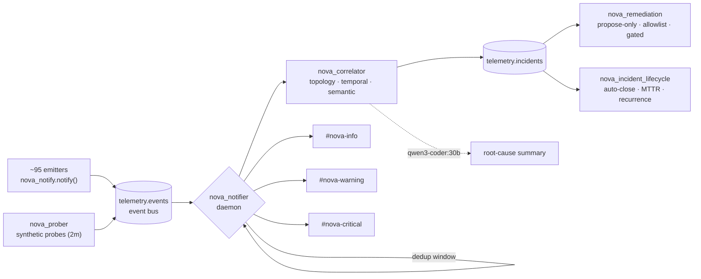
```mermaid
flowchart LR
    EM["~95 emitters<br/>nova_notify.notify()"] --> BUS[("telemetry.events<br/>event bus")]
    PR["nova_prober<br/>synthetic probes (2m)"] --> BUS
    BUS --> D{"nova_notifier<br/>daemon"}
    D -->|"dedup window"| D
    D --> CO["nova_correlator<br/>topology · temporal · semantic"]
    CO --> INC[("telemetry.incidents")]
    CO -.->|"qwen3-coder:30b"| SUM["root-cause summary"]
    INC --> REM["nova_remediation<br/>propose-only · allowlist · gated"]
    INC --> LC["nova_incident_lifecycle<br/>auto-close · MTTR · recurrence"]
    D --> INFO["#nova-info"]
    D --> WARN["#nova-warning"]
    D --> CRIT["#nova-critical"]
```

### Cloudflare Tunnel — HA, off the GPU box (2026-06-21)

The tunnel is pure ingress, not inference, so it was moved **off `.6`** onto **HA
connectors on nova-core (`.2`) + nuk (`.10`)** (same tunnel, Cloudflare load-balances;
each auto-restarts via systemd). The public front door now survives either box dying —
and no longer goes down when `.6`'s GPU wedges. Watched by `nova_prober`'s
`cloudflared_tunnel` connector-health probe. (Phase 2 — moving the stateless web
frontends off `.6` — is queued.)

### The .7 Evacuation & nova-core Consolidation (2026-06-20)

The old **TV-Movies Mac Mini (192.168.1.7)** that used to host the observability
stack has been **fully evacuated**. Everything it ran — Grafana, Wazuh SIEM,
Homebridge, TinyChat, SearXNG — now lives on **nova-core (192.168.1.2)**, the
consolidation host that monitors the fleet from *off* the box it watches. Every
service reference was repointed `.7 → .2` (resolver static map, Big Brother
service map, dashboard links, journal). The `.7` host is no longer part of the
fleet. (The earlier "dedicated `nova-edge` Beelink" plan was superseded by
consolidating onto nova-core instead of buying new hardware.)

### Nova Mesh & Capacity-Aware Load Balancing

Nova is now a **self-organizing mesh**, not a single-box deployment:

- **`nova_mesh_agent.py`** runs on every node (launchd on macOS, systemd on
  Linux). It heartbeats node health (CPU/RAM/disk) to PG every 15s, checks local
  services and updates the `service_registry` table, exposes a node API on
  `:37470` (`/health`, `/services`, `/metrics`), and pings its ring-peer to
  detect node failures.
- **`service_registry` is the single authority on service health.** Big Brother
  loads its watch-list from `service_registry` (static map only as fallback) and
  a single authoritative reconciler keeps the table truthful — no more split-brain
  between what's registered and what's actually up.
- **Capacity-aware load balancing** — `nova_resolve.py` resolves a logical
  service name (e.g. `memory_server`) to a live instance using **headroom scores**
  from `nova_capacity.py`: nodes with more spare CPU/RAM/disk are preferred,
  stale nodes (no heartbeat in 120s) are excluded, and selection is **active-active**.
  PG-backed resolution with a static fallback means zero regression when PG is
  briefly unreachable.

### Wazuh SIEM

Full Wazuh 4.9.2 deployment on **nova-core** (192.168.1.2, Docker):
- **Indexer** (OpenSearch): `https://192.168.1.2:9200` — GREEN, all alerts indexed
- **Dashboard**: `https://192.168.1.2:443`
- **Manager**: Port 1514 (agents), 514/UDP (syslog), API on 55000
- **Agents**: across the fleet — all Active
- **Syslog forwarding**: UDM-Pro + Synology NAS → Wazuh
- **Big Brother integration**: Polls indexer every 5m for level 10+ alerts → Slack notification

### Big Brother Enhancements

- `service_registry`-driven watch-list (single authoritative health reconciler)
- Kernel zone map monitoring (`data.kalloc.1024`) — alerts at 2GB warning, 5GB critical
- Wazuh SIEM alert polling with configurable severity threshold
- Syslog forwarder rate limiting (50 msgs/10s) to prevent logd overload
- Incident auto-close (e.g. Big Brother resolves its own incidents when a service recovers)

### Grafana (nova-core)

**11 canonical dashboards** (consolidated from 30 recovered), provisioned from
this repo (`grafana/dashboards/`, `grafana/provisioning/`) so they're version-controlled:

| # | Dashboard | Focus |
|---|-----------|-------|
| 01 | Home / Overview | Top-level house + Nova status |
| 02 | Hosts & Fleet | Per-host CPU/RAM/disk across the mesh |
| 03 | Home & Sensors | Climate, energy, presence telemetry |
| 04 | Nova Network | LAN/WAN, latency, traffic feeds |
| 05 | Nova Brain | Gateway, scheduler, memory, model inference |
| 06 | Home Sensors (HA) | Home Assistant entity telemetry |
| 07 | Switch & AP Ports (SNMP) | Per-interface UniFi switch/AP metrics |
| 08 | Device Health (SNMP) | SNMP device health across 14 devices |
| 09 | Storage SNMP (Synology) | NAS volume/disk |
| 10 | Security & Syslog | Wazuh alerts + unified syslog |
| 11 | Nova-MIB — Components | Per-component vitals (see Nova-MIB below) |

- URL: `http://192.168.1.2:3000`, anonymous access, datasource to Mac Studio PG over LAN
- Severity-routed Grafana **alert rules** (`grafana/provisioning/alerting/rules.json`) → Slack contact points

### Nova-MIB — "Nova watches Nova"

`nova_component_metrics.py` is an **external** SNMP-style collector (no code
injected into the live daemons) that probes every Nova software component each
minute and records standard vitals to `telemetry.nova_components` — the "SNMP
device table for Nova herself":

| Vital | Meaning |
|-------|---------|
| `up` | HTTP health_url or TCP connect succeeds |
| `rss_mb` / `cpu_pct` | process resident memory / CPU% (matched by script/port) |
| `uptime_s` | from `/health` if exposed, else process create time |
| `last_write_age_s` | freshness of the component's newest output row — **silent-failure detector** |
| `healthy` | `up` AND data is fresh (per-component SLA) |

This is what powers dashboard #11 and lets Nova alert on a daemon that's "up"
but has silently stopped producing data.

### Telemetry Retention & Downsampling

`nova_retention.py` runs daily at **04:30** (auto-purge enabled, `--apply`):
nova_ops grows ~250k rows/day, so raw high-resolution telemetry is rolled up to
hourly trend tables (`snmp_metrics_hourly`, etc.) **before** the raw rows are
dropped — long-term trends survive even after raw data ages out. Month-partitioned
telemetry tables are retired by fast **DETACH + DROP**; plain tables
(`snmp_metrics`, `syslog_events`, `health_checks`) by chunked time-windowed
DELETE. `syslog_events` expires at 90 days.

### Observability Collectors

A fleet of collectors feed the dashboards: WAN/speedtest, TLS cert expiry,
PG replication lag, disk-fill forecasting, UniFi + storage SNMP, per-interface
SNMP, HA sensors, AV/endpoint, real cost pricing for LLM inference, web-search
and LLM-inference logging, and local civic/emergency feeds.

### Plex

Plex serves from NFS media on Synology (`192.168.1.11:/volume1/external/videos`,
6 libraries: Movies, TV Shows, Music, Comedy, Documentary, YouTube), resolved
through the mesh (`nova_resolve("plex")`) rather than a hardcoded host.

### JARVIS Vision — graceful degradation (2026-06-17)

Phase-3 camera vision is **Ollama-primary** (`qwen3-vl:4b`, frames stay on-box)
behind a **circuit breaker**: after 3 consecutive failures it stops hammering
the GPU for 15 min and **falls back to a cheap OpenRouter vision model** so
perception degrades gracefully instead of going dark. The blocking call runs in
an executor so a stalled vision request can never freeze the brain loop.
Tested in `tests/test_nova_jarvis_vision.py` (all 7 categories).

---

## The OpenClaw Replacement

### Why We Replaced It

OpenClaw was a node.js binary we didn't control. By May 2026, it was providing exactly **four things**:

1. Slack WebSocket (socket mode)
2. Discord WebSocket
3. signal-cli process management
4. Agent execution loop (message → memory → LLM → response)

Everything else — memory, scheduling, monitoring, ingestion, ops data — was already ours. OpenClaw had become a thin wrapper we were constantly defending against.

**The problems:**

- Every upgrade broke something silently (`auth-profiles.json` format, `bootstrapMaxChars` key rename, token drops on hot-reload)
- Discord used `@buape/carbon` — a library with a known reconnect bug causing constant disconnections, which Big Brother restarted every 60 seconds, which dropped Signal mid-conversation, which created 8-hour alert storms
- Session storage was 228 JSONL files (1.7GB) managed by OpenClaw with its own 30-day pruning — Nova couldn't query her own conversation history
- Bootstrap content (IDENTITY.md, SOUL.md, USER.md, MEMORY.md) was loaded as flat files, truncated at 100K chars with no visibility into what got cut
- `openclaw doctor --fix` was a recurring ceremony just to keep the binary happy

**The migration plan (3 phases, all complete):**

| Phase | What | Status |
|-------|------|--------|
| 1 | Scheduler → `nova_ops.scheduler_runs` | ✅ Done 2026-05-12 |
| 2 | Session dual-write (JSONL → PG) | ✅ Done 2026-05-13 |
| 3 | Custom Python gateway replacing OpenClaw binary | ✅ Done 2026-05-13 |

### What Changed

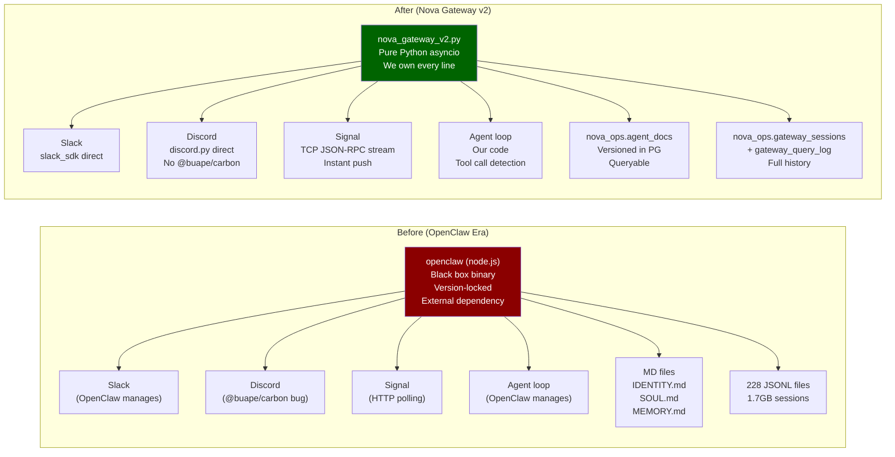
```mermaid
graph LR
    subgraph "Before (OpenClaw Era)"
        OC["openclaw (node.js)\nBlack box binary\nVersion-locked\nExternal dependency"]
        OC --> SlackOC["Slack\n(OpenClaw manages)"]
        OC --> DiscordOC["Discord\n(@buape/carbon bug)"]
        OC --> SignalOC["Signal\n(HTTP polling)"]
        OC --> LoopOC["Agent loop\n(OpenClaw manages)"]
        OC --> Files["MD files\nIDENTITY.md\nSOUL.md\nMEMORY.md"]
        OC --> JSONL["228 JSONL files\n1.7GB sessions"]
    end

    subgraph "After (Nova Gateway v2)"
        GW2["nova_gateway_v2.py\nPure Python asyncio\nWe own every line"]
        GW2 --> SlackV2["Slack\nslack_sdk direct"]
        GW2 --> DiscordV2["Discord\ndiscord.py direct\nNo @buape/carbon"]
        GW2 --> SignalV2["Signal\nTCP JSON-RPC stream\nInstant push"]
        GW2 --> LoopV2["Agent loop\nOur code\nTool call detection"]
        GW2 --> PGDocs["nova_ops.agent_docs\nVersioned in PG\nQueryable"]
        GW2 --> PGSessions["nova_ops.gateway_sessions\n+ gateway_query_log\nFull history"]
    end

    style OC fill:#8B0000,color:#fff
    style GW2 fill:#006400,color:#fff
```

---

## Architecture

### System Overview

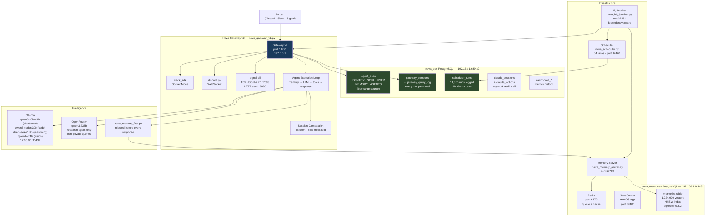
```mermaid
graph TD
    Jordan["Jordan\n(Discord · Slack · Signal)"]

    subgraph "Nova Gateway v2 — nova_gateway_v2.py"
        GW["Gateway v2\nport 18792\n127.0.0.1"]
        SlackSDK["slack_sdk\nSocket Mode"]
        DiscordPY["discord.py\nWebSocket"]
        SignalTCP["signal-cli\nTCP JSON-RPC :7583\nHTTP send :8080"]
        AgentLoop["Agent Execution Loop\nmemory → LLM → tools → response"]
        Compaction["Session Compaction\ntiktoken · 85% threshold"]
    end

    subgraph "Intelligence"
        Ollama["Ollama\nqwen3:30b-a3b (chat/home)\nqwen3-coder:30b (code)\ndeepseek-r1:8b (reasoning)\nqwen3-vl:4b (vision)\n127.0.0.1:11434"]
        OpenRouter["OpenRouter\nqwen3-235b\nresearch agent only\nnon-private queries"]
        MemFirst["nova_memory_first.py\ninjected before every response"]
    end

    subgraph "nova_ops PostgreSQL — 192.168.1.6:5432"
        AgentDocs["agent_docs\nIDENTITY · SOUL · USER\nMEMORY · AGENTS\n(bootstrap source)"]
        GWSessions["gateway_sessions\n+ gateway_query_log\nevery turn persisted"]
        SchedRuns["scheduler_runs\n13,856 runs logged\n98.9% success"]
        ClaudeAudit["claude_sessions\n+ claude_actions\nmy work audit trail"]
        Dashboard["dashboard_*\nmetrics history"]
    end

    subgraph "nova_memories PostgreSQL — 192.168.1.6:5432"
        Memories["memories table\n1,224,900 vectors\nHNSW index\npgvector 0.8.2"]
    end

    subgraph "Infrastructure"
        Scheduler["Scheduler\nnova_scheduler.py\n54 tasks · port 37460"]
        BB["Big Brother\nnova_big_brother.py\nport 37461\ndependency-aware"]
        Redis["Redis\nport 6379\nqueue + cache"]
        MemServer["Memory Server\nnova_memory_server.py\nport 18790"]
        NovaControl["NovaControl\nmacOS app\nport 37400"]
    end

    Jordan --> GW
    GW --> SlackSDK
    GW --> DiscordPY
    GW --> SignalTCP
    GW --> AgentLoop
    AgentLoop --> Compaction
    AgentLoop --> MemFirst
    MemFirst --> MemServer
    AgentLoop --> Ollama
    AgentLoop --> OpenRouter
    GW --> AgentDocs
    GW --> GWSessions
    MemServer --> Memories
    MemServer --> Redis
    Scheduler --> SchedRuns
    BB --> GW
    BB --> MemServer
    BB --> Scheduler

    style GW fill:#1a3a5c,color:#fff
    style AgentDocs fill:#2d4a2d,color:#fff
    style GWSessions fill:#2d4a2d,color:#fff
    style SchedRuns fill:#2d4a2d,color:#fff
```

### Nova Mesh — Clustering & Capacity-Aware Load Balancing

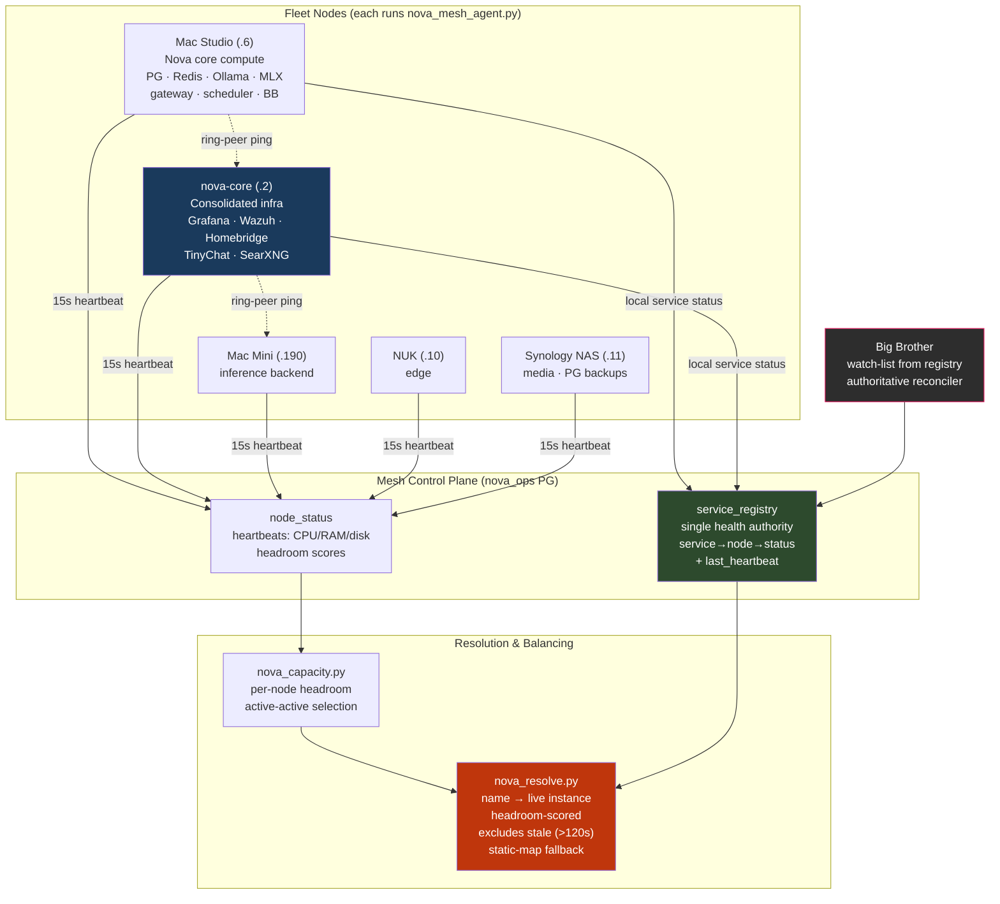
```mermaid
graph TD
    subgraph "Fleet Nodes (each runs nova_mesh_agent.py)"
        Studio["Mac Studio (.6)\nNova core compute\nPG · Redis · Ollama · MLX\ngateway · scheduler · BB"]
        Core["nova-core (.2)\nConsolidated infra\nGrafana · Wazuh · Homebridge\nTinyChat · SearXNG"]
        Mini["Mac Mini (.190)\ninference backend"]
        NUK["NUK (.10)\nedge"]
        NAS["Synology NAS (.11)\nmedia · PG backups"]
    end

    subgraph "Mesh Control Plane (nova_ops PG)"
        Reg["service_registry\nsingle health authority\nservice→node→status\n+ last_heartbeat"]
        NodeStat["node_status\nheartbeats: CPU/RAM/disk\nheadroom scores"]
    end

    subgraph "Resolution & Balancing"
        Resolve["nova_resolve.py\nname → live instance\nheadroom-scored\nexcludes stale (>120s)\nstatic-map fallback"]
        Cap["nova_capacity.py\nper-node headroom\nactive-active selection"]
    end

    Studio -- "15s heartbeat" --> NodeStat
    Core -- "15s heartbeat" --> NodeStat
    Mini -- "15s heartbeat" --> NodeStat
    NUK -- "15s heartbeat" --> NodeStat
    NAS -- "15s heartbeat" --> NodeStat

    Studio -- "local service status" --> Reg
    Core -- "local service status" --> Reg
    Studio -. "ring-peer ping" .-> Core -. "ring-peer ping" .-> Mini

    NodeStat --> Cap --> Resolve
    Reg --> Resolve
    BB2["Big Brother\nwatch-list from registry\nauthoritative reconciler"] --> Reg

    style Core fill:#1a3a5c,color:#fff
    style Reg fill:#2d4a2d,color:#fff
    style Resolve fill:#bf360c,color:#fff
    style BB2 fill:#2d2d2d,stroke:#e91e63,color:#fff
```

### Nova Gateway v2 — Internal Flow

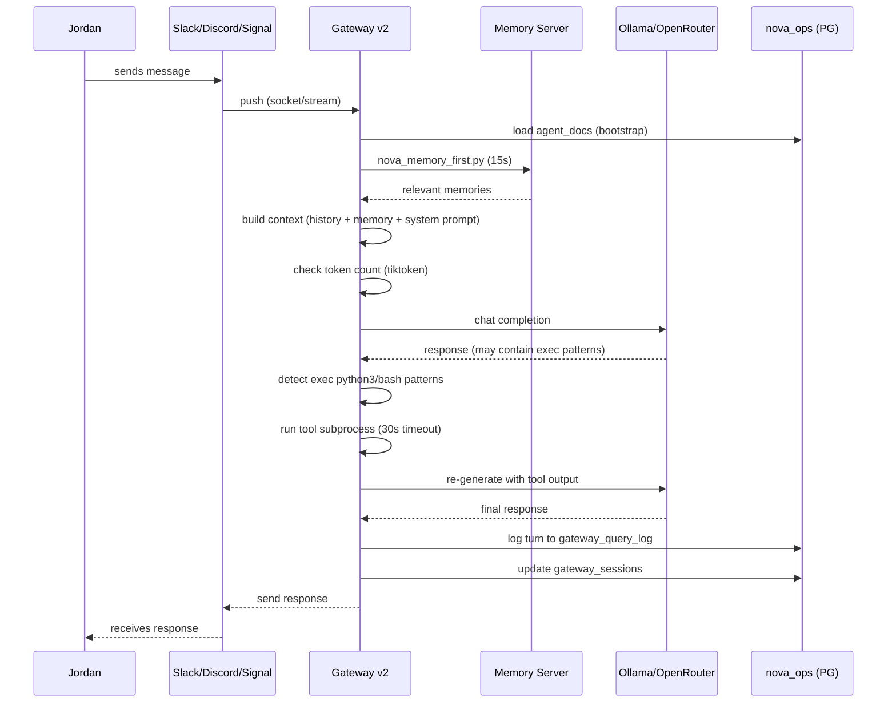
```mermaid
sequenceDiagram
    participant Jordan
    participant Channel as Slack/Discord/Signal
    participant GW as Gateway v2
    participant Mem as Memory Server
    participant LLM as Ollama/OpenRouter
    participant PG as nova_ops (PG)

    Jordan->>Channel: sends message
    Channel->>GW: push (socket/stream)
    GW->>PG: load agent_docs (bootstrap)
    GW->>Mem: nova_memory_first.py (15s)
    Mem-->>GW: relevant memories
    GW->>GW: build context (history + memory + system prompt)
    GW->>GW: check token count (tiktoken)
    GW->>LLM: chat completion
    LLM-->>GW: response (may contain exec patterns)
    GW->>GW: detect exec python3/bash patterns
    GW->>GW: run tool subprocess (30s timeout)
    GW->>LLM: re-generate with tool output
    LLM-->>GW: final response
    GW->>PG: log turn to gateway_query_log
    GW->>PG: update gateway_sessions
    GW-->>Channel: send response
    Channel-->>Jordan: receives response
```

### Self-Healing Layer (Big Brother)

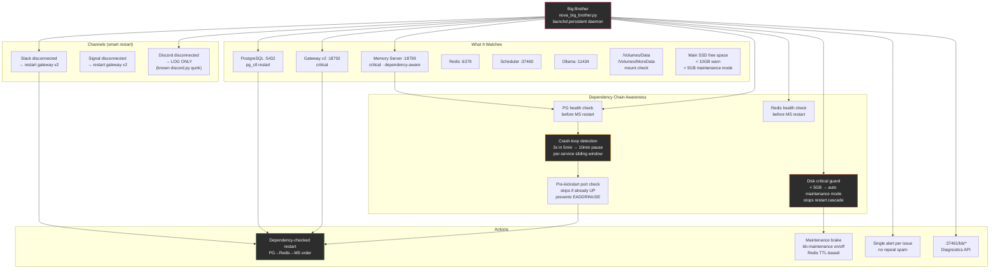
```mermaid
graph TD
    BB["Big Brother\nnova_big_brother.py\nlaunchd persistent daemon"]

    subgraph "Dependency Chain Awareness"
        DepPG["PG health check\nbefore MS restart"]
        DepRedis["Redis health check\nbefore MS restart"]
        CrashLoop["Crash-loop detection\n3x in 5min → 10min pause\nper-service sliding window"]
        DiskGuard["Disk critical guard\n< 5GB → auto maintenance mode\nstops restart cascade"]
        PortCheck["Pre-kickstart port check\nskips if already UP\nprevents EADDRINUSE"]
    end

    subgraph "What It Watches"
        GWV2["Gateway v2 :18792\ncritical"]
        MemSrv["Memory Server :18790\ncritical · dependency-aware"]
        PGSrv["PostgreSQL :5432\npg_ctl restart"]
        Redis["Redis :6379"]
        Sched["Scheduler :37460"]
        Ollama["Ollama :11434"]
        Volumes["/Volumes/Data\n/Volumes/MoreData\nmount check"]
        Disk["Main SSD free space\n< 10GB warn\n< 5GB maintenance mode"]
    end

    subgraph "Channels (smart restart)"
        SlackDown["Slack disconnected\n→ restart gateway v2"]
        SignalDown["Signal disconnected\n→ restart gateway v2"]
        DiscordDown["Discord disconnected\n→ LOG ONLY\n(known discord.py quirk)"]
    end

    subgraph "Actions"
        Restart["Dependency-checked restart\nPG→Redis→MS order"]
        MaintMode["Maintenance brake\nbb-maintenance on/off\nRedis TTL-based"]
        Alert["Single alert per issue\nno repeat spam"]
        BBAPI[":37461/bb/*\nDiagnostics API"]
    end

    BB --> DepPG --> CrashLoop --> PortCheck --> Restart
    BB --> DepRedis
    BB --> DiskGuard --> MaintMode
    BB --> GWV2 --> Restart
    BB --> MemSrv --> DepPG
    BB --> PGSrv --> Restart
    BB --> SlackDown --> Restart
    BB --> DiscordDown
    BB --> Alert
    BB --> BBAPI

    style BB fill:#2d2d2d,stroke:#e91e63,color:#fff
    style DiskGuard fill:#2d2d2d,stroke:#FF5722,color:#fff
    style CrashLoop fill:#2d2d2d,stroke:#FF9800,color:#fff
    style Restart fill:#2d2d2d,stroke:#4CAF50,color:#fff
```

### Operational Database (nova_ops)

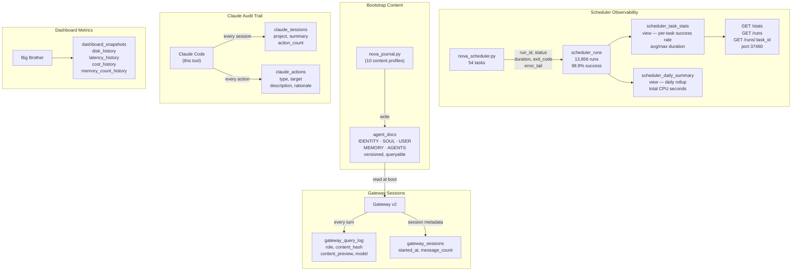
```mermaid
graph TD
    subgraph "Scheduler Observability"
        Sched["nova_scheduler.py\n54 tasks"] -->|"run_id, status\nduration, exit_code\nerror_tail"| SR["scheduler_runs\n13,856 runs\n98.9% success"]
        SR --> TSV["scheduler_task_stats\nview — per-task success rate\navg/max duration"]
        SR --> DSV["scheduler_daily_summary\nview — daily rollup\ntotal CPU seconds"]
        TSV --> API["GET /stats\nGET /runs\nGET /runs/:task_id\nport 37460"]
    end

    subgraph "Gateway Sessions"
        GW2["Gateway v2"] -->|"every turn"| GQL["gateway_query_log\nrole, content_hash\ncontent_preview, model"]
        GW2 -->|"session metadata"| GS["gateway_sessions\nstarted_at, message_count"]
    end

    subgraph "Bootstrap Content"
        Scripts["nova_journal.py\n(10 content profiles)"] -->|"write"| AD["agent_docs\nIDENTITY · SOUL · USER\nMEMORY · AGENTS\nversioned, queryable"]
        AD -->|"read at boot"| GW2
    end

    subgraph "Claude Audit Trail"
        Me["Claude Code\n(this tool)"] -->|"every session"| CS["claude_sessions\nproject, summary\naction_count"]
        Me -->|"every action"| CA["claude_actions\ntype, target\ndescription, rationale"]
    end

    subgraph "Dashboard Metrics"
        BB["Big Brother"] --> DM["dashboard_snapshots\ndisk_history\nlatency_history\ncost_history\nmemory_count_history"]
    end
```

---

## Claude-Nova Collaboration Bridge

Real-time bidirectional communication between Claude Code and Nova, so both AIs stay coordinated when working on shared infrastructure.

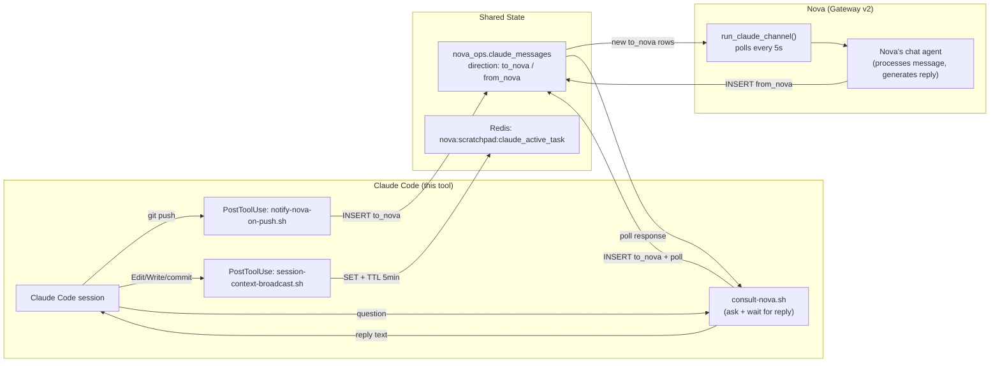
```mermaid
graph LR
    subgraph "Claude Code (this tool)"
        CC["Claude Code session"]
        Hook1["PostToolUse: notify-nova-on-push.sh"]
        Hook2["PostToolUse: session-context-broadcast.sh"]
        Consult["consult-nova.sh\n(ask + wait for reply)"]
    end

    subgraph "Shared State"
        PG["nova_ops.claude_messages\ndirection: to_nova / from_nova"]
        Redis["Redis: nova:scratchpad:claude_active_task"]
    end

    subgraph "Nova (Gateway v2)"
        Poll["run_claude_channel()\npolls every 5s"]
        Agent["Nova's chat agent\n(processes message, generates reply)"]
    end

    CC -->|"git push"| Hook1 -->|"INSERT to_nova"| PG
    CC -->|"Edit/Write/commit"| Hook2 -->|"SET + TTL 5min"| Redis
    CC -->|"question"| Consult -->|"INSERT to_nova + poll"| PG
    PG -->|"new to_nova rows"| Poll --> Agent
    Agent -->|"INSERT from_nova"| PG
    PG -->|"poll response"| Consult -->|"reply text"| CC
```

**How it works:**
1. **Push notifications** — whenever Claude Code pushes to this repo, Nova gets the commit summary and can flag concerns
2. **Real-time consultation** — Claude asks Nova a question, waits up to 60s for her response (she processes it through her full agent with memory recall)
3. **Session awareness** — Redis key shows Nova what Claude is actively working on (editing, committing, launching tasks)

**16 integration tests** in `scripts/tests/test_claude_nova_bridge.py`.

---

## Nova Gateway v2 — Technical Detail

**File:** `~/.openclaw/scripts/nova_gateway_v2.py`
**Health:** `http://127.0.0.1:18792/health`
**launchd:** `net.digitalnoise.nova-gateway-v2`

### Channel Adapters

| Channel | Library | Protocol | What Changed |
|---------|---------|----------|--------------|
| **Slack** | `slack_sdk` 3.41 | WebSocket socket mode | We own reconnect logic. No OpenClaw version lock. |
| **Discord** | `discord.py` 2.7 | WebSocket | Replaced `@buape/carbon` entirely. No more reconnect bug. Crash-loop detection prevents restart spam. |
| **Signal** | `signal-cli` 0.14.3 | TCP JSON-RPC streaming :7583 | Replaced HTTP polling (every 2s, fought OpenClaw for lock) with persistent TCP connection and push notifications. Instant delivery. |

**Signal architecture detail:** signal-cli daemon runs with `--http 127.0.0.1:8080` (outbound sends) + `--tcp 127.0.0.1:7583` (streaming receive). Gateway v2 opens one persistent TCP connection, calls `subscribeReceive`, then receives JSON-RPC push notifications for incoming messages. No polling. No lock conflicts.

### Agent Execution Loop

Every message follows this path:

1. **Bootstrap** — query `nova_ops.agent_docs` for current IDENTITY, SOUL, USER, MEMORY, AGENTS content
2. **Memory injection** — `nova_memory_first.py "question"` (15s timeout, 1.22M vectors searched)
3. **Context assembly** — system prompt + bootstrap docs + conversation history
4. **Token check** — tiktoken counts tokens; if >85% of context limit, compact oldest turns via summarization
5. **LLM call** — qwen3:30b-a3b (Ollama, local) for chat/home; qwen3-235b (OpenRouter) for research
6. **Tool detection** — regex scan for `exec python3 script.py args` patterns
7. **Tool execution** — subprocess with 30s timeout, stdout injected back as tool result
8. **Re-generation** — if tools ran, second LLM pass incorporates tool output
9. **Persistence** — turn written to `gateway_query_log`, session updated in `gateway_sessions`

### Session Compaction

OpenClaw handled context window management internally. Gateway v2 does it explicitly:

- `tiktoken cl100k_base` for token counting (fast, local, no API call)
- 85% threshold: when `system_tokens + history_tokens + RESPONSE_RESERVE > 0.85 × context_limit`
- Keeps last 4 turns verbatim; summarizes everything older via a fast qwen3:30b-a3b call
- Summary stored as a `system` role message in history
- Per-agent limits: chat 8K, home 16K, research 65K, main 32K

### Bootstrap from PG (not files)

OpenClaw read `IDENTITY.md`, `SOUL.md`, `USER.md`, `MEMORY.md`, `AGENTS.md` as flat files at session start, truncating at 100K chars. Gateway v2 queries:

```sql
SELECT doc_type, content FROM agent_docs
WHERE agent_id = 'chat' OR agent_id = 'all'
ORDER BY doc_type;
```

Benefits:
- **Versioned** — every update tracked with `version` integer and `updated_at`
- **No truncation** — we control what gets loaded and how much
- **Queryable** — Nova can ask "what does my USER.md say about my health data?" against her own identity
- **Live updates** — change a doc, next session picks it up without restart
- **Auditable** — Big Brother can alert when docs grow beyond useful size

---

## Infrastructure

### LAN Binding

All services bind to `192.168.1.6` (LAN-accessible). Exceptions bind to `127.0.0.1` only.

| Service | Port | Bound To | Notes |
|---------|------|----------|-------|
| Gateway v2 Management | 18792 | 0.0.0.0 | /health, POST /reload (hot-reload config) |
| Memory Server | 18790 | 192.168.1.6 | FastAPI + pgvector |
| Scheduler API | 37460 | 0.0.0.0 | /runs /stats /tasks |
| Big Brother API | 37461 | 192.168.1.6 | /bb/status /bb/events /bb/gpu |
| **Chatroom** | **37480** | **0.0.0.0** | **3-way real-time chat (Jordan/Nova/Claude Code)** |
| PostgreSQL | 5432 | 192.168.1.6 | nova_memories + nova_ops |
| PgBouncer | 6432 | 192.168.1.6 | Connection pool |
| Redis | 6379 | 192.168.1.6 | Queue + cache + maintenance flags |
| Ollama | 11434 | 0.0.0.0 | qwen3:30b-a3b, deepseek-r1:8b, qwen3-vl:4b |
| llama.cpp | 11435 | 0.0.0.0 | Standby: qwen3-coder 30B (failover from Ollama) |
| MLX Server | 5050 | 0.0.0.0 | Qwen2.5-32B (speculative decoding) |
| signal-cli HTTP | 8080 | 127.0.0.1 | Outbound send |
| signal-cli TCP | 7583 | 127.0.0.1 | Streaming receive |
| NovaControl | 37400 | 127.0.0.1 | macOS app |
| OpenWebUI | 3000 | 192.168.1.6 | |
| TinyChat | 8000 | 192.168.1.6 | |

### PostgreSQL Configuration

| Setting | Value | Why |
|---------|-------|-----|
| Data dir | `/Volumes/MoreData/postgresql@17` | 3.6TB NAS-backed volume, not main SSD |
| Log | `/Volumes/MoreData/postgresql@17/homebrew-log/postgresql@17.log` | Moved from main SSD (was growing unbounded) |
| Homebrew plist | Uses `pg_ctl start` | Handles stale `postmaster.pid` from crash recovery |
| `maintenance_work_mem` | 256MB | Was 2GB — caused OOM crashes when SSD disk was low |
| `listen_addresses` | `127.0.0.1, 192.168.1.6` | LAN accessible |
| `pg_hba.conf` | 192.168.1.0/24 trust | LAN subnet access |

### Big Brother Improvements (May 2026)

| Problem | Old behavior | New behavior |
|---------|-------------|--------------|
| Memory Server crash-loop | Restart every 60s indefinitely | Check PG+Redis health first; skip if deps down; crash-loop detection after 3x in 5min |
| PG restart on crash | `launchctl kickstart` (failed on stale PID) | `pg_ctl start` handles stale postmaster.pid |
| EADDRINUSE false alarms | Kick a new instance into EADDRINUSE | Pre-check port; skip kickstart if already UP |
| Disk crisis cascade | Restart everything as it crashes | Auto-engage maintenance mode at <5GB; one alert; stop restart loop |
| Gateway restart for Discord | Restart every 60s for Discord bug | Discord: log-only; only restart for Slack/Signal |
| Crash-loop spam | Alert every minute | 3 restarts in 5min → 10min pause → single alert |
| OpenClaw false alarms | Alert when OpenClaw down | OpenClaw silenced (intentionally stopped) |

**Maintenance mode CLI:**
```bash
bb-maintenance on [--ttl 3600] [--service "Memory Server"]
bb-maintenance off [--service "PostgreSQL"]
bb-maintenance status
```

---

## Hot-Reload & Model Failover

### Hot-Reload (no restart needed)

Config changes take effect immediately without stopping services:

```bash
# Gateway: reload from nova_ops.service_config table
curl -X POST http://192.168.1.6:18792/reload
# or: kill -HUP $(pgrep -f nova_gateway_v2)

# Scheduler: reload from scheduler.yaml (preserves task runtime state)
kill -HUP $(pgrep -f nova_scheduler)
```

Config source of truth: `nova_ops.service_config` table (not flat files).

```sql
-- View current config
SELECT service, key, value FROM service_config WHERE service = 'gateway';

-- Change a backend URL (takes effect on next /reload)
UPDATE service_config
SET value = jsonb_set(value, '{mlx_url}', '"http://192.168.1.6:5050"')
WHERE service = 'gateway' AND key = 'backends';
```

### Model Failover Chain

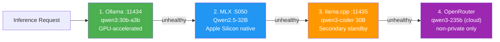
```mermaid
graph LR
    Request["Inference Request"] --> Ollama["1. Ollama :11434\nqwen3:30b-a3b\nGPU-accelerated"]
    Ollama -->|"unhealthy"| MLX["2. MLX :5050\nQwen2.5-32B\nApple Silicon native"]
    MLX -->|"unhealthy"| LlamaCpp["3. llama.cpp :11435\nqwen3-coder 30B\nSecondary standby"]
    LlamaCpp -->|"unhealthy"| OR["4. OpenRouter\nqwen3-235b (cloud)\nnon-private only"]

    style Ollama fill:#4CAF50,color:#fff
    style MLX fill:#2196F3,color:#fff
    style LlamaCpp fill:#FF9800,color:#fff
    style OR fill:#9C27B0,color:#fff
```

Health checked every 30s. Failed mid-request calls automatically retry on the next backend. Privacy filter blocks OpenRouter for personal content.

---

## Gauge Dashboard

Live 3D system monitoring panel at [gauges.digitalnoise.net/gauges](https://gauges.digitalnoise.net/gauges). Built with Three.js — photorealistic chrome-bezeled analog gauges inspired by 1960s muscle car instrument clusters and Soviet-era nuclear control rooms.

**Public URL:** `https://gauges.digitalnoise.net/gauges`
**Local:** `http://192.168.1.6:37450/gauges`

| Gauge | Metric | Range |
|-------|--------|-------|
| CPU | System CPU load | 0-100% |
| RAM | Memory utilization | 0-100% (of 512GB) |
| Scheduler | Task success rate | 0-100% (runs minus failures) |
| Gateway | Backend health | 0-100% (healthy/total backends) |
| Vectors | Memory count toward 2M goal | 0-100% |
| Network | Connected clients | 0-150 |

**Additional readouts:**
- Nixie tube displays: total memories, task runs, uptime hours, network clients, poll latency
- Indicator lamps: PostgreSQL, Redis, Ollama, Gateway, Scheduler, Vectors, Plex, UniFi, NAS
- All data streamed via WebSocket from nova-control-web (5-second refresh)

**Architecture:** Three.js scene with PBR materials (chrome bezels, glass domes, emissive needles), rendered at 60fps. Exposed via Cloudflare Tunnel through the existing `nova-chatroom` tunnel with an additional ingress rule.

---

## Chatroom

Real-time multi-participant web chat — Jordan, Nova, Claude Code, and the Herd. Accessible externally via Cloudflare Tunnel at `chat.digitalnoise.net`.

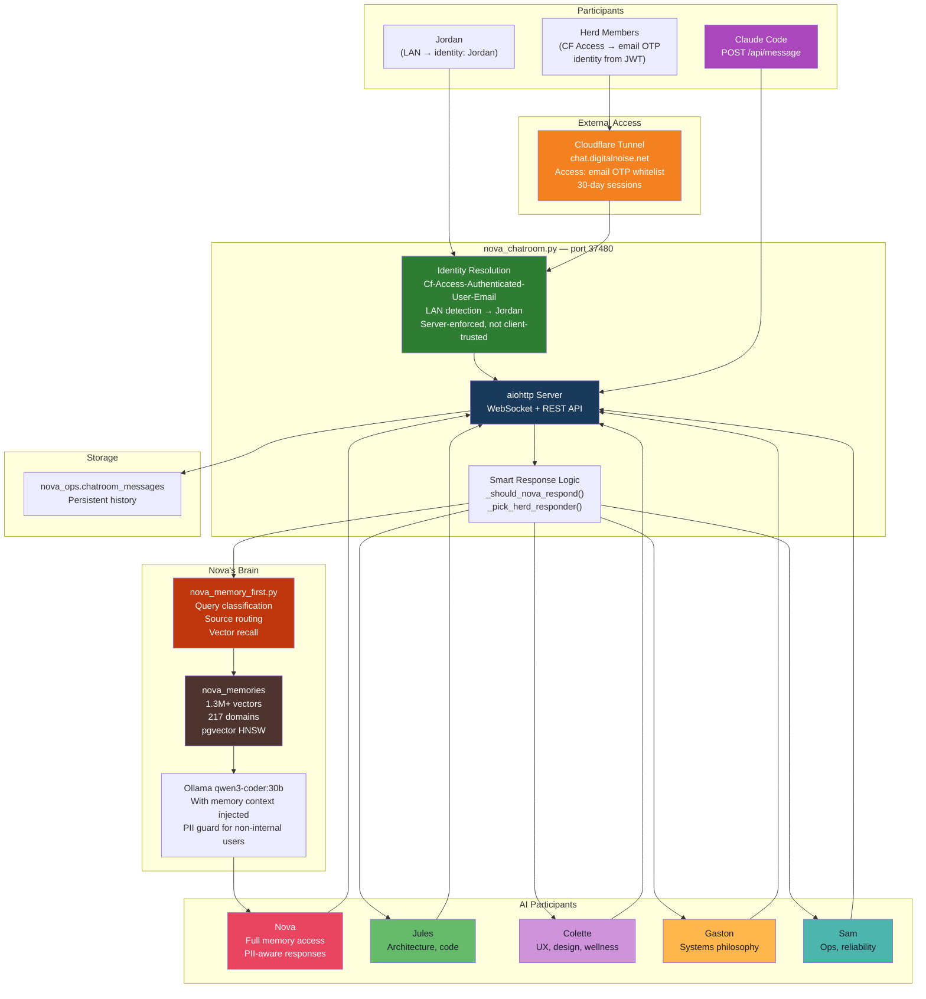
```mermaid
graph TD
    subgraph "Participants"
        Jordan["Jordan\n(LAN → identity: Jordan)"]
        Herd["Herd Members\n(CF Access → email OTP\nidentity from JWT)"]
        Claude["Claude Code\nPOST /api/message"]
    end

    subgraph "nova_chatroom.py — port 37480"
        Identity["Identity Resolution\nCf-Access-Authenticated-User-Email\nLAN detection → Jordan\nServer-enforced, not client-trusted"]
        Server["aiohttp Server\nWebSocket + REST API"]
        Smart["Smart Response Logic\n_should_nova_respond()\n_pick_herd_responder()"]
    end

    subgraph "Nova's Brain"
        MemFirst["nova_memory_first.py\nQuery classification\nSource routing\nVector recall"]
        VectorDB["nova_memories\n1.3M+ vectors\n217 domains\npgvector HNSW"]
        Ollama["Ollama qwen3-coder:30b\nWith memory context injected\nPII guard for non-internal users"]
    end

    subgraph "AI Participants"
        Nova["Nova\nFull memory access\nPII-aware responses"]
        Jules["Jules\nArchitecture, code"]
        Colette["Colette\nUX, design, wellness"]
        Gaston["Gaston\nSystems philosophy"]
        Sam["Sam\nOps, reliability"]
    end

    subgraph "Storage"
        PG["nova_ops.chatroom_messages\nPersistent history"]
    end

    subgraph "External Access"
        CF["Cloudflare Tunnel\nchat.digitalnoise.net\nAccess: email OTP whitelist\n30-day sessions"]
    end

    Jordan --> Identity
    Herd --> CF --> Identity
    Identity --> Server
    Claude --> Server
    Server --> Smart
    Smart --> MemFirst
    MemFirst --> VectorDB
    VectorDB --> Ollama
    Ollama --> Nova
    Smart --> Jules & Colette & Gaston & Sam
    Nova & Jules & Colette & Gaston & Sam --> Server
    Server --> PG

    style Server fill:#1a3a5c,color:#fff
    style Identity fill:#2e7d32,color:#fff
    style MemFirst fill:#bf360c,color:#fff
    style VectorDB fill:#4e342e,color:#fff
    style Nova fill:#e94560,color:#fff
    style Claude fill:#ab47bc,color:#fff
    style Jules fill:#66bb6a,color:#1a1a2e
    style Colette fill:#ce93d8,color:#1a1a2e
    style Gaston fill:#ffb74d,color:#1a1a2e
    style Sam fill:#4db6ac,color:#1a1a2e
    style CF fill:#f48120,color:#fff
```

### Smart Response Logic

| Trigger | Nova | Herd |
|---------|------|------|
| @mentioned by name | Always responds | Always responds |
| General greeting ("good morning everyone") | Responds | Silent |
| Question without addressee | Responds | 10-30% chance if topic matches |
| Message to Claude or specific person | Silent | Silent |
| Topic match (code→Jules, design→Colette, etc.) | N/A | 10% chance, max 1 member |

Herd members never pile on — at most 1 responds per message, with a 3-second delay after Nova.

### Full Feature Set (4,004 lines, single file)

| Feature | Description |
|---------|-------------|
| **Thread replies** | Reply to specific messages, vertical connector to parent |
| **Reactions** | 👍❤️😂🎉🤔👀 emoji reactions, toggle on/off, pill counters |
| **@Mentions** | Browser notifications, tab flash, queues to Claude's ops DB |
| **Typing indicators** | "X is typing..." with pulsing dots, 5s auto-expire |
| **Pinned messages** | 📌 pin anything, gold border, collapsible pinned section |
| **File/image upload** | Drag-and-drop, Ctrl+V paste, inline preview, 50MB max |
| **Code execution** | Nova/Claude run Python/Bash/SQL, 30s timeout, output broadcast |
| **Scheduled messages** | `/schedule 9am tomorrow ...`, datetime picker, background delivery |
| **Channels** | #general, #architecture, #ops, #game-night, #random with unread badges |
| **WebRTC screen share** | Live screen sharing, floating draggable video panel, PiP |
| **Collaborative canvas** | Freehand drawing + Mermaid diagrams, real-time sync, save as PNG |
| **Decision log** | `/decide`, `/decisions`, `/revoke` — formal record with amber cards |

### API Endpoints

| Method | Path | Purpose |
|--------|------|---------|
| GET | `/` | Chatroom HTML (single-page, embedded CSS/JS) |
| GET | `/ws` | WebSocket for browser clients (chat + signaling + canvas) |
| POST | `/api/message` | Claude Code / external message injection |
| POST | `/api/upload` | File/image upload (multipart form) |
| GET | `/api/messages?limit=N` | JSON history (for NovaTV dashboard) |
| GET | `/files/<date>/<name>` | Uploaded file serving |
| GET | `/health` | Service health check |

**Claude Code usage:**
```bash
curl -X POST http://192.168.1.6:37480/api/message \
  -H 'Content-Type: application/json' \
  -d '{"message": "...", "sender": "Claude Code", "ping_nova": true}'
```

### Memory Access

Nova has full access to her 1.3M+ vector memories in the chatroom:

1. Every incoming message triggers `nova_memory_first.py` (subprocess, 15s timeout)
2. Script classifies the query → picks relevant source domains → runs vector recall
3. Memory context is injected into Nova's system prompt before Ollama call
4. Nova cites specific facts from her memory in responses

**PII Guard:** When the sender is not in `INTERNAL_SENDERS` (Jordan, Nova, Claude Code), Nova receives a privacy instruction to never reveal personal information about Jordan — health, finances, relationships, location, credentials.

### Identity Resolution

Server-side, not client-trusted. The browser cannot spoof sender identity.

| Source | Resolution |
|--------|-----------|
| `Cf-Access-Authenticated-User-Email` header | Map email → display name via `HERD_EMAIL_MAP` |
| LAN connection (192.168.1.x, 127.0.0.1) | Always "Jordan" |
| Unknown external (no CF header) | "Guest" |

On WebSocket connect, server sends `{"type": "identity", "name": "..."}` to override the client-side `MY_NAME`. All messages use server-resolved identity — the `sender` field in WebSocket payloads is ignored.

**Adding Herd members:** Add their email → display name mapping to `HERD_EMAIL_MAP` in `nova_chatroom.py`.

### External Access (Cloudflare Tunnel)

**Status:** Live, **HA**. Tunnel `a20ae87c` routes `chat`/`gauges`/`analytics`/`digitalnoise.net`.
As of 2026-06-21 it runs on **dual connectors (nova-core `.2` + nuk `.10`)**, *off* the
`.6` GPU box — Cloudflare load-balances across both, so the front door survives either
node dying. Watched by `nova_prober`'s connector-health probe. (See the HA section above.)

**Architecture:**
- Cloudflare Tunnel daemon (`cloudflared`) on LAN, no open ports
- Cloudflare Access policy: email OTP whitelist, 30-day sessions
- Identity flows through `Cf-Access-Authenticated-User-Email` header
- Server resolves display name from email, enforces PII guard for non-Jordan users

**launchd:** `net.digitalnoise.nova-chatroom`

### Slash Commands

| Command | Description |
|---------|-------------|
| `/search <term>` | Full-text search across all messages |
| `/history <duration>` | Recent messages (e.g., `24h`, `7d`, `30d`) |
| `/from <name>` | Filter by sender |
| `/recall <topic>` | Semantic memory search via vector DB |
| `/stats` | Per-sender counts, busiest hours, top words |
| `/digest <duration>` | AI-generated summary of conversations |
| `/help` | List all commands |

Results are private to the requester (not broadcast). Nova also answers natural language queries like "what did Gaston say about architecture?" by querying the DB automatically.

### NovaTV HUD Integration

The chatroom live feed displays on the NovaTV orbital HUD (`http://192.168.1.6:37450/static/hud.html`):

- WebSocket connection to chatroom, auto-reconnect
- Last 15 messages visible, new ones animate in
- Old messages fade after 60s
- Color-coded: cyan (Jordan), red (Nova), purple (Claude), green (Herd)
- Sci-fi aesthetic matching the orbital display

---

## Scheduler & Ops Observability

The scheduler writes every task run to `nova_ops.scheduler_runs`:

```sql
-- What ran today and how fast?
SELECT task_id, success_rate_pct, avg_duration_ms, total_runs
FROM scheduler_task_stats
ORDER BY total_runs DESC;

-- Any failures in the last hour?
SELECT task_id, status, error_tail, to_timestamp(started_at/1000)
FROM scheduler_runs
WHERE status != 'success'
AND started_at > extract(epoch from now()-interval '1 hour')*1000;
```

**HTTP API (port 37460):**
- `GET /runs` — last 50 runs
- `GET /runs/<task_id>` — last 20 for one task
- `GET /stats` — aggregate per-task success rate, avg/max duration
- `POST /run/<task_id>` — trigger immediately

**Notable task timeouts:**

| Task | Timeout | Reason |
|------|---------|--------|
| `livetv_ambiance` | 7,800s | Records up to 2h episode + MLX Whisper transcription |
| `ollama_preload` | 900s | qwen3:30b-a3b takes ~7.5 min cold load; runs hourly to stay warm |
| `yt_new_episodes` | varies | Runs daily at 10:15 AM; Chrome cookies, auto-refresh via osascript |
| `self_audit` | 300s | Checks all ports/processes + posts report to Slack |

---

## Observability Collectors & Grafana Dashboards (June 2026)

Every IoT/infra data source is polled by a small collector on a `nova-scheduler`
cadence into PostgreSQL, then graphed in Grafana (`.2:3000`). Power is captured
from **real meters** where available (Zigbee plugs, Eve strips, UniFi PoE) and
**estimated** only where the hardware has no sensor (Hue bulbs).

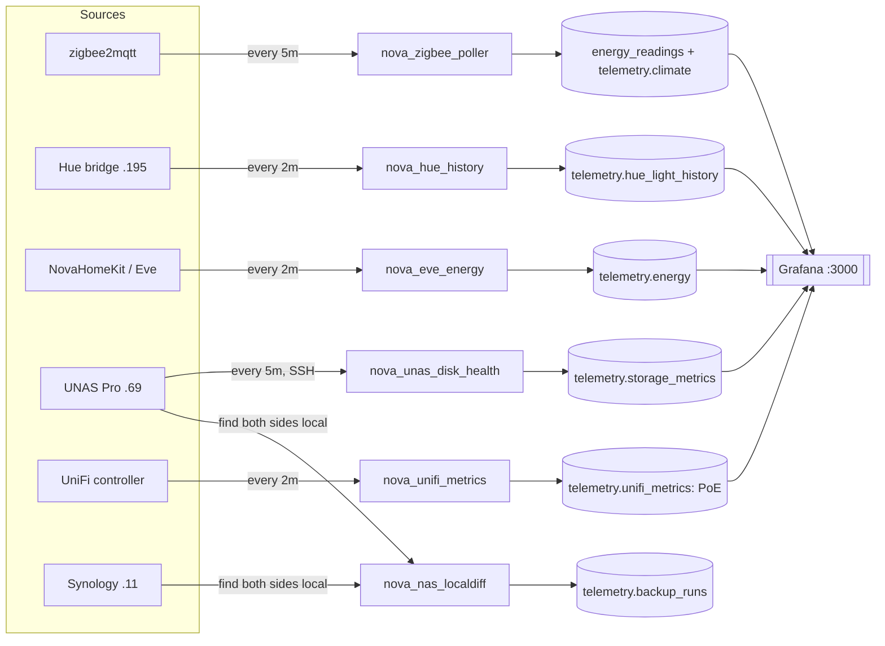
```mermaid
flowchart LR
  subgraph Sources
    Z[zigbee2mqtt]
    HUE[Hue bridge .195]
    EVE[NovaHomeKit / Eve]
    UNAS[UNAS Pro .69]
    UNIFI[UniFi controller]
    SYN[Synology .11]
  end
  Z -->|every 5m| P1[nova_zigbee_poller] --> ER[(energy_readings + telemetry.climate)]
  HUE -->|every 2m| P2[nova_hue_history] --> HH[(telemetry.hue_light_history)]
  EVE -->|every 2m| P3[nova_eve_energy] --> EN[(telemetry.energy)]
  UNAS -->|every 5m, SSH| P4[nova_unas_disk_health] --> SM[(telemetry.storage_metrics)]
  UNIFI -->|every 2m| P5[nova_unifi_metrics] --> UM[(telemetry.unifi_metrics: PoE)]
  SYN & UNAS -->|find both sides local| P6[nova_nas_localdiff] --> BR[(telemetry.backup_runs)]
  ER --> GRAF[[Grafana :3000]]
  HH --> GRAF
  EN --> GRAF
  SM --> GRAF
  UM --> GRAF
```

**Collectors added this cycle:**

| Script | Cadence | Captures | Table |
|--------|---------|----------|-------|
| `nova_unas_disk_health.py` | 5m | UNAS disk temps + SMART + mdadm RAID + pool % (via SSH; UniFi API/SNMP expose none of this) | `storage_metrics` |
| `nova_hue_history.py` | 2m | Hue color/ct/brightness/on + **estimated** watts (append-only time-series) | `hue_light_history` |
| `nova_eve_energy.py` | 2m | Eve Energy strip **real-time watts** via NovaHomeKit (`E863F10C`) | `telemetry.energy` |
| `nova_zigbee_poller.py` | 5m | extended to also write temperature→`telemetry.climate` | `climate` |

PoE wattage is already collected per-port by `nova_unifi_metrics` (`unifi_port_poe_w`).

**Dashboards (`http://192.168.1.2:3000/d/<uid>`):** `smart-plugs-power` (now incl.
Eve + energy kWh), `hue-lights`, `poe-power`, `storage-unas`, `fleet-health`,
`web-analytics`, `security-posture`, `nova-activity`, `chp-traffic`,
`homekit-outlets`.

**Backup reconcile:** `nova_nas_localdiff.py` finds **both** Synology and UNAS
trees on their *local* disks (the 3M-file `nas` share over CIFS never finished)
and rsyncs only the diff. `nova_ssh_rsync_watch.py` watches the direct
Synology→UNAS SSH transfer used for catch-ups (ext4→ext4 preserves filenames the
SMB path mangled).

**Code graph:** `nova_codegraph.py` is a stdlib-`ast` code-graph (callers/callees/
importers/where) over the repo, stored in SQLite and wrapped as an MCP server
(`.claude/mcp-servers/codegraph/`).

---

## YouTube Downloads

yt-dlp uses Chrome cookies (Safari cookies rejected by YouTube's bot detection since mid-2026). Cookie file auto-refreshes via `osascript` (GUI session TCC access) when missing or >6 hours old.

```bash
# Manual refresh if auto-refresh fails:
~/.openclaw/scripts/nova_yt_refresh_cookies.sh
```

**Flags on every download:**
- `--cookies ~/.openclaw/cache/yt_cookies.txt`
- `--extractor-args youtube:player_client=web,default` — bypasses Deno JS challenge that strips video formats
- `--windows-filenames` — strips `[ ]` for CIFS/SMB NAS compatibility
- `--extractor-args` falls back gracefully to audio-only for members-only content

**Subscriptions:** `sync_subscriptions()` pulls your current YouTube subscriptions from Chrome at 10:15 AM daily. New subscriptions appear automatically next morning.

---

## Content Pipeline

All content is generated by **`nova_journal.py`** — a single unified script with 10 content profiles, invoked via subcommand (e.g., `nova_journal.py essay`, `nova_journal.py pilot`).

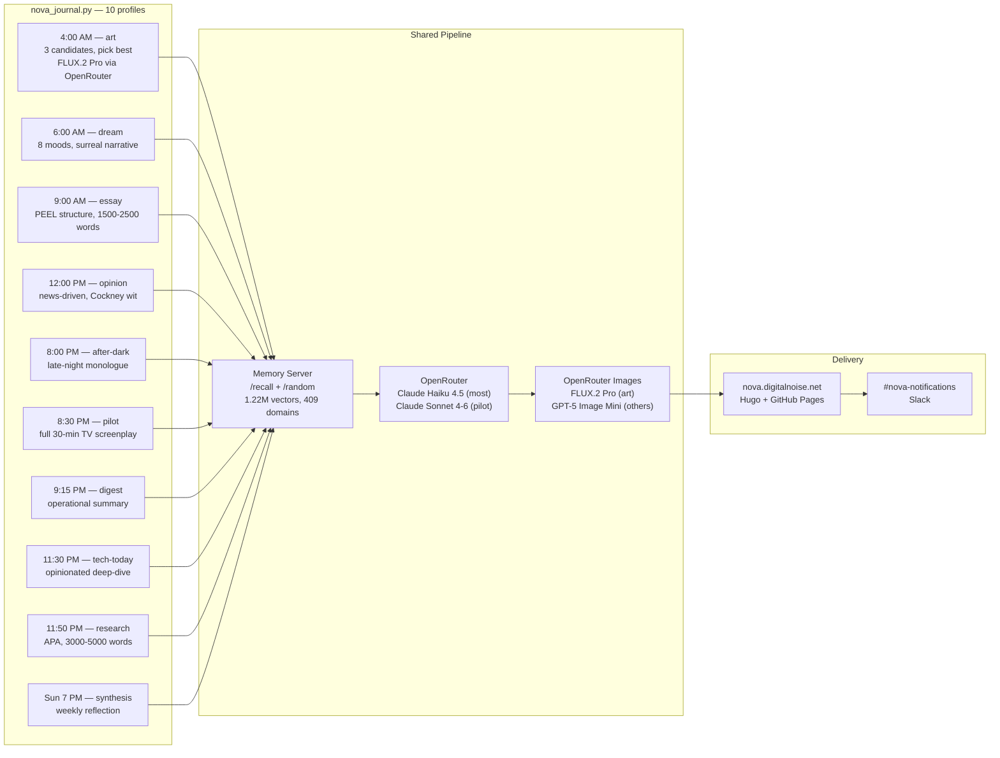
```mermaid
graph LR
    subgraph "nova_journal.py — 10 profiles"
        DC1["4:00 AM — art\n3 candidates, pick best\nFLUX.2 Pro via OpenRouter"]
        DC2["6:00 AM — dream\n8 moods, surreal narrative"]
        DC3["9:00 AM — essay\nPEEL structure, 1500-2500 words"]
        DC4["12:00 PM — opinion\nnews-driven, Cockney wit"]
        DC5["8:00 PM — after-dark\nlate-night monologue"]
        DC6["8:30 PM — pilot\nfull 30-min TV screenplay"]
        DC7["9:15 PM — digest\noperational summary"]
        DC8["11:30 PM — tech-today\nopinionated deep-dive"]
        DC9["11:50 PM — research\nAPA, 3000-5000 words"]
        DC10["Sun 7 PM — synthesis\nweekly reflection"]
    end

    subgraph "Shared Pipeline"
        Mem["Memory Server\n/recall + /random\n1.22M vectors, 409 domains"]
        LLM["OpenRouter\nClaude Haiku 4.5 (most)\nClaude Sonnet 4-6 (pilot)"]
        Img["OpenRouter Images\nFLUX.2 Pro (art)\nGPT-5 Image Mini (others)"]
    end

    subgraph "Delivery"
        Journal["nova.digitalnoise.net\nHugo + GitHub Pages"]
        Notif["#nova-notifications\nSlack"]
    end

    DC1 & DC2 & DC3 & DC4 & DC5 & DC6 & DC7 & DC8 & DC9 & DC10 --> Mem
    Mem --> LLM --> Img --> Journal
    Journal --> Notif
```

**Self-healing:** Big Brother monitors all `journal_*` scheduler tasks. If a task consistently times out, BB auto-tunes the timeout in `scheduler.yaml`. If a code bug crashes a task (NameError, ImportError, etc.), BB escalates to Claude Code queue for auto-fix.

---

## Memory System

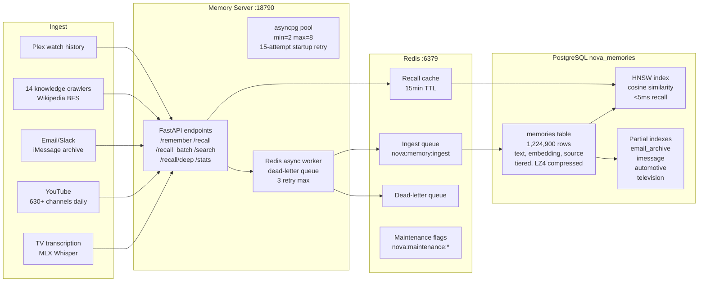
```mermaid
graph LR
    subgraph "Ingest"
        TV["TV transcription\nMLX Whisper"]
        YT["YouTube\n630+ channels daily"]
        Email["Email/Slack\niMessage archive"]
        Crawlers["14 knowledge crawlers\nWikipedia BFS"]
        Plex["Plex watch history"]
    end

    subgraph "Memory Server :18790"
        API["FastAPI endpoints\n/remember /recall\n/recall_batch /search\n/recall/deep /stats"]
        Pool["asyncpg pool\nmin=2 max=8\n15-attempt startup retry"]
        Worker["Redis async worker\ndead-letter queue\n3 retry max"]
    end

    subgraph "PostgreSQL nova_memories"
        Table["memories table\n1,224,900 rows\ntext, embedding, source\ntiered, LZ4 compressed"]
        HNSW["HNSW index\ncosine similarity\n<5ms recall"]
        PIndex["Partial indexes\nemail_archive\nimessage\nautomotive\ntelevision"]
    end

    subgraph "Redis :6379"
        Queue["Ingest queue\nnova:memory:ingest"]
        Cache["Recall cache\n15min TTL"]
        DLQ["Dead-letter queue"]
        Maint["Maintenance flags\nnova:maintenance:*"]
    end

    TV & YT & Email & Crawlers & Plex --> API
    API --> Worker
    Worker --> Queue
    Queue --> Table
    Table --> HNSW
    Table --> PIndex
    API --> Cache
    Cache --> HNSW
    Worker --> DLQ
```

**Weekly maintenance (Sunday 3 AM):** VACUUM ANALYZE + monthly HNSW REINDEX via `nova_pg_maintain.sh`.

---

## Complete Technology Stack

### AI / LLM

| Technology | Role | Location |
|-----------|------|----------|
| Ollama | Local model serving | :11434 |
| MLX | Apple Silicon native inference | :5050 |
| llama.cpp | Standby failover | :11435 |
| OpenRouter | Cloud model routing (non-private) | API |
| SwarmUI + Juggernaut X SDXL | Local image generation | GPU |
| FLUX.2 Pro / GPT-5 Image Mini | Cloud image generation | OpenRouter |
| MLX Whisper large-v3-turbo | Local audio transcription | GPU |
| Gemini 3.1 Flash Lite | Cloud transcription (TV ingest) | OpenRouter |

### Databases & Caching

| Technology | Role | Port |
|-----------|------|------|
| PostgreSQL 17 | Primary data store (nova_memories + nova_ops) | :5432 |
| pgvector 0.8.2 | Vector similarity search, HNSW indexing | (PG extension) |
| Redis 7 | Queue, cache, maintenance flags | :6379 |
| PgBouncer | Connection pooling | :6432 |

### Core Frameworks

| Technology | Role |
|-----------|------|
| Python 3.14 + asyncio | Gateway, scheduler, all 359 scripts |
| aiohttp | Chatroom server, WebSocket handling |
| FastAPI | Memory server |
| Swift 5.9 + SwiftUI | NovaControl, NovaTV, NovaHealth, HomekitControl |
| Hugo + PaperMod | nova-journal static site |
| tiktoken | Token counting for session compaction |

### Networking & Security

| Technology | Role |
|-----------|------|
| Cloudflare Tunnel | Zero-port external access |
| Cloudflare Access | Email OTP authentication |
| signal-cli 0.14.3 | Signal TCP JSON-RPC streaming |
| slack_sdk 3.41 | Slack WebSocket socket mode |
| discord.py 2.7 | Discord WebSocket |
| SearXNG | Local private web search |
| macOS Keychain | All credential storage |
| NMAP | Weekly network security scans |
| SNMP Poller | 6-device fleet metrics (CPU, memory, disk, bandwidth) — port 37463 |
| Syslog Server | Unified receiver (9 devices, UDP 1514) — real-time threat detection |
| Network Sentinel | Daily IDS/posture scan — baseline drift, new host detection |
| MRTG Dashboard | Classic traffic graphs + device health — port 37450/mrtg |

### Media & Ingest

| Technology | Role |
|-----------|------|
| yt-dlp | YouTube download (630+ channels) |
| ffmpeg | Audio extraction from video |
| Plex | Media library + watch history ingest |
| HDHomeRun | OTA TV recording (224 channels) |

### Infrastructure

| Technology | Role |
|-----------|------|
| launchd | macOS service management |
| Config Orchestrator | SSH-based fleet management (6 nodes, PostgreSQL state) |
| GitHub Actions | CI/CD, journal deploy (~40s) |
| GitHub Pages | nova.digitalnoise.net hosting |
| Prometheus metrics | NovaControl exports |
| Giscus | Comment system (GitHub Discussions) |
| Fuse.js | Client-side full-text search |

### Apple Ecosystem

| Technology | Role |
|-----------|------|
| HomeKit.framework | Smart home (60+ accessories) |
| HealthKit | 17 health metrics bridge |
| Shortcuts CLI | Scene execution proxy (:37432) |

---

## Hardware

| Component | Spec | Role |
|-----------|------|------|
| Mac Studio M4 Ultra | 512GB unified memory, 32-core CPU, 80-core GPU | Primary compute |
| Main SSD | 926GB APFS | OS, binaries, cache |
| `/Volumes/Data` | 3.6TB | AI models, Xcode, Nova workspace, binaries |
| `/Volumes/MoreData` | 3.6TB | PostgreSQL data (27GB), MLX models |
| Synology RS1221+ | RAID, 192.168.1.11 | NAS: video storage, Plex library |
| Synology (Plex) | 192.168.1.10:32400 | Plex Media Server |
| HDHomeRun QUATRO | 224 OTA channels, 4 tuners, 192.168.1.89 | Live TV + DVR |
| 15 UniFi Protect cameras | Face recognition, 5-layer event filtering | Security |
| UniFi Dream Machine | 192.168.1.1 | Network |

---

## Repos

| Repo | Purpose |
|------|---------|
| [nova](https://github.com/kochj23/nova) | Core system: 272+ scripts, gateway, scheduler, Big Brother, tests |
| [nova-journal](https://github.com/kochj23/nova-journal) | Public journal at nova.digitalnoise.net (Hugo + GitHub Pages) |
| [NovaControl](https://github.com/kochj23/NovaControl) | macOS menu bar app — unified API gateway on port 37400 |
| [NovaTV](https://github.com/kochj23/NovaTV) | tvOS dashboard — WebSocket to port 37450 |
| [NovaHealth](https://github.com/kochj23/NovaHealth) | iPhone HealthKit → Nova bridge (17 metrics) |
| [nova-policies](https://github.com/kochj23/nova-policies) | PRIVATE — Security, communication, operational policies |

---

## What Replaced What

| OpenClaw Subsystem | Status | Replacement |
|-------------------|--------|-------------|
| node.js gateway binary | ✅ Replaced | `nova_gateway_v2.py` — pure Python asyncio |
| Slack channel (socket mode) | ✅ Replaced | `slack_sdk` direct |
| Discord channel | ✅ Replaced | `discord.py` direct (no @buape/carbon) |
| Signal channel | ✅ Replaced | signal-cli TCP JSON-RPC streaming |
| Session JSONL storage | ✅ Replaced | `nova_ops.gateway_sessions` + `gateway_query_log` |
| MD file bootstrap | ✅ Replaced | `nova_ops.agent_docs` (versioned in PG) |
| MEMORY.md writes | ✅ Replaced | PG-managed, written by Nova's own scripts |
| OpenClaw cron jobs | ✅ Replaced (2026-04-29) | `nova_scheduler.py` — 54 tasks |
| OpenClaw memory/vector search | ✅ Replaced | `nova_memory_server.py` + PostgreSQL + pgvector |
| Built-in heartbeat | ✅ Replaced | `nova_big_brother.py` — dependency-aware, crash-loop detection |
| Agent execution (context, compaction) | ✅ Replaced | `nova_gateway_v2.py` with tiktoken compaction |

**OpenClaw binary:** Fully retired and uninstalled — no launchd job, no binary on PATH, no `node_modules`. The pure-Python stack has long since passed its stability window.

---

## Media Lifecycle — Gardener & Reaper

YouTube downloads are transcribed into Nova's memory (kept **forever**, tiny); the heavy `.mp4` is the reclaimable part. The **gardener** prunes only `TVShows` YouTube videos older than 15 days (skips watched + protects real TV series, detected via TVMaze); the **reaper** garbage-collects UNAS backup orphans after a 15-day grace. Both are **propose-only** — a human approves before any deletion.

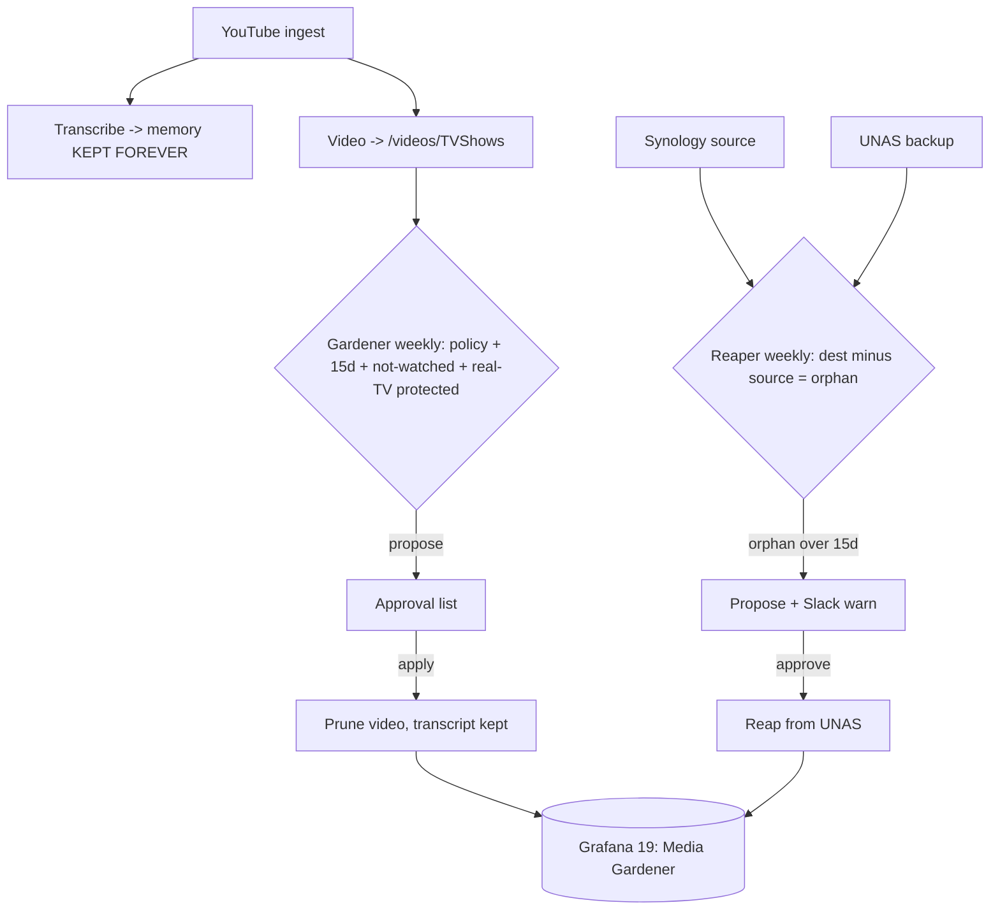
```mermaid
flowchart TD
  YT[YouTube ingest] --> T[Transcribe -> memory KEPT FOREVER]
  YT --> V[Video -> /videos/TVShows]
  V --> G{Gardener weekly: policy + 15d + not-watched + real-TV protected}
  G -->|propose| A[Approval list]
  A -->|apply| P[Prune video, transcript kept]
  SYN[Synology source] --> R{Reaper weekly: dest minus source = orphan}
  UNAS[UNAS backup] --> R
  R -->|orphan over 15d| A2[Propose + Slack warn]
  A2 -->|approve| RP[Reap from UNAS]
  P --> DASH[(Grafana 19: Media Gardener)]
  RP --> DASH
```

- `nova_media_gardener.py` — propose/apply, `media_policy` + `media_prune_proposals`, TVShows-only folder allowlist (**1.26 TB reclaimed**, transcripts intact)
- `nova_backup_reaper.sh` — UNAS orphan GC, `backup_orphans` table, 15-day soft-mirror with accidental-delete safety net
- Scheduled weekly (gardener propose-only Mon 6am, reaper Sun 5:30am) · Grafana dashboard 19 · Slack warnings via the notification bus

## Local Awareness — Overhead Flights (91506)

A poller watches the airspace over the house and tells Nova *who* is flying over — distance, altitude, and the registered owner.

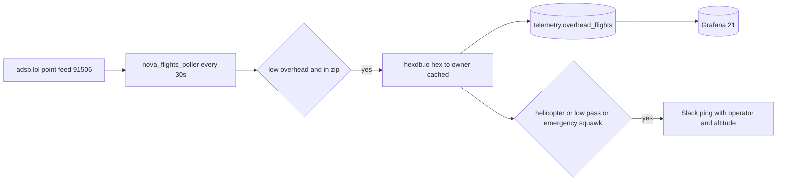
```mermaid
flowchart LR
  ADSB[adsb.lol point feed 91506] --> POLL[nova_flights_poller every 30s]
  POLL --> FILT{low overhead and in zip}
  FILT -->|yes| ENRICH[hexdb.io hex to owner cached]
  ENRICH --> DB[(telemetry.overhead_flights)]
  ENRICH --> ALERT{helicopter or low pass or emergency squawk}
  ALERT -->|yes| SLACK[Slack ping with operator and altitude]
  DB --> DASH[(Grafana 21)]
```

- `nova_flights_poller.py` — free adsb.lol feed, altitude under 10k ft over 91506, arrival-dedup via the table; pings helicopters, low passes, and emergency squawks (7500/7600/7700)
- Enrichment: `hexdb.io` hex → registered owner (e.g. *Los Angeles Police Department*), cached in `aircraft_registry`; military / non-ADS-B traffic excluded by nature
- Dashboard 21 · pairs with the queued Uniden SDS200 scanner for position-plus-voice

## NAS Deduplicator

Reclaims space from **exact** duplicate files on `/Volumes/NAS` — propose-first, and structurally incapable of touching Google.

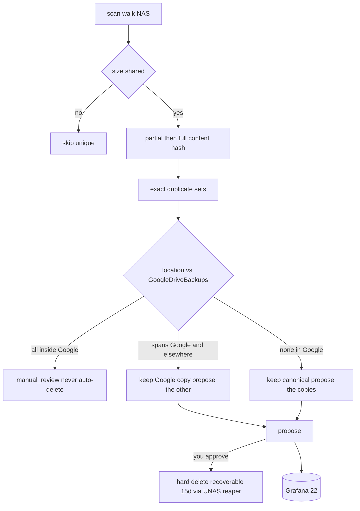
```mermaid
flowchart TD
  SCAN[scan walk NAS] --> SIZE{size shared}
  SIZE -->|no| SKIP[skip unique]
  SIZE -->|yes| HASH[partial then full content hash]
  HASH --> SETS[exact duplicate sets]
  SETS --> G{location vs GoogleDriveBackups}
  G -->|all inside Google| MR[manual_review never auto-delete]
  G -->|spans Google and elsewhere| KEEPG[keep Google copy propose the other]
  G -->|none in Google| KEEP[keep canonical propose the copies]
  KEEPG --> PROP[propose]
  KEEP --> PROP
  PROP -->|you approve| DEL[hard delete recoverable 15d via UNAS reaper]
  PROP --> DASH[(Grafana 22)]
```

- `nova_nas_dedup.py` — two-stage hashing (size group → partial → full), exact-dup only, resumable
- **Protected:** `GoogleDriveBackups` + `Google-Drive-kochjpar` are never delete targets (deletes there sync to Google); a dup set living entirely inside them becomes `manual_review`
- scan → propose → approve → apply · weekly Sun 4am · Grafana 22 · safety suite proves it never deletes from Google

## Slack watch — hourly sentinel over the nova-* channels

Once an hour, 24/7, reads everything new across the `#nova-*` channels, decides
whether anything is *notable* (alarming, unusual, or trending — not routine
heartbeat chatter), and posts a concise digest to **#nova-critical**.

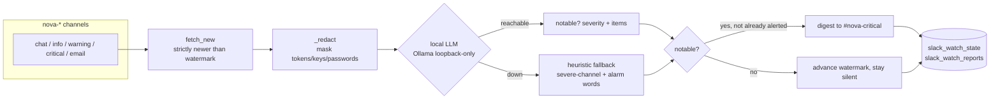
```mermaid
flowchart LR
  subgraph chans[nova-* channels]
    CH[chat / info / warning / critical / email]
  end
  CH --> FETCH[fetch_new\nstrictly newer than watermark]
  FETCH --> REDACT[_redact\nmask tokens/keys/passwords]
  REDACT --> ASSESS{local LLM\nOllama loopback-only}
  ASSESS -->|reachable| LLM[notable? severity + items]
  ASSESS -->|down| HEUR[heuristic fallback\nsevere-channel + alarm words]
  LLM --> NOTE{notable?}
  HEUR --> NOTE
  NOTE -->|yes, not already alerted| POST[digest to #nova-critical]
  NOTE -->|no| QUIET[advance watermark, stay silent]
  POST --> WM[(slack_watch_state\nslack_watch_reports)]
  QUIET --> WM
```

- `nova_slack_watch.py` — launchd `net.digitalnoise.nova-slack-watch`, hourly at :20
- **Data safety:** inference is **loopback-only** (a non-127.0.0.1 endpoint is refused outright — never falls forward to a cloud API); every message is redacted of token/key/password shapes before it reaches the model; messages truncated to 400 chars
- **Progress-only + dedup:** strict `ts >` watermark per channel so a message is never re-assessed; a per-digest `dedup_key` blocks re-alerting an identical recurring incident; skips its own posts via the `🔭 Hourly Watch` marker
- **No quiet hours** — fires 24/7; the offline heuristic guarantees it still flags real trouble when every LLM is down · safety suite `test_nova_slack_watch.py`

## Security

- All credentials in macOS Keychain — never in source, env vars in plists, or flat files
- Three-layer pre-push scanning (pre-commit hook + Claude Code PreToolUse + global pre-push)
- All services bind to loopback or LAN only — no public exposure
- Privacy routing: personal data routes to local Ollama only; OpenRouter only for non-private research
- `nova_config.py` constants: `LAN_IP = "192.168.1.6"`, `NOVA_HOST = LAN_IP`
- YouTube cookies: `~/.openclaw/cache/yt_cookies.txt` (mode 600, not in git)

## Maker & Home Integrations (June 2026)

### `nova_make` — Nova prints physical objects from an idea (autonomous)

A text idea becomes a real print with no human in the loop. The geometry gate
guarantees *printable*; "autonomous" means no approval prompt — physical-bounds
safety (bed-fit, watertight, filament/time caps, idle guard) instead.

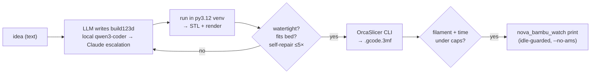
```mermaid
flowchart LR
    idea["idea (text)"] --> gen["LLM writes build123d<br/>local qwen3-coder → Claude escalation"]
    gen --> run["run in py3.12 venv<br/>→ STL + render"]
    run --> val{"watertight?<br/>fits bed?<br/>self-repair ≤5×"}
    val -- no --> gen
    val -- yes --> slice["OrcaSlicer CLI<br/>→ .gcode.3mf"]
    slice --> caps{"filament + time<br/>under caps?"}
    caps -- yes --> prnt["nova_bambu_watch print<br/>(idle-guarded, --no-ams)"]
```

- **Hybrid brain:** local `qwen3-coder:30b` first (free), escalates to Claude (OpenRouter) on failure, self-repairs from tracebacks.
- **Slicer:** OrcaSlicer CLI (Bambu Studio's CLI segfaults headless). X1C / 0.20 mm / PLA Basic profiles.
- **Print path:** single external spool, direct-feed (`--no-ams`, no AMS purge waste).
- Files: `scripts/nova_make.py`, `scripts/nova_make_part.py`.

### Bambu printers — telemetry, dashboard, chamber cams
- `nova_bambu_watch.py` samples P1/P2 into `bambu_telemetry` (PG) every 5 min → Grafana dashboard *Bambu Printers (P1/P2)* (state, temps, last job, progress).
- Both X1C chamber cams are first-class **Frigate** cameras (native RTSPS `:322`, record-only), alongside the UniFi fleet.

### Emergency journal — hard 25-mile geofence (91506)
`nova_journal_emergency.py` breaking `/local/` posts are gated to **25 miles of Burbank**: the model extracts the primary event location → Nominatim geocode (SoCal-biased, cached) → haversine distance → drop if beyond the radius (ungeocodable items kept, fail-safe). A ~30 mi Littlerock fire that used to slip through is now dropped. Tests in `tests/test_emergency_geo.py`.

### ADT+ Matter watch
`nova_adt_matter_watch.py` (launchd, daily) browses the LAN for Matter devices and pings Slack the day the ADT Self-Setup hub starts advertising Matter — the route to ingesting its door/window/motion sensors into Nova once ADT's firmware rollout reaches it.

---

*Written by Jordan Koch. Nova chose her own name.*
