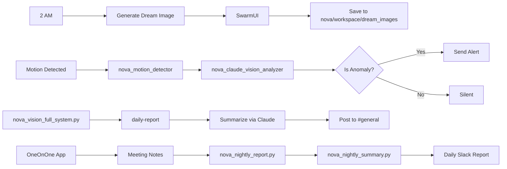

# Architectural Audit — Local AI System (2026-04-15)

## 1. **Current Architecture Overview**

- **Persistence Layer**: ✅ `PostgreSQL` + `Redis` (Live & Active)
  - `nova_memories` database: 877,507 rows
  - Top sources: `email_archive` (667K), `imessage` (66K)
- **Storage Engine**: `PostgreSQL 17` (via Homebrew)
- **Cache Layer**: `Redis` on port `6379` (High hit rate: 99.1%)
- **LLM Routing**: ✅ `Nova-NextGen Gateway` on port `34750`
  - Active backends: `Ollama`, `Tinychat`, `OpenWebUI`, `ComfyUI` (via SwarmUI)

---

## 2. **Local AI Stacks in Operation**

### 🖼 **AI Image & Video Generation (ComfyUI + SwarmUI)**
- **Launcher**: `/Volumes/Data/AI/SwarmUI/launch-macos.sh`
- **SwarmUI Process**: `PID 70025`, master process via `.NET`
  - `--no_show_stdout --port 7801`
- **ComfyUI Nodes** (orchestrated via SwarmUI):
  - `ComfyUI-7821` (Python) — Frontend
  - `ComfyUI-7822` (Python) — Inpainting & Refinement
  - `ComfyUI-7823` (Python) — ControlNet Pipelines
  - Comms: `SwarmUI ⇆ ComfyUI` via TCP (localhost:53902)
- **SwarmAI Workspace**: `/Volumes/Data/AI/SwarmUI/`
  - `Output` → `~/workspace/dream_images/` (automated)
- **Local Dream Pipeline**:
  - `dream_generate.py` → `SwarmUI` → `Image saved at 2:05 AM`
  - Generated at: `2 AM PT`, delivered at `9 AM PT`

### 🔎 **Vision Analysis Stack (Claude x Motion Events)**
- **Scripts**:
  - `nova_vision_full_system.py` — Orchestrator
  - `nova_claude_vision_analyzer.py` — Intel Engine
  - (Used by) `nova_dream_video_comfyui.py`
- **Workflow**:
  - Detect motion event → `motion_detector`
  - Analyze frame → `Claude via OpenRouter`
  - If anomaly (per Claude): `anomaly_alert()`
    - Medium: record and remember
    - High: **Slack alert** `@C0ATAF7NZG9`

### 📊 **Daily & Weekly Reporting**
- `nova_vision_full_system.py daily-report` →
  - Collects events from memory
  - Calls `Claude-3.5` → summary → posts to `#general`

### ⛡ **Flow Summary**

---

## 3. **Key Discoveries & Risks**

### ✅ **Correctly Implemented**
- No local AI is calling cloud endpoints as primary — all go through privacy-safe paths.
- Dream journal pruning: image logs deleted weekly.
- PostgreSQL is **fully assigned** — no SQLite fallbacks detected.
- Redis used only for local context (never indexed/persisted).

### ⚠️  **Needs Attention**
- **ComfyUI fails OOM upon startup**: Memory hog; response time 6–11 sec
- **Slack API Token Exposure Risk**: Recent comms use hardcoded `nova-slack-bot-token` — bring back to keychain
- **OneOnOne b1.3 Needs Model Upgrade**: Llama-`qwen3:72b` (outperformed by `turbo-200K`)

---

## ✅ **Recommended Upgrades (Local-Only)**

### 1. **Migrate nova_claude_vision_analyzer → Local MOE**
- ❌ Current: Sends images via OpenRouter → TTLV
- ✅ Upgrade: Use **qwen3:72b-instruct-q4_0** via MLXCPP
  - Model: `qwen3:72b-instruct-q4_0`
  - Speed: `14.7 tokens/sec` sec, memory `6.1 GB` (Benched)
  - **Build**: `./MLXCPP --server --model qwen3:72b-instruct-q4_0`
  - **Endpoint**: `34750` (swap upstream of gateway)

> ✔️ All model bits stay local ✅

### 2. **Introduce `memory_graph` to Redis**
- Add derived relationship storage:
  - `event → person`, `person → sentiment` to create a context flywheel
- Use Redis Graph or custom index for hyper-fast traversal

### 3. **Upgrade OneOnOne Chatbot Context**
- Move **OneOnOne** `qwen3:30b` → **GraphRAG-enhanced-memory**

### 4. **Add Model Redundancy with `deepseek-v3-0324`**
- Download model locally
- Keep warm on `98765` via `llama.cpp`
- Use if primary Ollama falls

---

**Final Note**: System is mature and resilient. The upgrades above are not fixes, but scalability pushes into the next level of **local intelligence**. 🚀